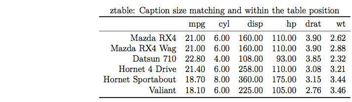
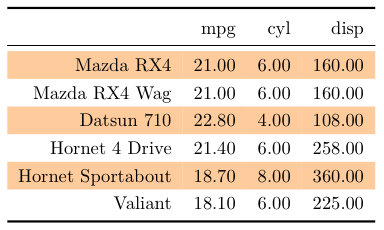

# Introduction

I like the "xtable"" package very much. But when I use a large font or "flushright" latex environment, there is a caption size discrepancy and misposition of caption.


That's why I developed ztable package.



Package "ztable" consist of one function: ztable. It's main function is creating zebra zebra striping tables(tables with alternating row colors) in both Latex and html formats easily from mainly data.frame or an R object such as matrix, lm, aov, anova, glm and coxph objects. It is fully customizable and you can get similar tables in both latex and html format without changing source. The default output is Latex format, but you can get html format by adding just one sentence.


```r
options(ztable.type="html")
```

It's usage is somewhat similar to xtable, but very simple.

## data.frame

### Basic Use

It's use is very simple. Just use 'ztable()' function. You can get the zebra sripig table by default.(default value zebra=1; striping on odd rows).


```r
require(ztable)
options(ztable.type="html")
options(ztable.zebra=1)
options(ztable.zebra.color="platinum")
options(ztable.colnames.bold=TRUE)
ztable(head(mtcars))
```

<head><style>
        table {
              text-align: right;}
        th {
              padding: 2px 2px 5px 5px;
	        }
        td {
             padding: 2px 2px 5px 5px; }
      </style></head><table align="center" style="border-collapse: collapse; caption-side:top; font-size:11pt;"><caption style="text-align:center;"></caption><tr>
<th style="border-left: 0px solid black;background-color: #FFFFFF;border-top: 2px solid gray;border-bottom: 1px solid gray;">&nbsp;</th>
<th style="font-weight: bold;border-left: 0px solid black;border-bottom: 1px solid gray;border-top: 2px solid gray;">mpg</th>
<th style="font-weight: bold;border-left: 0px solid black;border-bottom: 1px solid gray;border-top: 2px solid gray;">cyl</th>
<th style="font-weight: bold;border-left: 0px solid black;border-bottom: 1px solid gray;border-top: 2px solid gray;">disp</th>
<th style="font-weight: bold;border-left: 0px solid black;border-bottom: 1px solid gray;border-top: 2px solid gray;">hp</th>
<th style="font-weight: bold;border-left: 0px solid black;border-bottom: 1px solid gray;border-top: 2px solid gray;">drat</th>
<th style="font-weight: bold;border-left: 0px solid black;border-bottom: 1px solid gray;border-top: 2px solid gray;">wt</th>
<th style="font-weight: bold;border-left: 0px solid black;border-bottom: 1px solid gray;border-top: 2px solid gray;">qsec</th>
<th style="font-weight: bold;border-left: 0px solid black;border-bottom: 1px solid gray;border-top: 2px solid gray;">vs</th>
<th style="font-weight: bold;border-left: 0px solid black;border-bottom: 1px solid gray;border-top: 2px solid gray;">am</th>
<th style="font-weight: bold;border-left: 0px solid black;border-bottom: 1px solid gray;border-top: 2px solid gray;">gear</th>
<th style="font-weight: bold;border-left: 0px solid black;border-bottom: 1px solid gray;border-top: 2px solid gray;">carb</th>
</tr>
<tr>
<td style="border-left: 0px solid black; background-color: #E5E4E2; ">Mazda RX4</td>
<td align="right" style="border-left: 0px solid black;background-color: #E5E4E2;">21.00</td>
<td align="right" style="border-left: 0px solid black;background-color: #E5E4E2;">6.00</td>
<td align="right" style="border-left: 0px solid black;background-color: #E5E4E2;">160.00</td>
<td align="right" style="border-left: 0px solid black;background-color: #E5E4E2;">110.00</td>
<td align="right" style="border-left: 0px solid black;background-color: #E5E4E2;">3.90</td>
<td align="right" style="border-left: 0px solid black;background-color: #E5E4E2;">2.62</td>
<td align="right" style="border-left: 0px solid black;background-color: #E5E4E2;">16.46</td>
<td align="right" style="border-left: 0px solid black;background-color: #E5E4E2;">0.00</td>
<td align="right" style="border-left: 0px solid black;background-color: #E5E4E2;">1.00</td>
<td align="right" style="border-left: 0px solid black;background-color: #E5E4E2;">4.00</td>
<td align="right" style="border-left: 0px solid black;background-color: #E5E4E2;">4.00</td>
</tr>
<tr>
<td style="border-left: 0px solid black; ">Mazda RX4 Wag</td>
<td align="right" style="border-left: 0px solid black;">21.00</td>
<td align="right" style="border-left: 0px solid black;">6.00</td>
<td align="right" style="border-left: 0px solid black;">160.00</td>
<td align="right" style="border-left: 0px solid black;">110.00</td>
<td align="right" style="border-left: 0px solid black;">3.90</td>
<td align="right" style="border-left: 0px solid black;">2.88</td>
<td align="right" style="border-left: 0px solid black;">17.02</td>
<td align="right" style="border-left: 0px solid black;">0.00</td>
<td align="right" style="border-left: 0px solid black;">1.00</td>
<td align="right" style="border-left: 0px solid black;">4.00</td>
<td align="right" style="border-left: 0px solid black;">4.00</td>
</tr>
<tr>
<td style="border-left: 0px solid black; background-color: #E5E4E2; ">Datsun 710</td>
<td align="right" style="border-left: 0px solid black;background-color: #E5E4E2;">22.80</td>
<td align="right" style="border-left: 0px solid black;background-color: #E5E4E2;">4.00</td>
<td align="right" style="border-left: 0px solid black;background-color: #E5E4E2;">108.00</td>
<td align="right" style="border-left: 0px solid black;background-color: #E5E4E2;">93.00</td>
<td align="right" style="border-left: 0px solid black;background-color: #E5E4E2;">3.85</td>
<td align="right" style="border-left: 0px solid black;background-color: #E5E4E2;">2.32</td>
<td align="right" style="border-left: 0px solid black;background-color: #E5E4E2;">18.61</td>
<td align="right" style="border-left: 0px solid black;background-color: #E5E4E2;">1.00</td>
<td align="right" style="border-left: 0px solid black;background-color: #E5E4E2;">1.00</td>
<td align="right" style="border-left: 0px solid black;background-color: #E5E4E2;">4.00</td>
<td align="right" style="border-left: 0px solid black;background-color: #E5E4E2;">1.00</td>
</tr>
<tr>
<td style="border-left: 0px solid black; ">Hornet 4 Drive</td>
<td align="right" style="border-left: 0px solid black;">21.40</td>
<td align="right" style="border-left: 0px solid black;">6.00</td>
<td align="right" style="border-left: 0px solid black;">258.00</td>
<td align="right" style="border-left: 0px solid black;">110.00</td>
<td align="right" style="border-left: 0px solid black;">3.08</td>
<td align="right" style="border-left: 0px solid black;">3.21</td>
<td align="right" style="border-left: 0px solid black;">19.44</td>
<td align="right" style="border-left: 0px solid black;">1.00</td>
<td align="right" style="border-left: 0px solid black;">0.00</td>
<td align="right" style="border-left: 0px solid black;">3.00</td>
<td align="right" style="border-left: 0px solid black;">1.00</td>
</tr>
<tr>
<td style="border-left: 0px solid black; background-color: #E5E4E2; ">Hornet Sportabout</td>
<td align="right" style="border-left: 0px solid black;background-color: #E5E4E2;">18.70</td>
<td align="right" style="border-left: 0px solid black;background-color: #E5E4E2;">8.00</td>
<td align="right" style="border-left: 0px solid black;background-color: #E5E4E2;">360.00</td>
<td align="right" style="border-left: 0px solid black;background-color: #E5E4E2;">175.00</td>
<td align="right" style="border-left: 0px solid black;background-color: #E5E4E2;">3.15</td>
<td align="right" style="border-left: 0px solid black;background-color: #E5E4E2;">3.44</td>
<td align="right" style="border-left: 0px solid black;background-color: #E5E4E2;">17.02</td>
<td align="right" style="border-left: 0px solid black;background-color: #E5E4E2;">0.00</td>
<td align="right" style="border-left: 0px solid black;background-color: #E5E4E2;">0.00</td>
<td align="right" style="border-left: 0px solid black;background-color: #E5E4E2;">3.00</td>
<td align="right" style="border-left: 0px solid black;background-color: #E5E4E2;">2.00</td>
</tr>
<tr>
<td style="border-left: 0px solid black; ">Valiant</td>
<td align="right" style="border-left: 0px solid black;">18.10</td>
<td align="right" style="border-left: 0px solid black;">6.00</td>
<td align="right" style="border-left: 0px solid black;">225.00</td>
<td align="right" style="border-left: 0px solid black;">105.00</td>
<td align="right" style="border-left: 0px solid black;">2.76</td>
<td align="right" style="border-left: 0px solid black;">3.46</td>
<td align="right" style="border-left: 0px solid black;">20.22</td>
<td align="right" style="border-left: 0px solid black;">1.00</td>
<td align="right" style="border-left: 0px solid black;">0.00</td>
<td align="right" style="border-left: 0px solid black;">3.00</td>
<td align="right" style="border-left: 0px solid black;">1.00</td>
</tr>
<tr>
<td colspan="12" align="left" style="font-size:9pt ;border-top: 1px solid black;"></td>
</tr>
</table>

### Tailoring zebra striping

You can get non-zebra table by change parameter zebra=NULL or change zebra striping on even rows by zebra=2. 


```r
ztable(head(mtcars),zebra=NULL,size=3,
       caption="Table 1. Non-zebra Table with small size")
```

<head><style>
        table {
              text-align: right;}
        th {
              padding: 2px 2px 5px 5px;
	        }
        td {
             padding: 2px 2px 5px 5px; }
      </style></head><table align="center" style="border-collapse: collapse; caption-side:top; font-size:9pt;"><caption style="text-align:center;">Table 1. Non-zebra Table with small size</caption><tr>
<th style="border-left: 0px solid black;background-color: #FFFFFF;border-top: 2px solid gray;border-bottom: 1px solid gray;">&nbsp;</th>
<th style="font-weight: bold;border-left: 0px solid black;border-bottom: 1px solid gray;border-top: 2px solid gray;">mpg</th>
<th style="font-weight: bold;border-left: 0px solid black;border-bottom: 1px solid gray;border-top: 2px solid gray;">cyl</th>
<th style="font-weight: bold;border-left: 0px solid black;border-bottom: 1px solid gray;border-top: 2px solid gray;">disp</th>
<th style="font-weight: bold;border-left: 0px solid black;border-bottom: 1px solid gray;border-top: 2px solid gray;">hp</th>
<th style="font-weight: bold;border-left: 0px solid black;border-bottom: 1px solid gray;border-top: 2px solid gray;">drat</th>
<th style="font-weight: bold;border-left: 0px solid black;border-bottom: 1px solid gray;border-top: 2px solid gray;">wt</th>
<th style="font-weight: bold;border-left: 0px solid black;border-bottom: 1px solid gray;border-top: 2px solid gray;">qsec</th>
<th style="font-weight: bold;border-left: 0px solid black;border-bottom: 1px solid gray;border-top: 2px solid gray;">vs</th>
<th style="font-weight: bold;border-left: 0px solid black;border-bottom: 1px solid gray;border-top: 2px solid gray;">am</th>
<th style="font-weight: bold;border-left: 0px solid black;border-bottom: 1px solid gray;border-top: 2px solid gray;">gear</th>
<th style="font-weight: bold;border-left: 0px solid black;border-bottom: 1px solid gray;border-top: 2px solid gray;">carb</th>
</tr>
<tr>
<td style="border-left: 0px solid black; ">Mazda RX4</td>
<td align="right" style="border-left: 0px solid black;">21.00</td>
<td align="right" style="border-left: 0px solid black;">6.00</td>
<td align="right" style="border-left: 0px solid black;">160.00</td>
<td align="right" style="border-left: 0px solid black;">110.00</td>
<td align="right" style="border-left: 0px solid black;">3.90</td>
<td align="right" style="border-left: 0px solid black;">2.62</td>
<td align="right" style="border-left: 0px solid black;">16.46</td>
<td align="right" style="border-left: 0px solid black;">0.00</td>
<td align="right" style="border-left: 0px solid black;">1.00</td>
<td align="right" style="border-left: 0px solid black;">4.00</td>
<td align="right" style="border-left: 0px solid black;">4.00</td>
</tr>
<tr>
<td style="border-left: 0px solid black; ">Mazda RX4 Wag</td>
<td align="right" style="border-left: 0px solid black;">21.00</td>
<td align="right" style="border-left: 0px solid black;">6.00</td>
<td align="right" style="border-left: 0px solid black;">160.00</td>
<td align="right" style="border-left: 0px solid black;">110.00</td>
<td align="right" style="border-left: 0px solid black;">3.90</td>
<td align="right" style="border-left: 0px solid black;">2.88</td>
<td align="right" style="border-left: 0px solid black;">17.02</td>
<td align="right" style="border-left: 0px solid black;">0.00</td>
<td align="right" style="border-left: 0px solid black;">1.00</td>
<td align="right" style="border-left: 0px solid black;">4.00</td>
<td align="right" style="border-left: 0px solid black;">4.00</td>
</tr>
<tr>
<td style="border-left: 0px solid black; ">Datsun 710</td>
<td align="right" style="border-left: 0px solid black;">22.80</td>
<td align="right" style="border-left: 0px solid black;">4.00</td>
<td align="right" style="border-left: 0px solid black;">108.00</td>
<td align="right" style="border-left: 0px solid black;">93.00</td>
<td align="right" style="border-left: 0px solid black;">3.85</td>
<td align="right" style="border-left: 0px solid black;">2.32</td>
<td align="right" style="border-left: 0px solid black;">18.61</td>
<td align="right" style="border-left: 0px solid black;">1.00</td>
<td align="right" style="border-left: 0px solid black;">1.00</td>
<td align="right" style="border-left: 0px solid black;">4.00</td>
<td align="right" style="border-left: 0px solid black;">1.00</td>
</tr>
<tr>
<td style="border-left: 0px solid black; ">Hornet 4 Drive</td>
<td align="right" style="border-left: 0px solid black;">21.40</td>
<td align="right" style="border-left: 0px solid black;">6.00</td>
<td align="right" style="border-left: 0px solid black;">258.00</td>
<td align="right" style="border-left: 0px solid black;">110.00</td>
<td align="right" style="border-left: 0px solid black;">3.08</td>
<td align="right" style="border-left: 0px solid black;">3.21</td>
<td align="right" style="border-left: 0px solid black;">19.44</td>
<td align="right" style="border-left: 0px solid black;">1.00</td>
<td align="right" style="border-left: 0px solid black;">0.00</td>
<td align="right" style="border-left: 0px solid black;">3.00</td>
<td align="right" style="border-left: 0px solid black;">1.00</td>
</tr>
<tr>
<td style="border-left: 0px solid black; ">Hornet Sportabout</td>
<td align="right" style="border-left: 0px solid black;">18.70</td>
<td align="right" style="border-left: 0px solid black;">8.00</td>
<td align="right" style="border-left: 0px solid black;">360.00</td>
<td align="right" style="border-left: 0px solid black;">175.00</td>
<td align="right" style="border-left: 0px solid black;">3.15</td>
<td align="right" style="border-left: 0px solid black;">3.44</td>
<td align="right" style="border-left: 0px solid black;">17.02</td>
<td align="right" style="border-left: 0px solid black;">0.00</td>
<td align="right" style="border-left: 0px solid black;">0.00</td>
<td align="right" style="border-left: 0px solid black;">3.00</td>
<td align="right" style="border-left: 0px solid black;">2.00</td>
</tr>
<tr>
<td style="border-left: 0px solid black; ">Valiant</td>
<td align="right" style="border-left: 0px solid black;">18.10</td>
<td align="right" style="border-left: 0px solid black;">6.00</td>
<td align="right" style="border-left: 0px solid black;">225.00</td>
<td align="right" style="border-left: 0px solid black;">105.00</td>
<td align="right" style="border-left: 0px solid black;">2.76</td>
<td align="right" style="border-left: 0px solid black;">3.46</td>
<td align="right" style="border-left: 0px solid black;">20.22</td>
<td align="right" style="border-left: 0px solid black;">1.00</td>
<td align="right" style="border-left: 0px solid black;">0.00</td>
<td align="right" style="border-left: 0px solid black;">3.00</td>
<td align="right" style="border-left: 0px solid black;">1.00</td>
</tr>
<tr>
<td colspan="12" align="left" style="font-size:7pt ;border-top: 1px solid black;"></td>
</tr>
</table>
        
### Customize the caption and the font size 

You can change the position of table by using parameter position. You can use "r" for right position, "l" for left position and "c" for center position(default). You can change the color of zebra striping by change the parameter zebra.color. You can also change the size of font from 1 to 10(default is 5). You can change the caption.placement("top" or "bottom") and caption.position("c" for center / "r" for right/ "l" for left).  
    

```r
ztable(head(mtcars[c(1:7)]),zebra=2,zebra.color="lightcyan",size=7,
       caption="Table 2. Left-sided caption at botom with large font",
       caption.placement="bottom",caption.position="l") 
```

<head><style>
        table {
              text-align: right;}
        th {
              padding: 2px 2px 5px 5px;
	        }
        td {
             padding: 2px 2px 5px 5px; }
      </style></head><table align="center" style="border-collapse: collapse; caption-side:bottom; font-size:15pt;"><caption style="text-align:left;">Table 2. Left-sided caption at botom with large font</caption><tr>
<th style="border-left: 0px solid black;background-color: #FFFFFF;border-top: 2px solid gray;border-bottom: 1px solid gray;">&nbsp;</th>
<th style="font-weight: bold;border-left: 0px solid black;border-bottom: 1px solid gray;border-top: 2px solid gray;">mpg</th>
<th style="font-weight: bold;border-left: 0px solid black;border-bottom: 1px solid gray;border-top: 2px solid gray;">cyl</th>
<th style="font-weight: bold;border-left: 0px solid black;border-bottom: 1px solid gray;border-top: 2px solid gray;">disp</th>
<th style="font-weight: bold;border-left: 0px solid black;border-bottom: 1px solid gray;border-top: 2px solid gray;">hp</th>
<th style="font-weight: bold;border-left: 0px solid black;border-bottom: 1px solid gray;border-top: 2px solid gray;">drat</th>
<th style="font-weight: bold;border-left: 0px solid black;border-bottom: 1px solid gray;border-top: 2px solid gray;">wt</th>
<th style="font-weight: bold;border-left: 0px solid black;border-bottom: 1px solid gray;border-top: 2px solid gray;">qsec</th>
</tr>
<tr>
<td style="border-left: 0px solid black; ">Mazda RX4</td>
<td align="right" style="border-left: 0px solid black;">21.00</td>
<td align="right" style="border-left: 0px solid black;">6.00</td>
<td align="right" style="border-left: 0px solid black;">160.00</td>
<td align="right" style="border-left: 0px solid black;">110.00</td>
<td align="right" style="border-left: 0px solid black;">3.90</td>
<td align="right" style="border-left: 0px solid black;">2.62</td>
<td align="right" style="border-left: 0px solid black;">16.46</td>
</tr>
<tr>
<td style="border-left: 0px solid black; background-color: #E0FFFF; ">Mazda RX4 Wag</td>
<td align="right" style="border-left: 0px solid black;background-color: #E0FFFF;">21.00</td>
<td align="right" style="border-left: 0px solid black;background-color: #E0FFFF;">6.00</td>
<td align="right" style="border-left: 0px solid black;background-color: #E0FFFF;">160.00</td>
<td align="right" style="border-left: 0px solid black;background-color: #E0FFFF;">110.00</td>
<td align="right" style="border-left: 0px solid black;background-color: #E0FFFF;">3.90</td>
<td align="right" style="border-left: 0px solid black;background-color: #E0FFFF;">2.88</td>
<td align="right" style="border-left: 0px solid black;background-color: #E0FFFF;">17.02</td>
</tr>
<tr>
<td style="border-left: 0px solid black; ">Datsun 710</td>
<td align="right" style="border-left: 0px solid black;">22.80</td>
<td align="right" style="border-left: 0px solid black;">4.00</td>
<td align="right" style="border-left: 0px solid black;">108.00</td>
<td align="right" style="border-left: 0px solid black;">93.00</td>
<td align="right" style="border-left: 0px solid black;">3.85</td>
<td align="right" style="border-left: 0px solid black;">2.32</td>
<td align="right" style="border-left: 0px solid black;">18.61</td>
</tr>
<tr>
<td style="border-left: 0px solid black; background-color: #E0FFFF; ">Hornet 4 Drive</td>
<td align="right" style="border-left: 0px solid black;background-color: #E0FFFF;">21.40</td>
<td align="right" style="border-left: 0px solid black;background-color: #E0FFFF;">6.00</td>
<td align="right" style="border-left: 0px solid black;background-color: #E0FFFF;">258.00</td>
<td align="right" style="border-left: 0px solid black;background-color: #E0FFFF;">110.00</td>
<td align="right" style="border-left: 0px solid black;background-color: #E0FFFF;">3.08</td>
<td align="right" style="border-left: 0px solid black;background-color: #E0FFFF;">3.21</td>
<td align="right" style="border-left: 0px solid black;background-color: #E0FFFF;">19.44</td>
</tr>
<tr>
<td style="border-left: 0px solid black; ">Hornet Sportabout</td>
<td align="right" style="border-left: 0px solid black;">18.70</td>
<td align="right" style="border-left: 0px solid black;">8.00</td>
<td align="right" style="border-left: 0px solid black;">360.00</td>
<td align="right" style="border-left: 0px solid black;">175.00</td>
<td align="right" style="border-left: 0px solid black;">3.15</td>
<td align="right" style="border-left: 0px solid black;">3.44</td>
<td align="right" style="border-left: 0px solid black;">17.02</td>
</tr>
<tr>
<td style="border-left: 0px solid black; background-color: #E0FFFF; ">Valiant</td>
<td align="right" style="border-left: 0px solid black;background-color: #E0FFFF;">18.10</td>
<td align="right" style="border-left: 0px solid black;background-color: #E0FFFF;">6.00</td>
<td align="right" style="border-left: 0px solid black;background-color: #E0FFFF;">225.00</td>
<td align="right" style="border-left: 0px solid black;background-color: #E0FFFF;">105.00</td>
<td align="right" style="border-left: 0px solid black;background-color: #E0FFFF;">2.76</td>
<td align="right" style="border-left: 0px solid black;background-color: #E0FFFF;">3.46</td>
<td align="right" style="border-left: 0px solid black;background-color: #E0FFFF;">20.22</td>
</tr>
<tr>
<td colspan="8" align="left" style="font-size:13pt ;border-top: 1px solid black;"></td>
</tr>
</table>
       
## aov  object

'ztable()' can be used for 'aov' object. When used for 'aov' object, the function call is added as footer to the table. The parameter 'show.footer' can be used whether or not include footer in the table. Dafault value is TRUE.


```r
out <- aov(mpg ~ ., data=mtcars)
ztable(out)
```

<head><style>
        table {
              text-align: right;}
        th {
              padding: 2px 2px 5px 5px;
	        }
        td {
             padding: 2px 2px 5px 5px; }
      </style></head><table align="center" style="border-collapse: collapse; caption-side:top; font-size:11pt;"><caption style="text-align:center;"></caption><tr>
<th style="border-left: 0px solid black;background-color: #FFFFFF;border-top: 2px solid gray;border-bottom: 1px solid gray;">&nbsp;</th>
<th style="font-weight: bold;border-left: 0px solid black;border-bottom: 1px solid gray;border-top: 2px solid gray;">Df</th>
<th style="font-weight: bold;border-left: 0px solid black;border-bottom: 1px solid gray;border-top: 2px solid gray;">Sum Sq</th>
<th style="font-weight: bold;border-left: 0px solid black;border-bottom: 1px solid gray;border-top: 2px solid gray;">Mean Sq</th>
<th style="font-weight: bold;border-left: 0px solid black;border-bottom: 1px solid gray;border-top: 2px solid gray;">F value</th>
<th style="font-weight: bold;border-left: 0px solid black;border-bottom: 1px solid gray;border-top: 2px solid gray;">Pr(>F)</th>
</tr>
<tr>
<td style="border-left: 0px solid black; background-color: #E5E4E2; ">cyl        </td>
<td align="right" style="border-left: 0px solid black;background-color: #E5E4E2;">1</td>
<td align="right" style="border-left: 0px solid black;background-color: #E5E4E2;">817.71</td>
<td align="right" style="border-left: 0px solid black;background-color: #E5E4E2;">817.71</td>
<td align="right" style="border-left: 0px solid black;background-color: #E5E4E2;">116.42</td>
<td align="right" style="border-left: 0px solid black;background-color: #E5E4E2;">0.0000</td>
</tr>
<tr>
<td style="border-left: 0px solid black; ">disp       </td>
<td align="right" style="border-left: 0px solid black;">1</td>
<td align="right" style="border-left: 0px solid black;">37.59</td>
<td align="right" style="border-left: 0px solid black;">37.59</td>
<td align="right" style="border-left: 0px solid black;">5.35</td>
<td align="right" style="border-left: 0px solid black;">0.0309</td>
</tr>
<tr>
<td style="border-left: 0px solid black; background-color: #E5E4E2; ">hp         </td>
<td align="right" style="border-left: 0px solid black;background-color: #E5E4E2;">1</td>
<td align="right" style="border-left: 0px solid black;background-color: #E5E4E2;">9.37</td>
<td align="right" style="border-left: 0px solid black;background-color: #E5E4E2;">9.37</td>
<td align="right" style="border-left: 0px solid black;background-color: #E5E4E2;">1.33</td>
<td align="right" style="border-left: 0px solid black;background-color: #E5E4E2;">0.2610</td>
</tr>
<tr>
<td style="border-left: 0px solid black; ">drat       </td>
<td align="right" style="border-left: 0px solid black;">1</td>
<td align="right" style="border-left: 0px solid black;">16.47</td>
<td align="right" style="border-left: 0px solid black;">16.47</td>
<td align="right" style="border-left: 0px solid black;">2.34</td>
<td align="right" style="border-left: 0px solid black;">0.1406</td>
</tr>
<tr>
<td style="border-left: 0px solid black; background-color: #E5E4E2; ">wt         </td>
<td align="right" style="border-left: 0px solid black;background-color: #E5E4E2;">1</td>
<td align="right" style="border-left: 0px solid black;background-color: #E5E4E2;">77.48</td>
<td align="right" style="border-left: 0px solid black;background-color: #E5E4E2;">77.48</td>
<td align="right" style="border-left: 0px solid black;background-color: #E5E4E2;">11.03</td>
<td align="right" style="border-left: 0px solid black;background-color: #E5E4E2;">0.0032</td>
</tr>
<tr>
<td style="border-left: 0px solid black; ">qsec       </td>
<td align="right" style="border-left: 0px solid black;">1</td>
<td align="right" style="border-left: 0px solid black;">3.95</td>
<td align="right" style="border-left: 0px solid black;">3.95</td>
<td align="right" style="border-left: 0px solid black;">0.56</td>
<td align="right" style="border-left: 0px solid black;">0.4617</td>
</tr>
<tr>
<td style="border-left: 0px solid black; background-color: #E5E4E2; ">vs         </td>
<td align="right" style="border-left: 0px solid black;background-color: #E5E4E2;">1</td>
<td align="right" style="border-left: 0px solid black;background-color: #E5E4E2;">0.13</td>
<td align="right" style="border-left: 0px solid black;background-color: #E5E4E2;">0.13</td>
<td align="right" style="border-left: 0px solid black;background-color: #E5E4E2;">0.02</td>
<td align="right" style="border-left: 0px solid black;background-color: #E5E4E2;">0.8932</td>
</tr>
<tr>
<td style="border-left: 0px solid black; ">am         </td>
<td align="right" style="border-left: 0px solid black;">1</td>
<td align="right" style="border-left: 0px solid black;">14.47</td>
<td align="right" style="border-left: 0px solid black;">14.47</td>
<td align="right" style="border-left: 0px solid black;">2.06</td>
<td align="right" style="border-left: 0px solid black;">0.1659</td>
</tr>
<tr>
<td style="border-left: 0px solid black; background-color: #E5E4E2; ">gear       </td>
<td align="right" style="border-left: 0px solid black;background-color: #E5E4E2;">1</td>
<td align="right" style="border-left: 0px solid black;background-color: #E5E4E2;">0.97</td>
<td align="right" style="border-left: 0px solid black;background-color: #E5E4E2;">0.97</td>
<td align="right" style="border-left: 0px solid black;background-color: #E5E4E2;">0.14</td>
<td align="right" style="border-left: 0px solid black;background-color: #E5E4E2;">0.7137</td>
</tr>
<tr>
<td style="border-left: 0px solid black; ">carb       </td>
<td align="right" style="border-left: 0px solid black;">1</td>
<td align="right" style="border-left: 0px solid black;">0.41</td>
<td align="right" style="border-left: 0px solid black;">0.41</td>
<td align="right" style="border-left: 0px solid black;">0.06</td>
<td align="right" style="border-left: 0px solid black;">0.8122</td>
</tr>
<tr>
<td style="border-left: 0px solid black; background-color: #E5E4E2; ">Residuals  </td>
<td align="right" style="border-left: 0px solid black;background-color: #E5E4E2;">21</td>
<td align="right" style="border-left: 0px solid black;background-color: #E5E4E2;">147.49</td>
<td align="right" style="border-left: 0px solid black;background-color: #E5E4E2;">7.02</td>
<td align="right" style="border-left: 0px solid black;background-color: #E5E4E2;"></td>
<td align="right" style="border-left: 0px solid black;background-color: #E5E4E2;"></td>
</tr>
<tr>
<td colspan="6" align="left" style="font-size:9pt ;border-top: 1px solid black;">Call: aov(formula = mpg $\sim$ ., data = mtcars)</td>
</tr>
</table>

## Linear model : 'lm' object

'ztable()' can be used for 'lm' object. When used for 'lm' object, the function call is added as footer to the table, too. 


```r
fit <- lm(mpg ~ cyl + disp + wt + drat + am, data=mtcars)
ztable(fit)
```

<head><style>
        table {
              text-align: right;}
        th {
              padding: 2px 2px 5px 5px;
	        }
        td {
             padding: 2px 2px 5px 5px; }
      </style></head><table align="center" style="border-collapse: collapse; caption-side:top; font-size:11pt;"><caption style="text-align:center;"></caption><tr>
<th style="border-left: 0px solid black;background-color: #FFFFFF;border-top: 2px solid gray;border-bottom: 1px solid gray;">&nbsp;</th>
<th style="font-weight: bold;border-left: 0px solid black;border-bottom: 1px solid gray;border-top: 2px solid gray;">Estimate</th>
<th style="font-weight: bold;border-left: 0px solid black;border-bottom: 1px solid gray;border-top: 2px solid gray;">Std. Error</th>
<th style="font-weight: bold;border-left: 0px solid black;border-bottom: 1px solid gray;border-top: 2px solid gray;">t value</th>
<th style="font-weight: bold;border-left: 0px solid black;border-bottom: 1px solid gray;border-top: 2px solid gray;">Pr(>|t|)</th>
</tr>
<tr>
<td style="border-left: 0px solid black; background-color: #E5E4E2; ">(Intercept)</td>
<td align="right" style="border-left: 0px solid black;background-color: #E5E4E2;">41.2964</td>
<td align="right" style="border-left: 0px solid black;background-color: #E5E4E2;">7.5384</td>
<td align="right" style="border-left: 0px solid black;background-color: #E5E4E2;">5.48</td>
<td align="right" style="border-left: 0px solid black;background-color: #E5E4E2;">0.0000</td>
</tr>
<tr>
<td style="border-left: 0px solid black; ">cyl</td>
<td align="right" style="border-left: 0px solid black;">-1.7940</td>
<td align="right" style="border-left: 0px solid black;">0.6505</td>
<td align="right" style="border-left: 0px solid black;">-2.76</td>
<td align="right" style="border-left: 0px solid black;">0.0105</td>
</tr>
<tr>
<td style="border-left: 0px solid black; background-color: #E5E4E2; ">disp</td>
<td align="right" style="border-left: 0px solid black;background-color: #E5E4E2;">0.0074</td>
<td align="right" style="border-left: 0px solid black;background-color: #E5E4E2;">0.0123</td>
<td align="right" style="border-left: 0px solid black;background-color: #E5E4E2;">0.60</td>
<td align="right" style="border-left: 0px solid black;background-color: #E5E4E2;">0.5546</td>
</tr>
<tr>
<td style="border-left: 0px solid black; ">wt</td>
<td align="right" style="border-left: 0px solid black;">-3.5870</td>
<td align="right" style="border-left: 0px solid black;">1.2105</td>
<td align="right" style="border-left: 0px solid black;">-2.96</td>
<td align="right" style="border-left: 0px solid black;">0.0064</td>
</tr>
<tr>
<td style="border-left: 0px solid black; background-color: #E5E4E2; ">drat</td>
<td align="right" style="border-left: 0px solid black;background-color: #E5E4E2;">-0.0936</td>
<td align="right" style="border-left: 0px solid black;background-color: #E5E4E2;">1.5488</td>
<td align="right" style="border-left: 0px solid black;background-color: #E5E4E2;">-0.06</td>
<td align="right" style="border-left: 0px solid black;background-color: #E5E4E2;">0.9523</td>
</tr>
<tr>
<td style="border-left: 0px solid black; ">am</td>
<td align="right" style="border-left: 0px solid black;">0.1730</td>
<td align="right" style="border-left: 0px solid black;">1.5300</td>
<td align="right" style="border-left: 0px solid black;">0.11</td>
<td align="right" style="border-left: 0px solid black;">0.9109</td>
</tr>
<tr>
<td colspan="5" align="left" style="font-size:9pt ;border-top: 1px solid black;">Call: lm(formula = mpg $\sim$ cyl + disp + wt + drat + am, data = mtcars)</td>
</tr>
</table>

## Analysis of Variance Table : 'anova' object

'ztable()' can be used for 'anova' object to show the anova table. When used for 'anova' object, headings of anova are added as headings to the table. The parameter 'show.footer' can be used whether or not include footer in the table. Dafault value is TRUE.


```r
a=anova(fit)
str(a)
```

Classes 'anova' and 'data.frame':	6 obs. of  5 variables:
 $ Df     : int  1 1 1 1 1 26
 $ Sum Sq : num  8.18e+02 3.76e+01 8.22e+01 4.29e-04 9.26e-02 ...
 $ Mean Sq: num  8.18e+02 3.76e+01 8.22e+01 4.29e-04 9.26e-02 ...
 $ F value: num  1.13e+02 5.19 1.14e+01 5.93e-05 1.28e-02 ...
 $ Pr(>F) : num  5.94e-11 3.12e-02 2.36e-03 9.94e-01 9.11e-01 ...
 - attr(*, "heading")= chr  "Analysis of Variance Table\n" "Response: mpg"

```r
ztable(a)
```

<head><style>
        table {
              text-align: right;}
        th {
              padding: 2px 2px 5px 5px;
	        }
        td {
             padding: 2px 2px 5px 5px; }
      </style></head><table align="center" style="border-collapse: collapse; caption-side:top; font-size:11pt;"><caption style="text-align:center;"></caption><tr>
<td colspan="6"  align="left" style="font-size:9pt; padding: 0px 0px;">Analysis of Variance Table</td>
</tr>
<tr>
<td colspan="6"  align="left" style="font-size:9pt; padding: 0px 0px;">Response: mpg</td>
</tr>
<tr>
<th style="border-left: 0px solid black;background-color: #FFFFFF;border-top: 2px solid gray;border-bottom: 1px solid gray;">&nbsp;</th>
<th style="font-weight: bold;border-left: 0px solid black;border-bottom: 1px solid gray;border-top: 2px solid gray;">Df</th>
<th style="font-weight: bold;border-left: 0px solid black;border-bottom: 1px solid gray;border-top: 2px solid gray;">Sum Sq</th>
<th style="font-weight: bold;border-left: 0px solid black;border-bottom: 1px solid gray;border-top: 2px solid gray;">Mean Sq</th>
<th style="font-weight: bold;border-left: 0px solid black;border-bottom: 1px solid gray;border-top: 2px solid gray;">F value</th>
<th style="font-weight: bold;border-left: 0px solid black;border-bottom: 1px solid gray;border-top: 2px solid gray;">Pr(>F)</th>
</tr>
<tr>
<td style="border-left: 0px solid black; background-color: #E5E4E2; ">cyl</td>
<td align="right" style="border-left: 0px solid black;background-color: #E5E4E2;">1</td>
<td align="right" style="border-left: 0px solid black;background-color: #E5E4E2;">817.71</td>
<td align="right" style="border-left: 0px solid black;background-color: #E5E4E2;">817.71</td>
<td align="right" style="border-left: 0px solid black;background-color: #E5E4E2;">112.85</td>
<td align="right" style="border-left: 0px solid black;background-color: #E5E4E2;">0.0000</td>
</tr>
<tr>
<td style="border-left: 0px solid black; ">disp</td>
<td align="right" style="border-left: 0px solid black;">1</td>
<td align="right" style="border-left: 0px solid black;">37.59</td>
<td align="right" style="border-left: 0px solid black;">37.59</td>
<td align="right" style="border-left: 0px solid black;">5.19</td>
<td align="right" style="border-left: 0px solid black;">0.0312</td>
</tr>
<tr>
<td style="border-left: 0px solid black; background-color: #E5E4E2; ">wt</td>
<td align="right" style="border-left: 0px solid black;background-color: #E5E4E2;">1</td>
<td align="right" style="border-left: 0px solid black;background-color: #E5E4E2;">82.25</td>
<td align="right" style="border-left: 0px solid black;background-color: #E5E4E2;">82.25</td>
<td align="right" style="border-left: 0px solid black;background-color: #E5E4E2;">11.35</td>
<td align="right" style="border-left: 0px solid black;background-color: #E5E4E2;">0.0024</td>
</tr>
<tr>
<td style="border-left: 0px solid black; ">drat</td>
<td align="right" style="border-left: 0px solid black;">1</td>
<td align="right" style="border-left: 0px solid black;">0.00</td>
<td align="right" style="border-left: 0px solid black;">0.00</td>
<td align="right" style="border-left: 0px solid black;">0.00</td>
<td align="right" style="border-left: 0px solid black;">0.9939</td>
</tr>
<tr>
<td style="border-left: 0px solid black; background-color: #E5E4E2; ">am</td>
<td align="right" style="border-left: 0px solid black;background-color: #E5E4E2;">1</td>
<td align="right" style="border-left: 0px solid black;background-color: #E5E4E2;">0.09</td>
<td align="right" style="border-left: 0px solid black;background-color: #E5E4E2;">0.09</td>
<td align="right" style="border-left: 0px solid black;background-color: #E5E4E2;">0.01</td>
<td align="right" style="border-left: 0px solid black;background-color: #E5E4E2;">0.9109</td>
</tr>
<tr>
<td style="border-left: 0px solid black; ">Residuals</td>
<td align="right" style="border-left: 0px solid black;">26</td>
<td align="right" style="border-left: 0px solid black;">188.40</td>
<td align="right" style="border-left: 0px solid black;">7.25</td>
<td align="right" style="border-left: 0px solid black;"></td>
<td align="right" style="border-left: 0px solid black;"></td>
</tr>
<tr>
<td colspan="6" align="left" style="font-size:9pt ;border-top: 1px solid black;"></td>
</tr>
</table>

This is examples of another 'anova' object. The models in this anova tables showed as table headings. You can decide whether or not include the headings in the tableby using parameter 'show.heading'(default: TRUE). 


```r
fit2 <- lm(mpg ~ cyl+wt, data=mtcars)
b=anova(fit2,fit)
str(b)
```

Classes 'anova' and 'data.frame':	2 obs. of  6 variables:
 $ Res.Df   : num  29 26
 $ RSS      : num  191 188
 $ Df       : num  NA 3
 $ Sum of Sq: num  NA 2.77
 $ F        : num  NA 0.128
 $ Pr(>F)   : num  NA 0.943
 - attr(*, "heading")= chr  "Analysis of Variance Table\n" "Model 1: mpg ~ cyl + wt\nModel 2: mpg ~ cyl + disp + wt + drat + am"

```r
ztable(b)
```

<head><style>
        table {
              text-align: right;}
        th {
              padding: 2px 2px 5px 5px;
	        }
        td {
             padding: 2px 2px 5px 5px; }
      </style></head><table align="center" style="border-collapse: collapse; caption-side:top; font-size:11pt;"><caption style="text-align:center;"></caption><tr>
<td colspan="7"  align="left" style="font-size:9pt; padding: 0px 0px;">Analysis of Variance Table</td>
</tr>
<tr>
<td colspan="7"  align="left" style="font-size:9pt; padding: 0px 0px;">Model 1: mpg $\sim$ cyl + wt</td>
</tr>
<tr>
<td colspan="7"  align="left" style="font-size:9pt; padding: 0px 0px;">Model 2: mpg $\sim$ cyl + disp + wt + drat + am</td>
</tr>
<tr>
<th style="border-left: 0px solid black;background-color: #FFFFFF;border-top: 2px solid gray;border-bottom: 1px solid gray;">&nbsp;</th>
<th style="font-weight: bold;border-left: 0px solid black;border-bottom: 1px solid gray;border-top: 2px solid gray;">Res.Df</th>
<th style="font-weight: bold;border-left: 0px solid black;border-bottom: 1px solid gray;border-top: 2px solid gray;">RSS</th>
<th style="font-weight: bold;border-left: 0px solid black;border-bottom: 1px solid gray;border-top: 2px solid gray;">Df</th>
<th style="font-weight: bold;border-left: 0px solid black;border-bottom: 1px solid gray;border-top: 2px solid gray;">Sum of Sq</th>
<th style="font-weight: bold;border-left: 0px solid black;border-bottom: 1px solid gray;border-top: 2px solid gray;">F</th>
<th style="font-weight: bold;border-left: 0px solid black;border-bottom: 1px solid gray;border-top: 2px solid gray;">Pr(>F)</th>
</tr>
<tr>
<td style="border-left: 0px solid black; background-color: #E5E4E2; ">1</td>
<td align="right" style="border-left: 0px solid black;background-color: #E5E4E2;">29.0</td>
<td align="right" style="border-left: 0px solid black;background-color: #E5E4E2;">191.17</td>
<td align="right" style="border-left: 0px solid black;background-color: #E5E4E2;"></td>
<td align="right" style="border-left: 0px solid black;background-color: #E5E4E2;"></td>
<td align="right" style="border-left: 0px solid black;background-color: #E5E4E2;"></td>
<td align="right" style="border-left: 0px solid black;background-color: #E5E4E2;"></td>
</tr>
<tr>
<td style="border-left: 0px solid black; ">2</td>
<td align="right" style="border-left: 0px solid black;">26.0</td>
<td align="right" style="border-left: 0px solid black;">188.40</td>
<td align="right" style="border-left: 0px solid black;">3.0</td>
<td align="right" style="border-left: 0px solid black;">2.77</td>
<td align="right" style="border-left: 0px solid black;">0.13</td>
<td align="right" style="border-left: 0px solid black;">0.9429</td>
</tr>
<tr>
<td colspan="7" align="left" style="font-size:9pt ;border-top: 1px solid black;"></td>
</tr>
</table>

```r
ztable(b,show.heading=FALSE)
```

<head><style>
        table {
              text-align: right;}
        th {
              padding: 2px 2px 5px 5px;
	        }
        td {
             padding: 2px 2px 5px 5px; }
      </style></head><table align="center" style="border-collapse: collapse; caption-side:top; font-size:11pt;"><caption style="text-align:center;"></caption><tr>
<th style="border-left: 0px solid black;background-color: #FFFFFF;border-top: 2px solid gray;border-bottom: 1px solid gray;">&nbsp;</th>
<th style="font-weight: bold;border-left: 0px solid black;border-bottom: 1px solid gray;border-top: 2px solid gray;">Res.Df</th>
<th style="font-weight: bold;border-left: 0px solid black;border-bottom: 1px solid gray;border-top: 2px solid gray;">RSS</th>
<th style="font-weight: bold;border-left: 0px solid black;border-bottom: 1px solid gray;border-top: 2px solid gray;">Df</th>
<th style="font-weight: bold;border-left: 0px solid black;border-bottom: 1px solid gray;border-top: 2px solid gray;">Sum of Sq</th>
<th style="font-weight: bold;border-left: 0px solid black;border-bottom: 1px solid gray;border-top: 2px solid gray;">F</th>
<th style="font-weight: bold;border-left: 0px solid black;border-bottom: 1px solid gray;border-top: 2px solid gray;">Pr(>F)</th>
</tr>
<tr>
<td style="border-left: 0px solid black; background-color: #E5E4E2; ">1</td>
<td align="right" style="border-left: 0px solid black;background-color: #E5E4E2;">29.0</td>
<td align="right" style="border-left: 0px solid black;background-color: #E5E4E2;">191.17</td>
<td align="right" style="border-left: 0px solid black;background-color: #E5E4E2;"></td>
<td align="right" style="border-left: 0px solid black;background-color: #E5E4E2;"></td>
<td align="right" style="border-left: 0px solid black;background-color: #E5E4E2;"></td>
<td align="right" style="border-left: 0px solid black;background-color: #E5E4E2;"></td>
</tr>
<tr>
<td style="border-left: 0px solid black; ">2</td>
<td align="right" style="border-left: 0px solid black;">26.0</td>
<td align="right" style="border-left: 0px solid black;">188.40</td>
<td align="right" style="border-left: 0px solid black;">3.0</td>
<td align="right" style="border-left: 0px solid black;">2.77</td>
<td align="right" style="border-left: 0px solid black;">0.13</td>
<td align="right" style="border-left: 0px solid black;">0.9429</td>
</tr>
<tr>
<td colspan="7" align="left" style="font-size:9pt ;border-top: 1px solid black;"></td>
</tr>
</table>

## Generalized linear model ; 'glm' object

'ztable()' can be used for 'glm'(generalized linear model) object. In this time, 'ztable()' shows the **odds ratio(OR) and 95% confidence interval** as well as atandard R output.


```r
require(survival)
```

```
## Loading required package: survival
## Loading required package: splines
```

```r
data(colon)
attach(colon)
out <- glm(status ~ rx+obstruct+adhere+nodes+extent, data=colon, family=binomial)
ztable(out)
```

<head><style>
        table {
              text-align: right;}
        th {
              padding: 2px 2px 5px 5px;
	        }
        td {
             padding: 2px 2px 5px 5px; }
      </style></head><table align="center" style="border-collapse: collapse; caption-side:top; font-size:11pt;"><caption style="text-align:center;"></caption><tr>
<th style="border-left: 0px solid black;background-color: #FFFFFF;border-top: 2px solid gray;border-bottom: 1px solid gray;">&nbsp;</th>
<th style="font-weight: bold;border-left: 0px solid black;border-bottom: 1px solid gray;border-top: 2px solid gray;">Estimate</th>
<th style="font-weight: bold;border-left: 0px solid black;border-bottom: 1px solid gray;border-top: 2px solid gray;">Std. Error</th>
<th style="font-weight: bold;border-left: 0px solid black;border-bottom: 1px solid gray;border-top: 2px solid gray;">z value</th>
<th style="font-weight: bold;border-left: 0px solid black;border-bottom: 1px solid gray;border-top: 2px solid gray;">Pr(>|z|)</th>
<th style="font-weight: bold;border-left: 0px solid black;border-bottom: 1px solid gray;border-top: 2px solid gray;">OR</th>
<th style="font-weight: bold;border-left: 0px solid black;border-bottom: 1px solid gray;border-top: 2px solid gray;">lcl</th>
<th style="font-weight: bold;border-left: 0px solid black;border-bottom: 1px solid gray;border-top: 2px solid gray;">ucl</th>
</tr>
<tr>
<td style="border-left: 0px solid black; background-color: #E5E4E2; ">(Intercept)</td>
<td align="right" style="border-left: 0px solid black;background-color: #E5E4E2;">-2.3642</td>
<td align="right" style="border-left: 0px solid black;background-color: #E5E4E2;">0.3426</td>
<td align="right" style="border-left: 0px solid black;background-color: #E5E4E2;">-6.90</td>
<td align="right" style="border-left: 0px solid black;background-color: #E5E4E2;">0.0000</td>
<td align="right" style="border-left: 0px solid black;background-color: #E5E4E2;">0.09</td>
<td align="right" style="border-left: 0px solid black;background-color: #E5E4E2;">0.05</td>
<td align="right" style="border-left: 0px solid black;background-color: #E5E4E2;">0.18</td>
</tr>
<tr>
<td style="border-left: 0px solid black; ">rxLev</td>
<td align="right" style="border-left: 0px solid black;">-0.0712</td>
<td align="right" style="border-left: 0px solid black;">0.1203</td>
<td align="right" style="border-left: 0px solid black;">-0.59</td>
<td align="right" style="border-left: 0px solid black;">0.5538</td>
<td align="right" style="border-left: 0px solid black;">0.93</td>
<td align="right" style="border-left: 0px solid black;">0.74</td>
<td align="right" style="border-left: 0px solid black;">1.18</td>
</tr>
<tr>
<td style="border-left: 0px solid black; background-color: #E5E4E2; ">rxLev+5FU</td>
<td align="right" style="border-left: 0px solid black;background-color: #E5E4E2;">-0.6135</td>
<td align="right" style="border-left: 0px solid black;background-color: #E5E4E2;">0.1231</td>
<td align="right" style="border-left: 0px solid black;background-color: #E5E4E2;">-4.98</td>
<td align="right" style="border-left: 0px solid black;background-color: #E5E4E2;">0.0000</td>
<td align="right" style="border-left: 0px solid black;background-color: #E5E4E2;">0.54</td>
<td align="right" style="border-left: 0px solid black;background-color: #E5E4E2;">0.42</td>
<td align="right" style="border-left: 0px solid black;background-color: #E5E4E2;">0.69</td>
</tr>
<tr>
<td style="border-left: 0px solid black; ">obstruct</td>
<td align="right" style="border-left: 0px solid black;">0.2320</td>
<td align="right" style="border-left: 0px solid black;">0.1251</td>
<td align="right" style="border-left: 0px solid black;">1.85</td>
<td align="right" style="border-left: 0px solid black;">0.0636</td>
<td align="right" style="border-left: 0px solid black;">1.26</td>
<td align="right" style="border-left: 0px solid black;">0.99</td>
<td align="right" style="border-left: 0px solid black;">1.61</td>
</tr>
<tr>
<td style="border-left: 0px solid black; background-color: #E5E4E2; ">adhere</td>
<td align="right" style="border-left: 0px solid black;background-color: #E5E4E2;">0.4164</td>
<td align="right" style="border-left: 0px solid black;background-color: #E5E4E2;">0.1429</td>
<td align="right" style="border-left: 0px solid black;background-color: #E5E4E2;">2.91</td>
<td align="right" style="border-left: 0px solid black;background-color: #E5E4E2;">0.0036</td>
<td align="right" style="border-left: 0px solid black;background-color: #E5E4E2;">1.52</td>
<td align="right" style="border-left: 0px solid black;background-color: #E5E4E2;">1.15</td>
<td align="right" style="border-left: 0px solid black;background-color: #E5E4E2;">2.01</td>
</tr>
<tr>
<td style="border-left: 0px solid black; ">nodes</td>
<td align="right" style="border-left: 0px solid black;">0.1845</td>
<td align="right" style="border-left: 0px solid black;">0.0183</td>
<td align="right" style="border-left: 0px solid black;">10.06</td>
<td align="right" style="border-left: 0px solid black;">0.0000</td>
<td align="right" style="border-left: 0px solid black;">1.20</td>
<td align="right" style="border-left: 0px solid black;">1.16</td>
<td align="right" style="border-left: 0px solid black;">1.25</td>
</tr>
<tr>
<td style="border-left: 0px solid black; background-color: #E5E4E2; ">extent</td>
<td align="right" style="border-left: 0px solid black;background-color: #E5E4E2;">0.6238</td>
<td align="right" style="border-left: 0px solid black;background-color: #E5E4E2;">0.1142</td>
<td align="right" style="border-left: 0px solid black;background-color: #E5E4E2;">5.46</td>
<td align="right" style="border-left: 0px solid black;background-color: #E5E4E2;">0.0000</td>
<td align="right" style="border-left: 0px solid black;background-color: #E5E4E2;">1.87</td>
<td align="right" style="border-left: 0px solid black;background-color: #E5E4E2;">1.50</td>
<td align="right" style="border-left: 0px solid black;background-color: #E5E4E2;">2.34</td>
</tr>
<tr>
<td colspan="8" align="left" style="font-size:9pt ;border-top: 1px solid black;">Call: glm(formula = status $\sim$ rx + obstruct + adhere + nodes + extent,     family = binomial, data = colon)</td>
</tr>
</table>

Again, 'ztable()' also shows the anova table of this model.


```r
ztable(anova(out))
```

<head><style>
        table {
              text-align: right;}
        th {
              padding: 2px 2px 5px 5px;
	        }
        td {
             padding: 2px 2px 5px 5px; }
      </style></head><table align="center" style="border-collapse: collapse; caption-side:top; font-size:11pt;"><caption style="text-align:center;"></caption><tr>
<td colspan="5"  align="left" style="font-size:9pt; padding: 0px 0px;">Analysis of Deviance Table</td>
</tr>
<tr>
<td colspan="5"  align="left" style="font-size:9pt; padding: 0px 0px;">Model: binomial, link: logit</td>
</tr>
<tr>
<td colspan="5"  align="left" style="font-size:9pt; padding: 0px 0px;">Response: status</td>
</tr>
<tr>
<td colspan="5"  align="left" style="font-size:9pt; padding: 0px 0px;">Terms added sequentially (first to last)</td>
</tr>
<tr>
<th style="border-left: 0px solid black;background-color: #FFFFFF;border-top: 2px solid gray;border-bottom: 1px solid gray;">&nbsp;</th>
<th style="font-weight: bold;border-left: 0px solid black;border-bottom: 1px solid gray;border-top: 2px solid gray;">Df</th>
<th style="font-weight: bold;border-left: 0px solid black;border-bottom: 1px solid gray;border-top: 2px solid gray;">Deviance</th>
<th style="font-weight: bold;border-left: 0px solid black;border-bottom: 1px solid gray;border-top: 2px solid gray;">Resid. Df</th>
<th style="font-weight: bold;border-left: 0px solid black;border-bottom: 1px solid gray;border-top: 2px solid gray;">Resid. Dev</th>
</tr>
<tr>
<td style="border-left: 0px solid black; background-color: #E5E4E2; ">NULL</td>
<td align="right" style="border-left: 0px solid black;background-color: #E5E4E2;"></td>
<td align="right" style="border-left: 0px solid black;background-color: #E5E4E2;"></td>
<td align="right" style="border-left: 0px solid black;background-color: #E5E4E2;">1821</td>
<td align="right" style="border-left: 0px solid black;background-color: #E5E4E2;">2525.40</td>
</tr>
<tr>
<td style="border-left: 0px solid black; ">rx</td>
<td align="right" style="border-left: 0px solid black;">2</td>
<td align="right" style="border-left: 0px solid black;">34.84</td>
<td align="right" style="border-left: 0px solid black;">1819</td>
<td align="right" style="border-left: 0px solid black;">2490.56</td>
</tr>
<tr>
<td style="border-left: 0px solid black; background-color: #E5E4E2; ">obstruct</td>
<td align="right" style="border-left: 0px solid black;background-color: #E5E4E2;">1</td>
<td align="right" style="border-left: 0px solid black;background-color: #E5E4E2;">3.66</td>
<td align="right" style="border-left: 0px solid black;background-color: #E5E4E2;">1818</td>
<td align="right" style="border-left: 0px solid black;background-color: #E5E4E2;">2486.90</td>
</tr>
<tr>
<td style="border-left: 0px solid black; ">adhere</td>
<td align="right" style="border-left: 0px solid black;">1</td>
<td align="right" style="border-left: 0px solid black;">11.74</td>
<td align="right" style="border-left: 0px solid black;">1817</td>
<td align="right" style="border-left: 0px solid black;">2475.16</td>
</tr>
<tr>
<td style="border-left: 0px solid black; background-color: #E5E4E2; ">nodes</td>
<td align="right" style="border-left: 0px solid black;background-color: #E5E4E2;">1</td>
<td align="right" style="border-left: 0px solid black;background-color: #E5E4E2;">145.01</td>
<td align="right" style="border-left: 0px solid black;background-color: #E5E4E2;">1816</td>
<td align="right" style="border-left: 0px solid black;background-color: #E5E4E2;">2330.15</td>
</tr>
<tr>
<td style="border-left: 0px solid black; ">extent</td>
<td align="right" style="border-left: 0px solid black;">1</td>
<td align="right" style="border-left: 0px solid black;">32.59</td>
<td align="right" style="border-left: 0px solid black;">1815</td>
<td align="right" style="border-left: 0px solid black;">2297.55</td>
</tr>
<tr>
<td colspan="5" align="left" style="font-size:9pt ;border-top: 1px solid black;"></td>
</tr>
</table>

## More 'aov' object


```r
op <- options(contrasts = c("contr.helmert", "contr.poly"))
npk.aov <- aov(yield ~ block + N*P*K, npk) 
ztable(npk.aov,zebra=1)
```

<head><style>
        table {
              text-align: right;}
        th {
              padding: 2px 2px 5px 5px;
	        }
        td {
             padding: 2px 2px 5px 5px; }
      </style></head><table align="center" style="border-collapse: collapse; caption-side:top; font-size:11pt;"><caption style="text-align:center;"></caption><tr>
<th style="border-left: 0px solid black;background-color: #FFFFFF;border-top: 2px solid gray;border-bottom: 1px solid gray;">&nbsp;</th>
<th style="font-weight: bold;border-left: 0px solid black;border-bottom: 1px solid gray;border-top: 2px solid gray;">Df</th>
<th style="font-weight: bold;border-left: 0px solid black;border-bottom: 1px solid gray;border-top: 2px solid gray;">Sum Sq</th>
<th style="font-weight: bold;border-left: 0px solid black;border-bottom: 1px solid gray;border-top: 2px solid gray;">Mean Sq</th>
<th style="font-weight: bold;border-left: 0px solid black;border-bottom: 1px solid gray;border-top: 2px solid gray;">F value</th>
<th style="font-weight: bold;border-left: 0px solid black;border-bottom: 1px solid gray;border-top: 2px solid gray;">Pr(>F)</th>
</tr>
<tr>
<td style="border-left: 0px solid black; background-color: #E5E4E2; ">block      </td>
<td align="right" style="border-left: 0px solid black;background-color: #E5E4E2;">5</td>
<td align="right" style="border-left: 0px solid black;background-color: #E5E4E2;">343.29</td>
<td align="right" style="border-left: 0px solid black;background-color: #E5E4E2;">68.66</td>
<td align="right" style="border-left: 0px solid black;background-color: #E5E4E2;">4.45</td>
<td align="right" style="border-left: 0px solid black;background-color: #E5E4E2;">0.0159</td>
</tr>
<tr>
<td style="border-left: 0px solid black; ">N          </td>
<td align="right" style="border-left: 0px solid black;">1</td>
<td align="right" style="border-left: 0px solid black;">189.28</td>
<td align="right" style="border-left: 0px solid black;">189.28</td>
<td align="right" style="border-left: 0px solid black;">12.26</td>
<td align="right" style="border-left: 0px solid black;">0.0044</td>
</tr>
<tr>
<td style="border-left: 0px solid black; background-color: #E5E4E2; ">P          </td>
<td align="right" style="border-left: 0px solid black;background-color: #E5E4E2;">1</td>
<td align="right" style="border-left: 0px solid black;background-color: #E5E4E2;">8.40</td>
<td align="right" style="border-left: 0px solid black;background-color: #E5E4E2;">8.40</td>
<td align="right" style="border-left: 0px solid black;background-color: #E5E4E2;">0.54</td>
<td align="right" style="border-left: 0px solid black;background-color: #E5E4E2;">0.4749</td>
</tr>
<tr>
<td style="border-left: 0px solid black; ">K          </td>
<td align="right" style="border-left: 0px solid black;">1</td>
<td align="right" style="border-left: 0px solid black;">95.20</td>
<td align="right" style="border-left: 0px solid black;">95.20</td>
<td align="right" style="border-left: 0px solid black;">6.17</td>
<td align="right" style="border-left: 0px solid black;">0.0288</td>
</tr>
<tr>
<td style="border-left: 0px solid black; background-color: #E5E4E2; ">N:P        </td>
<td align="right" style="border-left: 0px solid black;background-color: #E5E4E2;">1</td>
<td align="right" style="border-left: 0px solid black;background-color: #E5E4E2;">21.28</td>
<td align="right" style="border-left: 0px solid black;background-color: #E5E4E2;">21.28</td>
<td align="right" style="border-left: 0px solid black;background-color: #E5E4E2;">1.38</td>
<td align="right" style="border-left: 0px solid black;background-color: #E5E4E2;">0.2632</td>
</tr>
<tr>
<td style="border-left: 0px solid black; ">N:K        </td>
<td align="right" style="border-left: 0px solid black;">1</td>
<td align="right" style="border-left: 0px solid black;">33.14</td>
<td align="right" style="border-left: 0px solid black;">33.14</td>
<td align="right" style="border-left: 0px solid black;">2.15</td>
<td align="right" style="border-left: 0px solid black;">0.1686</td>
</tr>
<tr>
<td style="border-left: 0px solid black; background-color: #E5E4E2; ">P:K        </td>
<td align="right" style="border-left: 0px solid black;background-color: #E5E4E2;">1</td>
<td align="right" style="border-left: 0px solid black;background-color: #E5E4E2;">0.48</td>
<td align="right" style="border-left: 0px solid black;background-color: #E5E4E2;">0.48</td>
<td align="right" style="border-left: 0px solid black;background-color: #E5E4E2;">0.03</td>
<td align="right" style="border-left: 0px solid black;background-color: #E5E4E2;">0.8628</td>
</tr>
<tr>
<td style="border-left: 0px solid black; ">Residuals  </td>
<td align="right" style="border-left: 0px solid black;">12</td>
<td align="right" style="border-left: 0px solid black;">185.29</td>
<td align="right" style="border-left: 0px solid black;">15.44</td>
<td align="right" style="border-left: 0px solid black;"></td>
<td align="right" style="border-left: 0px solid black;"></td>
</tr>
<tr>
<td colspan="6" align="left" style="font-size:9pt ;border-top: 1px solid black;">Call: aov(formula = yield $\sim$ block + N * P * K, data = npk)</td>
</tr>
</table>

## More 'lm' object


```r
ctl <- c(4.17,5.58,5.18,6.11,4.50,4.61,5.17,4.53,5.33,5.14)
trt <- c(4.81,4.17,4.41,3.59,5.87,3.83,6.03,4.89,4.32,4.69)
group <- gl(2, 10, 20, labels = c("Ctl","Trt"))
weight <- c(ctl, trt)
lm.D9 <- lm(weight ~ group)
ztable(lm.D9)
```

<head><style>
        table {
              text-align: right;}
        th {
              padding: 2px 2px 5px 5px;
	        }
        td {
             padding: 2px 2px 5px 5px; }
      </style></head><table align="center" style="border-collapse: collapse; caption-side:top; font-size:11pt;"><caption style="text-align:center;"></caption><tr>
<th style="border-left: 0px solid black;background-color: #FFFFFF;border-top: 2px solid gray;border-bottom: 1px solid gray;">&nbsp;</th>
<th style="font-weight: bold;border-left: 0px solid black;border-bottom: 1px solid gray;border-top: 2px solid gray;">Estimate</th>
<th style="font-weight: bold;border-left: 0px solid black;border-bottom: 1px solid gray;border-top: 2px solid gray;">Std. Error</th>
<th style="font-weight: bold;border-left: 0px solid black;border-bottom: 1px solid gray;border-top: 2px solid gray;">t value</th>
<th style="font-weight: bold;border-left: 0px solid black;border-bottom: 1px solid gray;border-top: 2px solid gray;">Pr(>|t|)</th>
</tr>
<tr>
<td style="border-left: 0px solid black; background-color: #E5E4E2; ">(Intercept)</td>
<td align="right" style="border-left: 0px solid black;background-color: #E5E4E2;">4.8465</td>
<td align="right" style="border-left: 0px solid black;background-color: #E5E4E2;">0.1557</td>
<td align="right" style="border-left: 0px solid black;background-color: #E5E4E2;">31.12</td>
<td align="right" style="border-left: 0px solid black;background-color: #E5E4E2;">0.0000</td>
</tr>
<tr>
<td style="border-left: 0px solid black; ">group1</td>
<td align="right" style="border-left: 0px solid black;">-0.1855</td>
<td align="right" style="border-left: 0px solid black;">0.1557</td>
<td align="right" style="border-left: 0px solid black;">-1.19</td>
<td align="right" style="border-left: 0px solid black;">0.2490</td>
</tr>
<tr>
<td colspan="5" align="left" style="font-size:9pt ;border-top: 1px solid black;">Call: lm(formula = weight $\sim$ group)</td>
</tr>
</table>

```r
ztable(anova(lm.D9),align="|c|rrrr|r|")
```

<head><style>
        table {
              text-align: right;}
        th {
              padding: 2px 2px 5px 5px;
	        }
        td {
             padding: 2px 2px 5px 5px; }
      </style></head><table align="center" style="border-collapse: collapse; caption-side:top; font-size:11pt;"><caption style="text-align:center;"></caption><tr>
<td colspan="6"  align="left" style="font-size:9pt; padding: 0px 0px;">Analysis of Variance Table</td>
</tr>
<tr>
<td colspan="6"  align="left" style="font-size:9pt; padding: 0px 0px;">Response: weight</td>
</tr>
<tr>
<th style="border-left: 1px solid black;background-color: #FFFFFF;border-top: 2px solid gray;border-bottom: 1px solid gray;">&nbsp;</th>
<th style="font-weight: bold;border-left: 1px solid black;border-bottom: 1px solid gray;border-top: 2px solid gray;">Df</th>
<th style="font-weight: bold;border-left: 0px solid black;border-bottom: 1px solid gray;border-top: 2px solid gray;">Sum Sq</th>
<th style="font-weight: bold;border-left: 0px solid black;border-bottom: 1px solid gray;border-top: 2px solid gray;">Mean Sq</th>
<th style="font-weight: bold;border-left: 0px solid black;border-bottom: 1px solid gray;border-top: 2px solid gray;">F value</th>
<th style="font-weight: bold;border-left: 1px solid black;border-right:1px solid black;border-bottom: 1px solid gray;border-top: 2px solid gray;">Pr(>F)</th>
</tr>
<tr>
<td style="border-left: 1px solid black; background-color: #E5E4E2; ">group</td>
<td align="right" style="border-left: 1px solid black;background-color: #E5E4E2;">1</td>
<td align="right" style="border-left: 0px solid black;background-color: #E5E4E2;">0.69</td>
<td align="right" style="border-left: 0px solid black;background-color: #E5E4E2;">0.69</td>
<td align="right" style="border-left: 0px solid black;background-color: #E5E4E2;">1.42</td>
<td align="right" style="border-left: 1px solid black;border-right:1px solid black;background-color: #E5E4E2;">0.2490</td>
</tr>
<tr>
<td style="border-left: 1px solid black; ">Residuals</td>
<td align="right" style="border-left: 1px solid black;">18</td>
<td align="right" style="border-left: 0px solid black;">8.73</td>
<td align="right" style="border-left: 0px solid black;">0.48</td>
<td align="right" style="border-left: 0px solid black;"></td>
<td align="right" style="border-left: 1px solid black;border-right:1px solid black;"></td>
</tr>
<tr>
<td colspan="6" align="left" style="font-size:9pt ;border-top: 1px solid black;"></td>
</tr>
</table>


## More 'glm' object


```r
counts <- c(18,17,15,20,10,20,25,13,12)
outcome <- gl(3,1,9)
treatment <- gl(3,3)
d.AD <- data.frame(treatment, outcome, counts)
glm.D93 <- glm(counts ~ outcome + treatment, family = poisson())
ztable(glm.D93)
```

<head><style>
        table {
              text-align: right;}
        th {
              padding: 2px 2px 5px 5px;
	        }
        td {
             padding: 2px 2px 5px 5px; }
      </style></head><table align="center" style="border-collapse: collapse; caption-side:top; font-size:11pt;"><caption style="text-align:center;"></caption><tr>
<th style="border-left: 0px solid black;background-color: #FFFFFF;border-top: 2px solid gray;border-bottom: 1px solid gray;">&nbsp;</th>
<th style="font-weight: bold;border-left: 0px solid black;border-bottom: 1px solid gray;border-top: 2px solid gray;">Estimate</th>
<th style="font-weight: bold;border-left: 0px solid black;border-bottom: 1px solid gray;border-top: 2px solid gray;">Std. Error</th>
<th style="font-weight: bold;border-left: 0px solid black;border-bottom: 1px solid gray;border-top: 2px solid gray;">z value</th>
<th style="font-weight: bold;border-left: 0px solid black;border-bottom: 1px solid gray;border-top: 2px solid gray;">Pr(>|z|)</th>
<th style="font-weight: bold;border-left: 0px solid black;border-bottom: 1px solid gray;border-top: 2px solid gray;">OR</th>
<th style="font-weight: bold;border-left: 0px solid black;border-bottom: 1px solid gray;border-top: 2px solid gray;">lcl</th>
<th style="font-weight: bold;border-left: 0px solid black;border-bottom: 1px solid gray;border-top: 2px solid gray;">ucl</th>
</tr>
<tr>
<td style="border-left: 0px solid black; background-color: #E5E4E2; ">(Intercept)</td>
<td align="right" style="border-left: 0px solid black;background-color: #E5E4E2;">2.7954</td>
<td align="right" style="border-left: 0px solid black;background-color: #E5E4E2;">0.0831</td>
<td align="right" style="border-left: 0px solid black;background-color: #E5E4E2;">33.64</td>
<td align="right" style="border-left: 0px solid black;background-color: #E5E4E2;">0.0000</td>
<td align="right" style="border-left: 0px solid black;background-color: #E5E4E2;">16.37</td>
<td align="right" style="border-left: 0px solid black;background-color: #E5E4E2;">13.84</td>
<td align="right" style="border-left: 0px solid black;background-color: #E5E4E2;">19.18</td>
</tr>
<tr>
<td style="border-left: 0px solid black; ">outcome1</td>
<td align="right" style="border-left: 0px solid black;">-0.2271</td>
<td align="right" style="border-left: 0px solid black;">0.1011</td>
<td align="right" style="border-left: 0px solid black;">-2.25</td>
<td align="right" style="border-left: 0px solid black;">0.0246</td>
<td align="right" style="border-left: 0px solid black;">0.80</td>
<td align="right" style="border-left: 0px solid black;">0.65</td>
<td align="right" style="border-left: 0px solid black;">0.97</td>
</tr>
<tr>
<td style="border-left: 0px solid black; background-color: #E5E4E2; ">outcome2</td>
<td align="right" style="border-left: 0px solid black;background-color: #E5E4E2;">-0.0220</td>
<td align="right" style="border-left: 0px solid black;background-color: #E5E4E2;">0.0592</td>
<td align="right" style="border-left: 0px solid black;background-color: #E5E4E2;">-0.37</td>
<td align="right" style="border-left: 0px solid black;background-color: #E5E4E2;">0.7106</td>
<td align="right" style="border-left: 0px solid black;background-color: #E5E4E2;">0.98</td>
<td align="right" style="border-left: 0px solid black;background-color: #E5E4E2;">0.87</td>
<td align="right" style="border-left: 0px solid black;background-color: #E5E4E2;">1.10</td>
</tr>
<tr>
<td style="border-left: 0px solid black; ">treatment1</td>
<td align="right" style="border-left: 0px solid black;">-0.0000</td>
<td align="right" style="border-left: 0px solid black;">0.1000</td>
<td align="right" style="border-left: 0px solid black;">-0.00</td>
<td align="right" style="border-left: 0px solid black;">1.0000</td>
<td align="right" style="border-left: 0px solid black;">1.00</td>
<td align="right" style="border-left: 0px solid black;">0.82</td>
<td align="right" style="border-left: 0px solid black;">1.22</td>
</tr>
<tr>
<td style="border-left: 0px solid black; background-color: #E5E4E2; ">treatment2</td>
<td align="right" style="border-left: 0px solid black;background-color: #E5E4E2;">-0.0000</td>
<td align="right" style="border-left: 0px solid black;background-color: #E5E4E2;">0.0577</td>
<td align="right" style="border-left: 0px solid black;background-color: #E5E4E2;">-0.00</td>
<td align="right" style="border-left: 0px solid black;background-color: #E5E4E2;">1.0000</td>
<td align="right" style="border-left: 0px solid black;background-color: #E5E4E2;">1.00</td>
<td align="right" style="border-left: 0px solid black;background-color: #E5E4E2;">0.89</td>
<td align="right" style="border-left: 0px solid black;background-color: #E5E4E2;">1.12</td>
</tr>
<tr>
<td colspan="8" align="left" style="font-size:9pt ;border-top: 1px solid black;">Call: glm(formula = counts $\sim$ outcome + treatment, family = poisson())</td>
</tr>
</table>

## Principal Components Analysis : 'prcomp' object

'ztable()' can be used in principal components analysis. Followings are examples of ztable() of 'prcomp' object.


```r
data(USArrests)
pr1 <- prcomp(USArrests) 
ztable(pr1)
```

<head><style>
        table {
              text-align: right;}
        th {
              padding: 2px 2px 5px 5px;
	        }
        td {
             padding: 2px 2px 5px 5px; }
      </style></head><table align="center" style="border-collapse: collapse; caption-side:top; font-size:11pt;"><caption style="text-align:center;"></caption><tr>
<td colspan="5"  align="left" style="font-size:9pt; padding: 0px 0px;">Rotation:</td>
</tr>
<tr>
<th style="border-left: 0px solid black;background-color: #FFFFFF;border-top: 2px solid gray;border-bottom: 1px solid gray;">&nbsp;</th>
<th style="font-weight: bold;border-left: 0px solid black;border-bottom: 1px solid gray;border-top: 2px solid gray;">PC1</th>
<th style="font-weight: bold;border-left: 0px solid black;border-bottom: 1px solid gray;border-top: 2px solid gray;">PC2</th>
<th style="font-weight: bold;border-left: 0px solid black;border-bottom: 1px solid gray;border-top: 2px solid gray;">PC3</th>
<th style="font-weight: bold;border-left: 0px solid black;border-bottom: 1px solid gray;border-top: 2px solid gray;">PC4</th>
</tr>
<tr>
<td style="border-left: 0px solid black; background-color: #E5E4E2; ">Murder</td>
<td align="right" style="border-left: 0px solid black;background-color: #E5E4E2;">0.0417</td>
<td align="right" style="border-left: 0px solid black;background-color: #E5E4E2;">-0.0448</td>
<td align="right" style="border-left: 0px solid black;background-color: #E5E4E2;">0.0799</td>
<td align="right" style="border-left: 0px solid black;background-color: #E5E4E2;">-0.9949</td>
</tr>
<tr>
<td style="border-left: 0px solid black; ">Assault</td>
<td align="right" style="border-left: 0px solid black;">0.9952</td>
<td align="right" style="border-left: 0px solid black;">-0.0588</td>
<td align="right" style="border-left: 0px solid black;">-0.0676</td>
<td align="right" style="border-left: 0px solid black;">0.0389</td>
</tr>
<tr>
<td style="border-left: 0px solid black; background-color: #E5E4E2; ">UrbanPop</td>
<td align="right" style="border-left: 0px solid black;background-color: #E5E4E2;">0.0463</td>
<td align="right" style="border-left: 0px solid black;background-color: #E5E4E2;">0.9769</td>
<td align="right" style="border-left: 0px solid black;background-color: #E5E4E2;">-0.2005</td>
<td align="right" style="border-left: 0px solid black;background-color: #E5E4E2;">-0.0582</td>
</tr>
<tr>
<td style="border-left: 0px solid black; ">Rape</td>
<td align="right" style="border-left: 0px solid black;">0.0752</td>
<td align="right" style="border-left: 0px solid black;">0.2007</td>
<td align="right" style="border-left: 0px solid black;">0.9741</td>
<td align="right" style="border-left: 0px solid black;">0.0723</td>
</tr>
<tr>
<td colspan="5" align="left" style="font-size:9pt ;border-top: 1px solid black;"></td>
</tr>
</table>

```r
ztable(summary(pr1))
```

<head><style>
        table {
              text-align: right;}
        th {
              padding: 2px 2px 5px 5px;
	        }
        td {
             padding: 2px 2px 5px 5px; }
      </style></head><table align="center" style="border-collapse: collapse; caption-side:top; font-size:11pt;"><caption style="text-align:center;"></caption><tr>
<td colspan="5"  align="left" style="font-size:9pt; padding: 0px 0px;">Importance of components:</td>
</tr>
<tr>
<th style="border-left: 0px solid black;background-color: #FFFFFF;border-top: 2px solid gray;border-bottom: 1px solid gray;">&nbsp;</th>
<th style="font-weight: bold;border-left: 0px solid black;border-bottom: 1px solid gray;border-top: 2px solid gray;">PC1</th>
<th style="font-weight: bold;border-left: 0px solid black;border-bottom: 1px solid gray;border-top: 2px solid gray;">PC2</th>
<th style="font-weight: bold;border-left: 0px solid black;border-bottom: 1px solid gray;border-top: 2px solid gray;">PC3</th>
<th style="font-weight: bold;border-left: 0px solid black;border-bottom: 1px solid gray;border-top: 2px solid gray;">PC4</th>
</tr>
<tr>
<td style="border-left: 0px solid black; background-color: #E5E4E2; ">Standard deviation</td>
<td align="right" style="border-left: 0px solid black;background-color: #E5E4E2;">83.7324</td>
<td align="right" style="border-left: 0px solid black;background-color: #E5E4E2;">14.2124</td>
<td align="right" style="border-left: 0px solid black;background-color: #E5E4E2;">6.4894</td>
<td align="right" style="border-left: 0px solid black;background-color: #E5E4E2;">2.4828</td>
</tr>
<tr>
<td style="border-left: 0px solid black; ">Proportion of Variance</td>
<td align="right" style="border-left: 0px solid black;">0.9655</td>
<td align="right" style="border-left: 0px solid black;">0.0278</td>
<td align="right" style="border-left: 0px solid black;">0.0058</td>
<td align="right" style="border-left: 0px solid black;">0.0008</td>
</tr>
<tr>
<td style="border-left: 0px solid black; background-color: #E5E4E2; ">Cumulative Proportion</td>
<td align="right" style="border-left: 0px solid black;background-color: #E5E4E2;">0.9655</td>
<td align="right" style="border-left: 0px solid black;background-color: #E5E4E2;">0.9933</td>
<td align="right" style="border-left: 0px solid black;background-color: #E5E4E2;">0.9991</td>
<td align="right" style="border-left: 0px solid black;background-color: #E5E4E2;">1.0000</td>
</tr>
<tr>
<td colspan="5" align="left" style="font-size:9pt ;border-top: 1px solid black;"></td>
</tr>
</table>

## Survival Analysis : 'coxph' object

'ztable()' can be used in principal components analysis. When used for Cox proportional hazard model, 'ztable()' showed the hazard ratio and 95% confidence interval ready for publication to medical journal.


```r
colon$TS = Surv(time,status==1) 
out=coxph(TS~rx+obstruct+adhere+differ+extent+surg+node4,data=colon)
ztable(out)
```

<head><style>
        table {
              text-align: right;}
        th {
              padding: 2px 2px 5px 5px;
	        }
        td {
             padding: 2px 2px 5px 5px; }
      </style></head><table align="center" style="border-collapse: collapse; caption-side:top; font-size:11pt;"><caption style="text-align:center;"></caption><tr>
<th style="border-left: 0px solid black;background-color: #FFFFFF;border-top: 2px solid gray;border-bottom: 1px solid gray;">&nbsp;</th>
<th style="font-weight: bold;border-left: 0px solid black;border-bottom: 1px solid gray;border-top: 2px solid gray;">HR</th>
<th style="font-weight: bold;border-left: 0px solid black;border-bottom: 1px solid gray;border-top: 2px solid gray;">lcl</th>
<th style="font-weight: bold;border-left: 0px solid black;border-bottom: 1px solid gray;border-top: 2px solid gray;">ucl</th>
<th style="font-weight: bold;border-left: 0px solid black;border-bottom: 1px solid gray;border-top: 2px solid gray;">se(coef)</th>
<th style="font-weight: bold;border-left: 0px solid black;border-bottom: 1px solid gray;border-top: 2px solid gray;">z</th>
<th style="font-weight: bold;border-left: 0px solid black;border-bottom: 1px solid gray;border-top: 2px solid gray;">Pr(>|z|)</th>
</tr>
<tr>
<td style="border-left: 0px solid black; background-color: #E5E4E2; ">rx1</td>
<td align="right" style="border-left: 0px solid black;background-color: #E5E4E2;">0.999</td>
<td align="right" style="border-left: 0px solid black;background-color: #E5E4E2;">0.925</td>
<td align="right" style="border-left: 0px solid black;background-color: #E5E4E2;">1.079</td>
<td align="right" style="border-left: 0px solid black;background-color: #E5E4E2;">0.039</td>
<td align="right" style="border-left: 0px solid black;background-color: #E5E4E2;">-0.030</td>
<td align="right" style="border-left: 0px solid black;background-color: #E5E4E2;">0.9764</td>
</tr>
<tr>
<td style="border-left: 0px solid black; ">rx2</td>
<td align="right" style="border-left: 0px solid black;">0.871</td>
<td align="right" style="border-left: 0px solid black;">0.829</td>
<td align="right" style="border-left: 0px solid black;">0.915</td>
<td align="right" style="border-left: 0px solid black;">0.025</td>
<td align="right" style="border-left: 0px solid black;">-5.464</td>
<td align="right" style="border-left: 0px solid black;">0.0000</td>
</tr>
<tr>
<td style="border-left: 0px solid black; background-color: #E5E4E2; ">obstruct</td>
<td align="right" style="border-left: 0px solid black;background-color: #E5E4E2;">1.267</td>
<td align="right" style="border-left: 0px solid black;background-color: #E5E4E2;">1.079</td>
<td align="right" style="border-left: 0px solid black;background-color: #E5E4E2;">1.489</td>
<td align="right" style="border-left: 0px solid black;background-color: #E5E4E2;">0.082</td>
<td align="right" style="border-left: 0px solid black;background-color: #E5E4E2;">2.885</td>
<td align="right" style="border-left: 0px solid black;background-color: #E5E4E2;">0.0039</td>
</tr>
<tr>
<td style="border-left: 0px solid black; ">adhere</td>
<td align="right" style="border-left: 0px solid black;">1.181</td>
<td align="right" style="border-left: 0px solid black;">0.991</td>
<td align="right" style="border-left: 0px solid black;">1.409</td>
<td align="right" style="border-left: 0px solid black;">0.090</td>
<td align="right" style="border-left: 0px solid black;">1.856</td>
<td align="right" style="border-left: 0px solid black;">0.0634</td>
</tr>
<tr>
<td style="border-left: 0px solid black; background-color: #E5E4E2; ">differ</td>
<td align="right" style="border-left: 0px solid black;background-color: #E5E4E2;">1.219</td>
<td align="right" style="border-left: 0px solid black;background-color: #E5E4E2;">1.067</td>
<td align="right" style="border-left: 0px solid black;background-color: #E5E4E2;">1.394</td>
<td align="right" style="border-left: 0px solid black;background-color: #E5E4E2;">0.068</td>
<td align="right" style="border-left: 0px solid black;background-color: #E5E4E2;">2.906</td>
<td align="right" style="border-left: 0px solid black;background-color: #E5E4E2;">0.0037</td>
</tr>
<tr>
<td style="border-left: 0px solid black; ">extent</td>
<td align="right" style="border-left: 0px solid black;">1.523</td>
<td align="right" style="border-left: 0px solid black;">1.298</td>
<td align="right" style="border-left: 0px solid black;">1.787</td>
<td align="right" style="border-left: 0px solid black;">0.082</td>
<td align="right" style="border-left: 0px solid black;">5.152</td>
<td align="right" style="border-left: 0px solid black;">0.0000</td>
</tr>
<tr>
<td style="border-left: 0px solid black; background-color: #E5E4E2; ">surg</td>
<td align="right" style="border-left: 0px solid black;background-color: #E5E4E2;">1.274</td>
<td align="right" style="border-left: 0px solid black;background-color: #E5E4E2;">1.104</td>
<td align="right" style="border-left: 0px solid black;background-color: #E5E4E2;">1.469</td>
<td align="right" style="border-left: 0px solid black;background-color: #E5E4E2;">0.073</td>
<td align="right" style="border-left: 0px solid black;background-color: #E5E4E2;">3.319</td>
<td align="right" style="border-left: 0px solid black;background-color: #E5E4E2;">0.0009</td>
</tr>
<tr>
<td style="border-left: 0px solid black; ">node4</td>
<td align="right" style="border-left: 0px solid black;">2.359</td>
<td align="right" style="border-left: 0px solid black;">2.059</td>
<td align="right" style="border-left: 0px solid black;">2.702</td>
<td align="right" style="border-left: 0px solid black;">0.069</td>
<td align="right" style="border-left: 0px solid black;">12.383</td>
<td align="right" style="border-left: 0px solid black;">0.0000</td>
</tr>
<tr>
<td colspan="7" align="left" style="font-size:9pt ;border-top: 1px solid black;">Call: coxph(formula = TS $\sim$ rx + obstruct + adhere + differ + extent +     surg + node4, data = colon)</td>
</tr>
</table>


## Customize the zebra striping colors

If you wanted to use several colors for zebra striping, you can set the parameter 'zebra' to zero(e.g. zebra=0) and set the 'zebra.color' parameter with vector of your favorite colors. Your favorite colors are used to zebra striping. For your convienience, ten colors are predifned for this purpose. The predefined colors are: 
c("peach","peach-orange","peachpuff","peach-yellow","pear","pearl","peridot","periwinkle","pastelred", "pastelgray"). 


```r
ztable(head(mtcars,15),zebra=0,zebra.color=NULL) 
```

<head><style>
        table {
              text-align: right;}
        th {
              padding: 2px 2px 5px 5px;
	        }
        td {
             padding: 2px 2px 5px 5px; }
      </style></head><table align="center" style="border-collapse: collapse; caption-side:top; font-size:11pt;"><caption style="text-align:center;"></caption><tr>
<th style="border-left: 0px solid black;background-color: #FFFFFF;border-top: 2px solid gray;border-bottom: 1px solid gray;">&nbsp;</th>
<th style="font-weight: bold;border-left: 0px solid black;border-bottom: 1px solid gray;border-top: 2px solid gray;">mpg</th>
<th style="font-weight: bold;border-left: 0px solid black;border-bottom: 1px solid gray;border-top: 2px solid gray;">cyl</th>
<th style="font-weight: bold;border-left: 0px solid black;border-bottom: 1px solid gray;border-top: 2px solid gray;">disp</th>
<th style="font-weight: bold;border-left: 0px solid black;border-bottom: 1px solid gray;border-top: 2px solid gray;">hp</th>
<th style="font-weight: bold;border-left: 0px solid black;border-bottom: 1px solid gray;border-top: 2px solid gray;">drat</th>
<th style="font-weight: bold;border-left: 0px solid black;border-bottom: 1px solid gray;border-top: 2px solid gray;">wt</th>
<th style="font-weight: bold;border-left: 0px solid black;border-bottom: 1px solid gray;border-top: 2px solid gray;">qsec</th>
<th style="font-weight: bold;border-left: 0px solid black;border-bottom: 1px solid gray;border-top: 2px solid gray;">vs</th>
<th style="font-weight: bold;border-left: 0px solid black;border-bottom: 1px solid gray;border-top: 2px solid gray;">am</th>
<th style="font-weight: bold;border-left: 0px solid black;border-bottom: 1px solid gray;border-top: 2px solid gray;">gear</th>
<th style="font-weight: bold;border-left: 0px solid black;border-bottom: 1px solid gray;border-top: 2px solid gray;">carb</th>
</tr>
<tr>
<td style="border-left: 0px solid black; background-color: #FFCC99; ">Mazda RX4</td>
<td align="right" style="border-left: 0px solid black;background-color: #FFCC99;">21.00</td>
<td align="right" style="border-left: 0px solid black;background-color: #FFCC99;">6.00</td>
<td align="right" style="border-left: 0px solid black;background-color: #FFCC99;">160.00</td>
<td align="right" style="border-left: 0px solid black;background-color: #FFCC99;">110.00</td>
<td align="right" style="border-left: 0px solid black;background-color: #FFCC99;">3.90</td>
<td align="right" style="border-left: 0px solid black;background-color: #FFCC99;">2.62</td>
<td align="right" style="border-left: 0px solid black;background-color: #FFCC99;">16.46</td>
<td align="right" style="border-left: 0px solid black;background-color: #FFCC99;">0.00</td>
<td align="right" style="border-left: 0px solid black;background-color: #FFCC99;">1.00</td>
<td align="right" style="border-left: 0px solid black;background-color: #FFCC99;">4.00</td>
<td align="right" style="border-left: 0px solid black;background-color: #FFCC99;">4.00</td>
</tr>
<tr>
<td style="border-left: 0px solid black; background-color: #FFDAB9; ">Mazda RX4 Wag</td>
<td align="right" style="border-left: 0px solid black;background-color: #FFDAB9;">21.00</td>
<td align="right" style="border-left: 0px solid black;background-color: #FFDAB9;">6.00</td>
<td align="right" style="border-left: 0px solid black;background-color: #FFDAB9;">160.00</td>
<td align="right" style="border-left: 0px solid black;background-color: #FFDAB9;">110.00</td>
<td align="right" style="border-left: 0px solid black;background-color: #FFDAB9;">3.90</td>
<td align="right" style="border-left: 0px solid black;background-color: #FFDAB9;">2.88</td>
<td align="right" style="border-left: 0px solid black;background-color: #FFDAB9;">17.02</td>
<td align="right" style="border-left: 0px solid black;background-color: #FFDAB9;">0.00</td>
<td align="right" style="border-left: 0px solid black;background-color: #FFDAB9;">1.00</td>
<td align="right" style="border-left: 0px solid black;background-color: #FFDAB9;">4.00</td>
<td align="right" style="border-left: 0px solid black;background-color: #FFDAB9;">4.00</td>
</tr>
<tr>
<td style="border-left: 0px solid black; background-color: #FADFAD; ">Datsun 710</td>
<td align="right" style="border-left: 0px solid black;background-color: #FADFAD;">22.80</td>
<td align="right" style="border-left: 0px solid black;background-color: #FADFAD;">4.00</td>
<td align="right" style="border-left: 0px solid black;background-color: #FADFAD;">108.00</td>
<td align="right" style="border-left: 0px solid black;background-color: #FADFAD;">93.00</td>
<td align="right" style="border-left: 0px solid black;background-color: #FADFAD;">3.85</td>
<td align="right" style="border-left: 0px solid black;background-color: #FADFAD;">2.32</td>
<td align="right" style="border-left: 0px solid black;background-color: #FADFAD;">18.61</td>
<td align="right" style="border-left: 0px solid black;background-color: #FADFAD;">1.00</td>
<td align="right" style="border-left: 0px solid black;background-color: #FADFAD;">1.00</td>
<td align="right" style="border-left: 0px solid black;background-color: #FADFAD;">4.00</td>
<td align="right" style="border-left: 0px solid black;background-color: #FADFAD;">1.00</td>
</tr>
<tr>
<td style="border-left: 0px solid black; background-color: #D1E231; ">Hornet 4 Drive</td>
<td align="right" style="border-left: 0px solid black;background-color: #D1E231;">21.40</td>
<td align="right" style="border-left: 0px solid black;background-color: #D1E231;">6.00</td>
<td align="right" style="border-left: 0px solid black;background-color: #D1E231;">258.00</td>
<td align="right" style="border-left: 0px solid black;background-color: #D1E231;">110.00</td>
<td align="right" style="border-left: 0px solid black;background-color: #D1E231;">3.08</td>
<td align="right" style="border-left: 0px solid black;background-color: #D1E231;">3.21</td>
<td align="right" style="border-left: 0px solid black;background-color: #D1E231;">19.44</td>
<td align="right" style="border-left: 0px solid black;background-color: #D1E231;">1.00</td>
<td align="right" style="border-left: 0px solid black;background-color: #D1E231;">0.00</td>
<td align="right" style="border-left: 0px solid black;background-color: #D1E231;">3.00</td>
<td align="right" style="border-left: 0px solid black;background-color: #D1E231;">1.00</td>
</tr>
<tr>
<td style="border-left: 0px solid black; background-color: #F0EAD6; ">Hornet Sportabout</td>
<td align="right" style="border-left: 0px solid black;background-color: #F0EAD6;">18.70</td>
<td align="right" style="border-left: 0px solid black;background-color: #F0EAD6;">8.00</td>
<td align="right" style="border-left: 0px solid black;background-color: #F0EAD6;">360.00</td>
<td align="right" style="border-left: 0px solid black;background-color: #F0EAD6;">175.00</td>
<td align="right" style="border-left: 0px solid black;background-color: #F0EAD6;">3.15</td>
<td align="right" style="border-left: 0px solid black;background-color: #F0EAD6;">3.44</td>
<td align="right" style="border-left: 0px solid black;background-color: #F0EAD6;">17.02</td>
<td align="right" style="border-left: 0px solid black;background-color: #F0EAD6;">0.00</td>
<td align="right" style="border-left: 0px solid black;background-color: #F0EAD6;">0.00</td>
<td align="right" style="border-left: 0px solid black;background-color: #F0EAD6;">3.00</td>
<td align="right" style="border-left: 0px solid black;background-color: #F0EAD6;">2.00</td>
</tr>
<tr>
<td style="border-left: 0px solid black; background-color: #E6E200; ">Valiant</td>
<td align="right" style="border-left: 0px solid black;background-color: #E6E200;">18.10</td>
<td align="right" style="border-left: 0px solid black;background-color: #E6E200;">6.00</td>
<td align="right" style="border-left: 0px solid black;background-color: #E6E200;">225.00</td>
<td align="right" style="border-left: 0px solid black;background-color: #E6E200;">105.00</td>
<td align="right" style="border-left: 0px solid black;background-color: #E6E200;">2.76</td>
<td align="right" style="border-left: 0px solid black;background-color: #E6E200;">3.46</td>
<td align="right" style="border-left: 0px solid black;background-color: #E6E200;">20.22</td>
<td align="right" style="border-left: 0px solid black;background-color: #E6E200;">1.00</td>
<td align="right" style="border-left: 0px solid black;background-color: #E6E200;">0.00</td>
<td align="right" style="border-left: 0px solid black;background-color: #E6E200;">3.00</td>
<td align="right" style="border-left: 0px solid black;background-color: #E6E200;">1.00</td>
</tr>
<tr>
<td style="border-left: 0px solid black; background-color: #CCCCFF; ">Duster 360</td>
<td align="right" style="border-left: 0px solid black;background-color: #CCCCFF;">14.30</td>
<td align="right" style="border-left: 0px solid black;background-color: #CCCCFF;">8.00</td>
<td align="right" style="border-left: 0px solid black;background-color: #CCCCFF;">360.00</td>
<td align="right" style="border-left: 0px solid black;background-color: #CCCCFF;">245.00</td>
<td align="right" style="border-left: 0px solid black;background-color: #CCCCFF;">3.21</td>
<td align="right" style="border-left: 0px solid black;background-color: #CCCCFF;">3.57</td>
<td align="right" style="border-left: 0px solid black;background-color: #CCCCFF;">15.84</td>
<td align="right" style="border-left: 0px solid black;background-color: #CCCCFF;">0.00</td>
<td align="right" style="border-left: 0px solid black;background-color: #CCCCFF;">0.00</td>
<td align="right" style="border-left: 0px solid black;background-color: #CCCCFF;">3.00</td>
<td align="right" style="border-left: 0px solid black;background-color: #CCCCFF;">4.00</td>
</tr>
<tr>
<td style="border-left: 0px solid black; background-color: #FF6961; ">Merc 240D</td>
<td align="right" style="border-left: 0px solid black;background-color: #FF6961;">24.40</td>
<td align="right" style="border-left: 0px solid black;background-color: #FF6961;">4.00</td>
<td align="right" style="border-left: 0px solid black;background-color: #FF6961;">146.70</td>
<td align="right" style="border-left: 0px solid black;background-color: #FF6961;">62.00</td>
<td align="right" style="border-left: 0px solid black;background-color: #FF6961;">3.69</td>
<td align="right" style="border-left: 0px solid black;background-color: #FF6961;">3.19</td>
<td align="right" style="border-left: 0px solid black;background-color: #FF6961;">20.00</td>
<td align="right" style="border-left: 0px solid black;background-color: #FF6961;">1.00</td>
<td align="right" style="border-left: 0px solid black;background-color: #FF6961;">0.00</td>
<td align="right" style="border-left: 0px solid black;background-color: #FF6961;">4.00</td>
<td align="right" style="border-left: 0px solid black;background-color: #FF6961;">2.00</td>
</tr>
<tr>
<td style="border-left: 0px solid black; background-color: #CFCFC4; ">Merc 230</td>
<td align="right" style="border-left: 0px solid black;background-color: #CFCFC4;">22.80</td>
<td align="right" style="border-left: 0px solid black;background-color: #CFCFC4;">4.00</td>
<td align="right" style="border-left: 0px solid black;background-color: #CFCFC4;">140.80</td>
<td align="right" style="border-left: 0px solid black;background-color: #CFCFC4;">95.00</td>
<td align="right" style="border-left: 0px solid black;background-color: #CFCFC4;">3.92</td>
<td align="right" style="border-left: 0px solid black;background-color: #CFCFC4;">3.15</td>
<td align="right" style="border-left: 0px solid black;background-color: #CFCFC4;">22.90</td>
<td align="right" style="border-left: 0px solid black;background-color: #CFCFC4;">1.00</td>
<td align="right" style="border-left: 0px solid black;background-color: #CFCFC4;">0.00</td>
<td align="right" style="border-left: 0px solid black;background-color: #CFCFC4;">4.00</td>
<td align="right" style="border-left: 0px solid black;background-color: #CFCFC4;">2.00</td>
</tr>
<tr>
<td style="border-left: 0px solid black; background-color: #FFE5B4; ">Merc 280</td>
<td align="right" style="border-left: 0px solid black;background-color: #FFE5B4;">19.20</td>
<td align="right" style="border-left: 0px solid black;background-color: #FFE5B4;">6.00</td>
<td align="right" style="border-left: 0px solid black;background-color: #FFE5B4;">167.60</td>
<td align="right" style="border-left: 0px solid black;background-color: #FFE5B4;">123.00</td>
<td align="right" style="border-left: 0px solid black;background-color: #FFE5B4;">3.92</td>
<td align="right" style="border-left: 0px solid black;background-color: #FFE5B4;">3.44</td>
<td align="right" style="border-left: 0px solid black;background-color: #FFE5B4;">18.30</td>
<td align="right" style="border-left: 0px solid black;background-color: #FFE5B4;">1.00</td>
<td align="right" style="border-left: 0px solid black;background-color: #FFE5B4;">0.00</td>
<td align="right" style="border-left: 0px solid black;background-color: #FFE5B4;">4.00</td>
<td align="right" style="border-left: 0px solid black;background-color: #FFE5B4;">4.00</td>
</tr>
<tr>
<td style="border-left: 0px solid black; background-color: #FFCC99; ">Merc 280C</td>
<td align="right" style="border-left: 0px solid black;background-color: #FFCC99;">17.80</td>
<td align="right" style="border-left: 0px solid black;background-color: #FFCC99;">6.00</td>
<td align="right" style="border-left: 0px solid black;background-color: #FFCC99;">167.60</td>
<td align="right" style="border-left: 0px solid black;background-color: #FFCC99;">123.00</td>
<td align="right" style="border-left: 0px solid black;background-color: #FFCC99;">3.92</td>
<td align="right" style="border-left: 0px solid black;background-color: #FFCC99;">3.44</td>
<td align="right" style="border-left: 0px solid black;background-color: #FFCC99;">18.90</td>
<td align="right" style="border-left: 0px solid black;background-color: #FFCC99;">1.00</td>
<td align="right" style="border-left: 0px solid black;background-color: #FFCC99;">0.00</td>
<td align="right" style="border-left: 0px solid black;background-color: #FFCC99;">4.00</td>
<td align="right" style="border-left: 0px solid black;background-color: #FFCC99;">4.00</td>
</tr>
<tr>
<td style="border-left: 0px solid black; background-color: #FFDAB9; ">Merc 450SE</td>
<td align="right" style="border-left: 0px solid black;background-color: #FFDAB9;">16.40</td>
<td align="right" style="border-left: 0px solid black;background-color: #FFDAB9;">8.00</td>
<td align="right" style="border-left: 0px solid black;background-color: #FFDAB9;">275.80</td>
<td align="right" style="border-left: 0px solid black;background-color: #FFDAB9;">180.00</td>
<td align="right" style="border-left: 0px solid black;background-color: #FFDAB9;">3.07</td>
<td align="right" style="border-left: 0px solid black;background-color: #FFDAB9;">4.07</td>
<td align="right" style="border-left: 0px solid black;background-color: #FFDAB9;">17.40</td>
<td align="right" style="border-left: 0px solid black;background-color: #FFDAB9;">0.00</td>
<td align="right" style="border-left: 0px solid black;background-color: #FFDAB9;">0.00</td>
<td align="right" style="border-left: 0px solid black;background-color: #FFDAB9;">3.00</td>
<td align="right" style="border-left: 0px solid black;background-color: #FFDAB9;">3.00</td>
</tr>
<tr>
<td style="border-left: 0px solid black; background-color: #FADFAD; ">Merc 450SL</td>
<td align="right" style="border-left: 0px solid black;background-color: #FADFAD;">17.30</td>
<td align="right" style="border-left: 0px solid black;background-color: #FADFAD;">8.00</td>
<td align="right" style="border-left: 0px solid black;background-color: #FADFAD;">275.80</td>
<td align="right" style="border-left: 0px solid black;background-color: #FADFAD;">180.00</td>
<td align="right" style="border-left: 0px solid black;background-color: #FADFAD;">3.07</td>
<td align="right" style="border-left: 0px solid black;background-color: #FADFAD;">3.73</td>
<td align="right" style="border-left: 0px solid black;background-color: #FADFAD;">17.60</td>
<td align="right" style="border-left: 0px solid black;background-color: #FADFAD;">0.00</td>
<td align="right" style="border-left: 0px solid black;background-color: #FADFAD;">0.00</td>
<td align="right" style="border-left: 0px solid black;background-color: #FADFAD;">3.00</td>
<td align="right" style="border-left: 0px solid black;background-color: #FADFAD;">3.00</td>
</tr>
<tr>
<td style="border-left: 0px solid black; background-color: #D1E231; ">Merc 450SLC</td>
<td align="right" style="border-left: 0px solid black;background-color: #D1E231;">15.20</td>
<td align="right" style="border-left: 0px solid black;background-color: #D1E231;">8.00</td>
<td align="right" style="border-left: 0px solid black;background-color: #D1E231;">275.80</td>
<td align="right" style="border-left: 0px solid black;background-color: #D1E231;">180.00</td>
<td align="right" style="border-left: 0px solid black;background-color: #D1E231;">3.07</td>
<td align="right" style="border-left: 0px solid black;background-color: #D1E231;">3.78</td>
<td align="right" style="border-left: 0px solid black;background-color: #D1E231;">18.00</td>
<td align="right" style="border-left: 0px solid black;background-color: #D1E231;">0.00</td>
<td align="right" style="border-left: 0px solid black;background-color: #D1E231;">0.00</td>
<td align="right" style="border-left: 0px solid black;background-color: #D1E231;">3.00</td>
<td align="right" style="border-left: 0px solid black;background-color: #D1E231;">3.00</td>
</tr>
<tr>
<td style="border-left: 0px solid black; background-color: #F0EAD6; ">Cadillac Fleetwood</td>
<td align="right" style="border-left: 0px solid black;background-color: #F0EAD6;">10.40</td>
<td align="right" style="border-left: 0px solid black;background-color: #F0EAD6;">8.00</td>
<td align="right" style="border-left: 0px solid black;background-color: #F0EAD6;">472.00</td>
<td align="right" style="border-left: 0px solid black;background-color: #F0EAD6;">205.00</td>
<td align="right" style="border-left: 0px solid black;background-color: #F0EAD6;">2.93</td>
<td align="right" style="border-left: 0px solid black;background-color: #F0EAD6;">5.25</td>
<td align="right" style="border-left: 0px solid black;background-color: #F0EAD6;">17.98</td>
<td align="right" style="border-left: 0px solid black;background-color: #F0EAD6;">0.00</td>
<td align="right" style="border-left: 0px solid black;background-color: #F0EAD6;">0.00</td>
<td align="right" style="border-left: 0px solid black;background-color: #F0EAD6;">3.00</td>
<td align="right" style="border-left: 0px solid black;background-color: #F0EAD6;">4.00</td>
</tr>
<tr>
<td colspan="12" align="left" style="font-size:9pt ;border-top: 1px solid black;"></td>
</tr>
</table>

The color names used for this purpose are predefined in the data 'zcolors' included in 'ztable' package. Please type '?zcolors' in R console for help file or just type 'zcolors'. You can see 749 color names defined in data 'zcolors'. 


## Place two or more ztables or figures side by side

If you wanted to place two or more ztables or figures side by side, you can use function **parallelTables()**. Function **parallelTables()** takes three parameters. The first parameter width is a numeric vector specifies the width to which the tables or figures should be scaled. The second parameter is a list of ztable or names of valid figure. The 3rd parameter 'type' is the type of table to produce. Possible values for type are "latex" or "html". Default value is "latex". See the examples.


```r
z=ztable(head(mtcars[1:3]),tabular=TRUE,zebra.color="peach-orange")
z1=ztable(head(iris[1:3]),tabular=TRUE,zebra=2)

parallelTables(width=c(0.5,0.5),list(z,z1),type="html")
```

<table width="100%" cellspacing="5px" cellpadding="5px" border="0">
        
<colgroup>
<col width=50%>
<col width=50%>
</colgroup>
<tr><td><head><style>
        table {
              text-align: right;}
        th {
              padding: 2px 2px 5px 5px;
	        }
        td {
             padding: 2px 2px 5px 5px; }
      </style></head><table align="center" style="border-collapse: collapse; caption-side:top; font-size:11pt;"><caption style="text-align:center;"></caption><tr>
<th style="border-left: 0px solid black;background-color: #FFFFFF;border-top: 2px solid gray;border-bottom: 1px solid gray;">&nbsp;</th>
<th style="font-weight: bold;border-left: 0px solid black;border-bottom: 1px solid gray;border-top: 2px solid gray;">mpg</th>
<th style="font-weight: bold;border-left: 0px solid black;border-bottom: 1px solid gray;border-top: 2px solid gray;">cyl</th>
<th style="font-weight: bold;border-left: 0px solid black;border-bottom: 1px solid gray;border-top: 2px solid gray;">disp</th>
</tr>
<tr>
<td style="border-left: 0px solid black; background-color: #FFCC99; ">Mazda RX4</td>
<td align="right" style="border-left: 0px solid black;background-color: #FFCC99;">21.00</td>
<td align="right" style="border-left: 0px solid black;background-color: #FFCC99;">6.00</td>
<td align="right" style="border-left: 0px solid black;background-color: #FFCC99;">160.00</td>
</tr>
<tr>
<td style="border-left: 0px solid black; ">Mazda RX4 Wag</td>
<td align="right" style="border-left: 0px solid black;">21.00</td>
<td align="right" style="border-left: 0px solid black;">6.00</td>
<td align="right" style="border-left: 0px solid black;">160.00</td>
</tr>
<tr>
<td style="border-left: 0px solid black; background-color: #FFCC99; ">Datsun 710</td>
<td align="right" style="border-left: 0px solid black;background-color: #FFCC99;">22.80</td>
<td align="right" style="border-left: 0px solid black;background-color: #FFCC99;">4.00</td>
<td align="right" style="border-left: 0px solid black;background-color: #FFCC99;">108.00</td>
</tr>
<tr>
<td style="border-left: 0px solid black; ">Hornet 4 Drive</td>
<td align="right" style="border-left: 0px solid black;">21.40</td>
<td align="right" style="border-left: 0px solid black;">6.00</td>
<td align="right" style="border-left: 0px solid black;">258.00</td>
</tr>
<tr>
<td style="border-left: 0px solid black; background-color: #FFCC99; ">Hornet Sportabout</td>
<td align="right" style="border-left: 0px solid black;background-color: #FFCC99;">18.70</td>
<td align="right" style="border-left: 0px solid black;background-color: #FFCC99;">8.00</td>
<td align="right" style="border-left: 0px solid black;background-color: #FFCC99;">360.00</td>
</tr>
<tr>
<td style="border-left: 0px solid black; ">Valiant</td>
<td align="right" style="border-left: 0px solid black;">18.10</td>
<td align="right" style="border-left: 0px solid black;">6.00</td>
<td align="right" style="border-left: 0px solid black;">225.00</td>
</tr>
<tr>
<td colspan="4" align="left" style="font-size:9pt ;border-top: 1px solid black;"></td>
</tr>
</table>
</td>
<td><head><style>
        table {
              text-align: right;}
        th {
              padding: 2px 2px 5px 5px;
	        }
        td {
             padding: 2px 2px 5px 5px; }
      </style></head><table align="center" style="border-collapse: collapse; caption-side:top; font-size:11pt;"><caption style="text-align:center;"></caption><tr>
<th style="border-left: 0px solid black;background-color: #FFFFFF;border-top: 2px solid gray;border-bottom: 1px solid gray;">&nbsp;</th>
<th style="font-weight: bold;border-left: 0px solid black;border-bottom: 1px solid gray;border-top: 2px solid gray;">Sepal.Length</th>
<th style="font-weight: bold;border-left: 0px solid black;border-bottom: 1px solid gray;border-top: 2px solid gray;">Sepal.Width</th>
<th style="font-weight: bold;border-left: 0px solid black;border-bottom: 1px solid gray;border-top: 2px solid gray;">Petal.Length</th>
</tr>
<tr>
<td style="border-left: 0px solid black; ">1</td>
<td align="right" style="border-left: 0px solid black;">5.10</td>
<td align="right" style="border-left: 0px solid black;">3.50</td>
<td align="right" style="border-left: 0px solid black;">1.40</td>
</tr>
<tr>
<td style="border-left: 0px solid black; background-color: #E5E4E2; ">2</td>
<td align="right" style="border-left: 0px solid black;background-color: #E5E4E2;">4.90</td>
<td align="right" style="border-left: 0px solid black;background-color: #E5E4E2;">3.00</td>
<td align="right" style="border-left: 0px solid black;background-color: #E5E4E2;">1.40</td>
</tr>
<tr>
<td style="border-left: 0px solid black; ">3</td>
<td align="right" style="border-left: 0px solid black;">4.70</td>
<td align="right" style="border-left: 0px solid black;">3.20</td>
<td align="right" style="border-left: 0px solid black;">1.30</td>
</tr>
<tr>
<td style="border-left: 0px solid black; background-color: #E5E4E2; ">4</td>
<td align="right" style="border-left: 0px solid black;background-color: #E5E4E2;">4.60</td>
<td align="right" style="border-left: 0px solid black;background-color: #E5E4E2;">3.10</td>
<td align="right" style="border-left: 0px solid black;background-color: #E5E4E2;">1.50</td>
</tr>
<tr>
<td style="border-left: 0px solid black; ">5</td>
<td align="right" style="border-left: 0px solid black;">5.00</td>
<td align="right" style="border-left: 0px solid black;">3.60</td>
<td align="right" style="border-left: 0px solid black;">1.40</td>
</tr>
<tr>
<td style="border-left: 0px solid black; background-color: #E5E4E2; ">6</td>
<td align="right" style="border-left: 0px solid black;background-color: #E5E4E2;">5.40</td>
<td align="right" style="border-left: 0px solid black;background-color: #E5E4E2;">3.90</td>
<td align="right" style="border-left: 0px solid black;background-color: #E5E4E2;">1.70</td>
</tr>
<tr>
<td colspan="4" align="left" style="font-size:9pt ;border-top: 1px solid black;"></td>
</tr>
</table>
</td>
</tr>
</table>

```r
parallelTables(width=c(0.5,0.5),list(z,"vignettes/figures/ztable3.png"),type="html")
```

<table width="100%" cellspacing="5px" cellpadding="5px" border="0">
        
<colgroup>
<col width=50%>
<col width=50%>
</colgroup>
<tr><td><head><style>
        table {
              text-align: right;}
        th {
              padding: 2px 2px 5px 5px;
	        }
        td {
             padding: 2px 2px 5px 5px; }
      </style></head><table align="center" style="border-collapse: collapse; caption-side:top; font-size:11pt;"><caption style="text-align:center;"></caption><tr>
<th style="border-left: 0px solid black;background-color: #FFFFFF;border-top: 2px solid gray;border-bottom: 1px solid gray;">&nbsp;</th>
<th style="font-weight: bold;border-left: 0px solid black;border-bottom: 1px solid gray;border-top: 2px solid gray;">mpg</th>
<th style="font-weight: bold;border-left: 0px solid black;border-bottom: 1px solid gray;border-top: 2px solid gray;">cyl</th>
<th style="font-weight: bold;border-left: 0px solid black;border-bottom: 1px solid gray;border-top: 2px solid gray;">disp</th>
</tr>
<tr>
<td style="border-left: 0px solid black; background-color: #FFCC99; ">Mazda RX4</td>
<td align="right" style="border-left: 0px solid black;background-color: #FFCC99;">21.00</td>
<td align="right" style="border-left: 0px solid black;background-color: #FFCC99;">6.00</td>
<td align="right" style="border-left: 0px solid black;background-color: #FFCC99;">160.00</td>
</tr>
<tr>
<td style="border-left: 0px solid black; ">Mazda RX4 Wag</td>
<td align="right" style="border-left: 0px solid black;">21.00</td>
<td align="right" style="border-left: 0px solid black;">6.00</td>
<td align="right" style="border-left: 0px solid black;">160.00</td>
</tr>
<tr>
<td style="border-left: 0px solid black; background-color: #FFCC99; ">Datsun 710</td>
<td align="right" style="border-left: 0px solid black;background-color: #FFCC99;">22.80</td>
<td align="right" style="border-left: 0px solid black;background-color: #FFCC99;">4.00</td>
<td align="right" style="border-left: 0px solid black;background-color: #FFCC99;">108.00</td>
</tr>
<tr>
<td style="border-left: 0px solid black; ">Hornet 4 Drive</td>
<td align="right" style="border-left: 0px solid black;">21.40</td>
<td align="right" style="border-left: 0px solid black;">6.00</td>
<td align="right" style="border-left: 0px solid black;">258.00</td>
</tr>
<tr>
<td style="border-left: 0px solid black; background-color: #FFCC99; ">Hornet Sportabout</td>
<td align="right" style="border-left: 0px solid black;background-color: #FFCC99;">18.70</td>
<td align="right" style="border-left: 0px solid black;background-color: #FFCC99;">8.00</td>
<td align="right" style="border-left: 0px solid black;background-color: #FFCC99;">360.00</td>
</tr>
<tr>
<td style="border-left: 0px solid black; ">Valiant</td>
<td align="right" style="border-left: 0px solid black;">18.10</td>
<td align="right" style="border-left: 0px solid black;">6.00</td>
<td align="right" style="border-left: 0px solid black;">225.00</td>
</tr>
<tr>
<td colspan="4" align="left" style="font-size:9pt ;border-top: 1px solid black;"></td>
</tr>
</table>
</td>
<td></td>
</tr>
</table>


## Vertical striping

If you wanted to vertical striping table, you can get it by set the parameter zebra.type 2. You can change the ztables parameters when printing. 

```r
z1=ztable(head(iris),zebra=2)
z1
```

<head><style>
        table {
              text-align: right;}
        th {
              padding: 2px 2px 5px 5px;
	        }
        td {
             padding: 2px 2px 5px 5px; }
      </style></head><table align="center" style="border-collapse: collapse; caption-side:top; font-size:11pt;"><caption style="text-align:center;"></caption><tr>
<th style="border-left: 0px solid black;background-color: #FFFFFF;border-top: 2px solid gray;border-bottom: 1px solid gray;">&nbsp;</th>
<th style="font-weight: bold;border-left: 0px solid black;border-bottom: 1px solid gray;border-top: 2px solid gray;">Sepal.Length</th>
<th style="font-weight: bold;border-left: 0px solid black;border-bottom: 1px solid gray;border-top: 2px solid gray;">Sepal.Width</th>
<th style="font-weight: bold;border-left: 0px solid black;border-bottom: 1px solid gray;border-top: 2px solid gray;">Petal.Length</th>
<th style="font-weight: bold;border-left: 0px solid black;border-bottom: 1px solid gray;border-top: 2px solid gray;">Petal.Width</th>
<th style="font-weight: bold;border-left: 0px solid black;border-bottom: 1px solid gray;border-top: 2px solid gray;">Species</th>
</tr>
<tr>
<td style="border-left: 0px solid black; ">1</td>
<td align="right" style="border-left: 0px solid black;">5.10</td>
<td align="right" style="border-left: 0px solid black;">3.50</td>
<td align="right" style="border-left: 0px solid black;">1.40</td>
<td align="right" style="border-left: 0px solid black;">0.20</td>
<td align="left" style="border-left: 0px solid black;">setosa</td>
</tr>
<tr>
<td style="border-left: 0px solid black; background-color: #E5E4E2; ">2</td>
<td align="right" style="border-left: 0px solid black;background-color: #E5E4E2;">4.90</td>
<td align="right" style="border-left: 0px solid black;background-color: #E5E4E2;">3.00</td>
<td align="right" style="border-left: 0px solid black;background-color: #E5E4E2;">1.40</td>
<td align="right" style="border-left: 0px solid black;background-color: #E5E4E2;">0.20</td>
<td align="left" style="border-left: 0px solid black;background-color: #E5E4E2;">setosa</td>
</tr>
<tr>
<td style="border-left: 0px solid black; ">3</td>
<td align="right" style="border-left: 0px solid black;">4.70</td>
<td align="right" style="border-left: 0px solid black;">3.20</td>
<td align="right" style="border-left: 0px solid black;">1.30</td>
<td align="right" style="border-left: 0px solid black;">0.20</td>
<td align="left" style="border-left: 0px solid black;">setosa</td>
</tr>
<tr>
<td style="border-left: 0px solid black; background-color: #E5E4E2; ">4</td>
<td align="right" style="border-left: 0px solid black;background-color: #E5E4E2;">4.60</td>
<td align="right" style="border-left: 0px solid black;background-color: #E5E4E2;">3.10</td>
<td align="right" style="border-left: 0px solid black;background-color: #E5E4E2;">1.50</td>
<td align="right" style="border-left: 0px solid black;background-color: #E5E4E2;">0.20</td>
<td align="left" style="border-left: 0px solid black;background-color: #E5E4E2;">setosa</td>
</tr>
<tr>
<td style="border-left: 0px solid black; ">5</td>
<td align="right" style="border-left: 0px solid black;">5.00</td>
<td align="right" style="border-left: 0px solid black;">3.60</td>
<td align="right" style="border-left: 0px solid black;">1.40</td>
<td align="right" style="border-left: 0px solid black;">0.20</td>
<td align="left" style="border-left: 0px solid black;">setosa</td>
</tr>
<tr>
<td style="border-left: 0px solid black; background-color: #E5E4E2; ">6</td>
<td align="right" style="border-left: 0px solid black;background-color: #E5E4E2;">5.40</td>
<td align="right" style="border-left: 0px solid black;background-color: #E5E4E2;">3.90</td>
<td align="right" style="border-left: 0px solid black;background-color: #E5E4E2;">1.70</td>
<td align="right" style="border-left: 0px solid black;background-color: #E5E4E2;">0.40</td>
<td align="left" style="border-left: 0px solid black;background-color: #E5E4E2;">setosa</td>
</tr>
<tr>
<td colspan="6" align="left" style="font-size:9pt ;border-top: 1px solid black;"></td>
</tr>
</table>

```r
print(z1,zebra.type=2)
```

<head><style>
        table {
              text-align: right;}
        th {
              padding: 2px 2px 5px 5px;
	        }
        td {
             padding: 2px 2px 5px 5px; }
      </style></head><table align="center" style="border-collapse: collapse; caption-side:top; font-size:11pt;"><caption style="text-align:center;"></caption><tr>
<th style="border-left: 0px solid black;background-color: #FFFFFF;border-top: 2px solid gray;border-bottom: 1px solid gray;">&nbsp;</th>
<th style="font-weight: bold;border-left: 0px solid black;border-bottom: 1px solid gray;border-top: 2px solid gray;">Sepal.Length</th>
<th style="font-weight: bold;border-left: 0px solid black;border-bottom: 1px solid gray;border-top: 2px solid gray;">Sepal.Width</th>
<th style="font-weight: bold;border-left: 0px solid black;border-bottom: 1px solid gray;border-top: 2px solid gray;">Petal.Length</th>
<th style="font-weight: bold;border-left: 0px solid black;border-bottom: 1px solid gray;border-top: 2px solid gray;">Petal.Width</th>
<th style="font-weight: bold;border-left: 0px solid black;border-bottom: 1px solid gray;border-top: 2px solid gray;">Species</th>
</tr>
<tr>
<td style="border-left: 0px solid black; ">1</td>
<td align="right" style="border-left: 0px solid black;background-color: #E5E4E2;">5.10</td>
<td align="right" style="border-left: 0px solid black;">3.50</td>
<td align="right" style="border-left: 0px solid black;background-color: #E5E4E2;">1.40</td>
<td align="right" style="border-left: 0px solid black;">0.20</td>
<td align="left" style="border-left: 0px solid black;background-color: #E5E4E2;">setosa</td>
</tr>
<tr>
<td style="border-left: 0px solid black; ">2</td>
<td align="right" style="border-left: 0px solid black;background-color: #E5E4E2;">4.90</td>
<td align="right" style="border-left: 0px solid black;">3.00</td>
<td align="right" style="border-left: 0px solid black;background-color: #E5E4E2;">1.40</td>
<td align="right" style="border-left: 0px solid black;">0.20</td>
<td align="left" style="border-left: 0px solid black;background-color: #E5E4E2;">setosa</td>
</tr>
<tr>
<td style="border-left: 0px solid black; ">3</td>
<td align="right" style="border-left: 0px solid black;background-color: #E5E4E2;">4.70</td>
<td align="right" style="border-left: 0px solid black;">3.20</td>
<td align="right" style="border-left: 0px solid black;background-color: #E5E4E2;">1.30</td>
<td align="right" style="border-left: 0px solid black;">0.20</td>
<td align="left" style="border-left: 0px solid black;background-color: #E5E4E2;">setosa</td>
</tr>
<tr>
<td style="border-left: 0px solid black; ">4</td>
<td align="right" style="border-left: 0px solid black;background-color: #E5E4E2;">4.60</td>
<td align="right" style="border-left: 0px solid black;">3.10</td>
<td align="right" style="border-left: 0px solid black;background-color: #E5E4E2;">1.50</td>
<td align="right" style="border-left: 0px solid black;">0.20</td>
<td align="left" style="border-left: 0px solid black;background-color: #E5E4E2;">setosa</td>
</tr>
<tr>
<td style="border-left: 0px solid black; ">5</td>
<td align="right" style="border-left: 0px solid black;background-color: #E5E4E2;">5.00</td>
<td align="right" style="border-left: 0px solid black;">3.60</td>
<td align="right" style="border-left: 0px solid black;background-color: #E5E4E2;">1.40</td>
<td align="right" style="border-left: 0px solid black;">0.20</td>
<td align="left" style="border-left: 0px solid black;background-color: #E5E4E2;">setosa</td>
</tr>
<tr>
<td style="border-left: 0px solid black; ">6</td>
<td align="right" style="border-left: 0px solid black;background-color: #E5E4E2;">5.40</td>
<td align="right" style="border-left: 0px solid black;">3.90</td>
<td align="right" style="border-left: 0px solid black;background-color: #E5E4E2;">1.70</td>
<td align="right" style="border-left: 0px solid black;">0.40</td>
<td align="left" style="border-left: 0px solid black;background-color: #E5E4E2;">setosa</td>
</tr>
<tr>
<td colspan="6" align="left" style="font-size:9pt ;border-top: 1px solid black;"></td>
</tr>
</table>

```r
print(z1,zebra=1,zebra.type=2,zebra.colnames=TRUE)
```

<head><style>
        table {
              text-align: right;}
        th {
              padding: 2px 2px 5px 5px;
	        }
        td {
             padding: 2px 2px 5px 5px; }
      </style></head><table align="center" style="border-collapse: collapse; caption-side:top; font-size:11pt;"><caption style="text-align:center;"></caption><tr>
<th style="border-left: 0px solid black;background-color: #E5E4E2;border-top: 2px solid gray;border-bottom: 1px solid gray;">&nbsp;</th>
<th style="font-weight: bold;border-left: 0px solid black;border-bottom: 1px solid gray;border-top: 2px solid gray;">Sepal.Length</th>
<th style="font-weight: bold;border-left: 0px solid black;border-bottom: 1px solid gray;border-top: 2px solid gray;background-color: #E5E4E2;">Sepal.Width</th>
<th style="font-weight: bold;border-left: 0px solid black;border-bottom: 1px solid gray;border-top: 2px solid gray;">Petal.Length</th>
<th style="font-weight: bold;border-left: 0px solid black;border-bottom: 1px solid gray;border-top: 2px solid gray;background-color: #E5E4E2;">Petal.Width</th>
<th style="font-weight: bold;border-left: 0px solid black;border-bottom: 1px solid gray;border-top: 2px solid gray;">Species</th>
</tr>
<tr>
<td style="border-left: 0px solid black; background-color: #E5E4E2; ">1</td>
<td align="right" style="border-left: 0px solid black;">5.10</td>
<td align="right" style="border-left: 0px solid black;background-color: #E5E4E2;">3.50</td>
<td align="right" style="border-left: 0px solid black;">1.40</td>
<td align="right" style="border-left: 0px solid black;background-color: #E5E4E2;">0.20</td>
<td align="left" style="border-left: 0px solid black;">setosa</td>
</tr>
<tr>
<td style="border-left: 0px solid black; background-color: #E5E4E2; ">2</td>
<td align="right" style="border-left: 0px solid black;">4.90</td>
<td align="right" style="border-left: 0px solid black;background-color: #E5E4E2;">3.00</td>
<td align="right" style="border-left: 0px solid black;">1.40</td>
<td align="right" style="border-left: 0px solid black;background-color: #E5E4E2;">0.20</td>
<td align="left" style="border-left: 0px solid black;">setosa</td>
</tr>
<tr>
<td style="border-left: 0px solid black; background-color: #E5E4E2; ">3</td>
<td align="right" style="border-left: 0px solid black;">4.70</td>
<td align="right" style="border-left: 0px solid black;background-color: #E5E4E2;">3.20</td>
<td align="right" style="border-left: 0px solid black;">1.30</td>
<td align="right" style="border-left: 0px solid black;background-color: #E5E4E2;">0.20</td>
<td align="left" style="border-left: 0px solid black;">setosa</td>
</tr>
<tr>
<td style="border-left: 0px solid black; background-color: #E5E4E2; ">4</td>
<td align="right" style="border-left: 0px solid black;">4.60</td>
<td align="right" style="border-left: 0px solid black;background-color: #E5E4E2;">3.10</td>
<td align="right" style="border-left: 0px solid black;">1.50</td>
<td align="right" style="border-left: 0px solid black;background-color: #E5E4E2;">0.20</td>
<td align="left" style="border-left: 0px solid black;">setosa</td>
</tr>
<tr>
<td style="border-left: 0px solid black; background-color: #E5E4E2; ">5</td>
<td align="right" style="border-left: 0px solid black;">5.00</td>
<td align="right" style="border-left: 0px solid black;background-color: #E5E4E2;">3.60</td>
<td align="right" style="border-left: 0px solid black;">1.40</td>
<td align="right" style="border-left: 0px solid black;background-color: #E5E4E2;">0.20</td>
<td align="left" style="border-left: 0px solid black;">setosa</td>
</tr>
<tr>
<td style="border-left: 0px solid black; background-color: #E5E4E2; ">6</td>
<td align="right" style="border-left: 0px solid black;">5.40</td>
<td align="right" style="border-left: 0px solid black;background-color: #E5E4E2;">3.90</td>
<td align="right" style="border-left: 0px solid black;">1.70</td>
<td align="right" style="border-left: 0px solid black;background-color: #E5E4E2;">0.40</td>
<td align="left" style="border-left: 0px solid black;">setosa</td>
</tr>
<tr>
<td colspan="6" align="left" style="font-size:9pt ;border-top: 1px solid black;"></td>
</tr>
</table>

## More tailoring zebra striping

You can update parameters of ztable with 'update_ztable' function.

```r
options(ztable.zebra.color=NULL)
(z1=ztable(head(iris),zebra=0,zebra.type=2))
```

<head><style>
        table {
              text-align: right;}
        th {
              padding: 2px 2px 5px 5px;
	        }
        td {
             padding: 2px 2px 5px 5px; }
      </style></head><table align="center" style="border-collapse: collapse; caption-side:top; font-size:11pt;"><caption style="text-align:center;"></caption><tr>
<th style="border-left: 0px solid black;background-color: #FFFFFF;border-top: 2px solid gray;border-bottom: 1px solid gray;">&nbsp;</th>
<th style="font-weight: bold;border-left: 0px solid black;border-bottom: 1px solid gray;border-top: 2px solid gray;">Sepal.Length</th>
<th style="font-weight: bold;border-left: 0px solid black;border-bottom: 1px solid gray;border-top: 2px solid gray;">Sepal.Width</th>
<th style="font-weight: bold;border-left: 0px solid black;border-bottom: 1px solid gray;border-top: 2px solid gray;">Petal.Length</th>
<th style="font-weight: bold;border-left: 0px solid black;border-bottom: 1px solid gray;border-top: 2px solid gray;">Petal.Width</th>
<th style="font-weight: bold;border-left: 0px solid black;border-bottom: 1px solid gray;border-top: 2px solid gray;">Species</th>
</tr>
<tr>
<td style="border-left: 0px solid black; background-color: #FFE5B4; ">1</td>
<td align="right" style="border-left: 0px solid black;background-color: #FFCC99;">5.10</td>
<td align="right" style="border-left: 0px solid black;background-color: #FFDAB9;">3.50</td>
<td align="right" style="border-left: 0px solid black;background-color: #FADFAD;">1.40</td>
<td align="right" style="border-left: 0px solid black;background-color: #D1E231;">0.20</td>
<td align="left" style="border-left: 0px solid black;background-color: #F0EAD6;">setosa</td>
</tr>
<tr>
<td style="border-left: 0px solid black; background-color: #FFE5B4; ">2</td>
<td align="right" style="border-left: 0px solid black;background-color: #FFCC99;">4.90</td>
<td align="right" style="border-left: 0px solid black;background-color: #FFDAB9;">3.00</td>
<td align="right" style="border-left: 0px solid black;background-color: #FADFAD;">1.40</td>
<td align="right" style="border-left: 0px solid black;background-color: #D1E231;">0.20</td>
<td align="left" style="border-left: 0px solid black;background-color: #F0EAD6;">setosa</td>
</tr>
<tr>
<td style="border-left: 0px solid black; background-color: #FFE5B4; ">3</td>
<td align="right" style="border-left: 0px solid black;background-color: #FFCC99;">4.70</td>
<td align="right" style="border-left: 0px solid black;background-color: #FFDAB9;">3.20</td>
<td align="right" style="border-left: 0px solid black;background-color: #FADFAD;">1.30</td>
<td align="right" style="border-left: 0px solid black;background-color: #D1E231;">0.20</td>
<td align="left" style="border-left: 0px solid black;background-color: #F0EAD6;">setosa</td>
</tr>
<tr>
<td style="border-left: 0px solid black; background-color: #FFE5B4; ">4</td>
<td align="right" style="border-left: 0px solid black;background-color: #FFCC99;">4.60</td>
<td align="right" style="border-left: 0px solid black;background-color: #FFDAB9;">3.10</td>
<td align="right" style="border-left: 0px solid black;background-color: #FADFAD;">1.50</td>
<td align="right" style="border-left: 0px solid black;background-color: #D1E231;">0.20</td>
<td align="left" style="border-left: 0px solid black;background-color: #F0EAD6;">setosa</td>
</tr>
<tr>
<td style="border-left: 0px solid black; background-color: #FFE5B4; ">5</td>
<td align="right" style="border-left: 0px solid black;background-color: #FFCC99;">5.00</td>
<td align="right" style="border-left: 0px solid black;background-color: #FFDAB9;">3.60</td>
<td align="right" style="border-left: 0px solid black;background-color: #FADFAD;">1.40</td>
<td align="right" style="border-left: 0px solid black;background-color: #D1E231;">0.20</td>
<td align="left" style="border-left: 0px solid black;background-color: #F0EAD6;">setosa</td>
</tr>
<tr>
<td style="border-left: 0px solid black; background-color: #FFE5B4; ">6</td>
<td align="right" style="border-left: 0px solid black;background-color: #FFCC99;">5.40</td>
<td align="right" style="border-left: 0px solid black;background-color: #FFDAB9;">3.90</td>
<td align="right" style="border-left: 0px solid black;background-color: #FADFAD;">1.70</td>
<td align="right" style="border-left: 0px solid black;background-color: #D1E231;">0.40</td>
<td align="left" style="border-left: 0px solid black;background-color: #F0EAD6;">setosa</td>
</tr>
<tr>
<td colspan="6" align="left" style="font-size:9pt ;border-top: 1px solid black;"></td>
</tr>
</table>

You can change the background color of colnames rows by setting zebra.colnames=TRUE.


```r
update_ztable(z1,colnames.bold=TRUE,zebra.colnames=TRUE)
```

<head><style>
        table {
              text-align: right;}
        th {
              padding: 2px 2px 5px 5px;
	        }
        td {
             padding: 2px 2px 5px 5px; }
      </style></head><table align="center" style="border-collapse: collapse; caption-side:top; font-size:11pt;"><caption style="text-align:center;"></caption><tr>
<th style="border-left: 0px solid black;background-color: #FFE5B4;border-top: 2px solid gray;border-bottom: 1px solid gray;">&nbsp;</th>
<th style="font-weight: bold;border-left: 0px solid black;border-bottom: 1px solid gray;border-top: 2px solid gray;background-color: #FFCC99;">Sepal.Length</th>
<th style="font-weight: bold;border-left: 0px solid black;border-bottom: 1px solid gray;border-top: 2px solid gray;background-color: #FFDAB9;">Sepal.Width</th>
<th style="font-weight: bold;border-left: 0px solid black;border-bottom: 1px solid gray;border-top: 2px solid gray;background-color: #FADFAD;">Petal.Length</th>
<th style="font-weight: bold;border-left: 0px solid black;border-bottom: 1px solid gray;border-top: 2px solid gray;background-color: #D1E231;">Petal.Width</th>
<th style="font-weight: bold;border-left: 0px solid black;border-bottom: 1px solid gray;border-top: 2px solid gray;background-color: #F0EAD6;">Species</th>
</tr>
<tr>
<td style="border-left: 0px solid black; background-color: #FFE5B4; ">1</td>
<td align="right" style="border-left: 0px solid black;background-color: #FFCC99;">5.10</td>
<td align="right" style="border-left: 0px solid black;background-color: #FFDAB9;">3.50</td>
<td align="right" style="border-left: 0px solid black;background-color: #FADFAD;">1.40</td>
<td align="right" style="border-left: 0px solid black;background-color: #D1E231;">0.20</td>
<td align="left" style="border-left: 0px solid black;background-color: #F0EAD6;">setosa</td>
</tr>
<tr>
<td style="border-left: 0px solid black; background-color: #FFE5B4; ">2</td>
<td align="right" style="border-left: 0px solid black;background-color: #FFCC99;">4.90</td>
<td align="right" style="border-left: 0px solid black;background-color: #FFDAB9;">3.00</td>
<td align="right" style="border-left: 0px solid black;background-color: #FADFAD;">1.40</td>
<td align="right" style="border-left: 0px solid black;background-color: #D1E231;">0.20</td>
<td align="left" style="border-left: 0px solid black;background-color: #F0EAD6;">setosa</td>
</tr>
<tr>
<td style="border-left: 0px solid black; background-color: #FFE5B4; ">3</td>
<td align="right" style="border-left: 0px solid black;background-color: #FFCC99;">4.70</td>
<td align="right" style="border-left: 0px solid black;background-color: #FFDAB9;">3.20</td>
<td align="right" style="border-left: 0px solid black;background-color: #FADFAD;">1.30</td>
<td align="right" style="border-left: 0px solid black;background-color: #D1E231;">0.20</td>
<td align="left" style="border-left: 0px solid black;background-color: #F0EAD6;">setosa</td>
</tr>
<tr>
<td style="border-left: 0px solid black; background-color: #FFE5B4; ">4</td>
<td align="right" style="border-left: 0px solid black;background-color: #FFCC99;">4.60</td>
<td align="right" style="border-left: 0px solid black;background-color: #FFDAB9;">3.10</td>
<td align="right" style="border-left: 0px solid black;background-color: #FADFAD;">1.50</td>
<td align="right" style="border-left: 0px solid black;background-color: #D1E231;">0.20</td>
<td align="left" style="border-left: 0px solid black;background-color: #F0EAD6;">setosa</td>
</tr>
<tr>
<td style="border-left: 0px solid black; background-color: #FFE5B4; ">5</td>
<td align="right" style="border-left: 0px solid black;background-color: #FFCC99;">5.00</td>
<td align="right" style="border-left: 0px solid black;background-color: #FFDAB9;">3.60</td>
<td align="right" style="border-left: 0px solid black;background-color: #FADFAD;">1.40</td>
<td align="right" style="border-left: 0px solid black;background-color: #D1E231;">0.20</td>
<td align="left" style="border-left: 0px solid black;background-color: #F0EAD6;">setosa</td>
</tr>
<tr>
<td style="border-left: 0px solid black; background-color: #FFE5B4; ">6</td>
<td align="right" style="border-left: 0px solid black;background-color: #FFCC99;">5.40</td>
<td align="right" style="border-left: 0px solid black;background-color: #FFDAB9;">3.90</td>
<td align="right" style="border-left: 0px solid black;background-color: #FADFAD;">1.70</td>
<td align="right" style="border-left: 0px solid black;background-color: #D1E231;">0.40</td>
<td align="left" style="border-left: 0px solid black;background-color: #F0EAD6;">setosa</td>
</tr>
<tr>
<td colspan="6" align="left" style="font-size:9pt ;border-top: 1px solid black;"></td>
</tr>
</table>

You can customize the striping when printing.

```r
print(z1,zebra.color=c(rep("white",5),"peach"),zebra.colnames=TRUE)
```

<head><style>
        table {
              text-align: right;}
        th {
              padding: 2px 2px 5px 5px;
	        }
        td {
             padding: 2px 2px 5px 5px; }
      </style></head><table align="center" style="border-collapse: collapse; caption-side:top; font-size:11pt;"><caption style="text-align:center;"></caption><tr>
<th style="border-left: 0px solid black;background-color: #FFFFFF;border-top: 2px solid gray;border-bottom: 1px solid gray;">&nbsp;</th>
<th style="font-weight: bold;border-left: 0px solid black;border-bottom: 1px solid gray;border-top: 2px solid gray;">Sepal.Length</th>
<th style="font-weight: bold;border-left: 0px solid black;border-bottom: 1px solid gray;border-top: 2px solid gray;">Sepal.Width</th>
<th style="font-weight: bold;border-left: 0px solid black;border-bottom: 1px solid gray;border-top: 2px solid gray;">Petal.Length</th>
<th style="font-weight: bold;border-left: 0px solid black;border-bottom: 1px solid gray;border-top: 2px solid gray;">Petal.Width</th>
<th style="font-weight: bold;border-left: 0px solid black;border-bottom: 1px solid gray;border-top: 2px solid gray;background-color: #FFE5B4;">Species</th>
</tr>
<tr>
<td style="border-left: 0px solid black; ">1</td>
<td align="right" style="border-left: 0px solid black;">5.10</td>
<td align="right" style="border-left: 0px solid black;">3.50</td>
<td align="right" style="border-left: 0px solid black;">1.40</td>
<td align="right" style="border-left: 0px solid black;">0.20</td>
<td align="left" style="border-left: 0px solid black;background-color: #FFE5B4;">setosa</td>
</tr>
<tr>
<td style="border-left: 0px solid black; ">2</td>
<td align="right" style="border-left: 0px solid black;">4.90</td>
<td align="right" style="border-left: 0px solid black;">3.00</td>
<td align="right" style="border-left: 0px solid black;">1.40</td>
<td align="right" style="border-left: 0px solid black;">0.20</td>
<td align="left" style="border-left: 0px solid black;background-color: #FFE5B4;">setosa</td>
</tr>
<tr>
<td style="border-left: 0px solid black; ">3</td>
<td align="right" style="border-left: 0px solid black;">4.70</td>
<td align="right" style="border-left: 0px solid black;">3.20</td>
<td align="right" style="border-left: 0px solid black;">1.30</td>
<td align="right" style="border-left: 0px solid black;">0.20</td>
<td align="left" style="border-left: 0px solid black;background-color: #FFE5B4;">setosa</td>
</tr>
<tr>
<td style="border-left: 0px solid black; ">4</td>
<td align="right" style="border-left: 0px solid black;">4.60</td>
<td align="right" style="border-left: 0px solid black;">3.10</td>
<td align="right" style="border-left: 0px solid black;">1.50</td>
<td align="right" style="border-left: 0px solid black;">0.20</td>
<td align="left" style="border-left: 0px solid black;background-color: #FFE5B4;">setosa</td>
</tr>
<tr>
<td style="border-left: 0px solid black; ">5</td>
<td align="right" style="border-left: 0px solid black;">5.00</td>
<td align="right" style="border-left: 0px solid black;">3.60</td>
<td align="right" style="border-left: 0px solid black;">1.40</td>
<td align="right" style="border-left: 0px solid black;">0.20</td>
<td align="left" style="border-left: 0px solid black;background-color: #FFE5B4;">setosa</td>
</tr>
<tr>
<td style="border-left: 0px solid black; ">6</td>
<td align="right" style="border-left: 0px solid black;">5.40</td>
<td align="right" style="border-left: 0px solid black;">3.90</td>
<td align="right" style="border-left: 0px solid black;">1.70</td>
<td align="right" style="border-left: 0px solid black;">0.40</td>
<td align="left" style="border-left: 0px solid black;background-color: #FFE5B4;">setosa</td>
</tr>
<tr>
<td colspan="6" align="left" style="font-size:9pt ;border-top: 1px solid black;"></td>
</tr>
</table>

## Horizontal and vertical striping
You can use both horizontal and vertical striping or change the backgroung of any cell by setting the parameter 'zebra.type=3' with the parameter zebra.list. 
Parameter 'zebra.list' sets the cells specified with cells[y,x] with "color". The y and x are integer indicating rows and columns. NA value of y or x indicating all columns or rows. Plaese note that the row count start from the column names row, and the column count start from the row names column.


```r
zlist=list(y=c(3,NA,3,6),x=c(NA,4,4,6),color=c("platinum","peach","darkchampagne","scarlet"))
z1=update_ztable(z1,zebra.list=zlist,zebra.type=3)
print(z1)
```

<head><style>
        table {
              text-align: right;}
        th {
              padding: 2px 2px 5px 5px;
	        }
        td {
             padding: 2px 2px 5px 5px; }
      </style></head><table align="center" style="border-collapse: collapse; caption-side:top; font-size:11pt;"><caption style="text-align:center;"></caption><tr>
<th style="border-left: 0px solid black;background-color: #FFFFFF;border-top: 2px solid gray;border-bottom: 1px solid gray;">&nbsp;</th>
<th style="font-weight: bold;border-left: 0px solid black;border-bottom: 1px solid gray;border-top: 2px solid gray;">Sepal.Length</th>
<th style="font-weight: bold;border-left: 0px solid black;border-bottom: 1px solid gray;border-top: 2px solid gray;">Sepal.Width</th>
<th style="font-weight: bold;border-left: 0px solid black;border-bottom: 1px solid gray;border-top: 2px solid gray;background-color: #FFE5B4;">Petal.Length</th>
<th style="font-weight: bold;border-left: 0px solid black;border-bottom: 1px solid gray;border-top: 2px solid gray;">Petal.Width</th>
<th style="font-weight: bold;border-left: 0px solid black;border-bottom: 1px solid gray;border-top: 2px solid gray;">Species</th>
</tr>
<tr>
<td style="border-left: 0px solid black; ">1</td>
<td align="right" style="border-left: 0px solid black;">5.10</td>
<td align="right" style="border-left: 0px solid black;">3.50</td>
<td align="right" style="border-left: 0px solid black;background-color: #FFE5B4;">1.40</td>
<td align="right" style="border-left: 0px solid black;">0.20</td>
<td align="left" style="border-left: 0px solid black;">setosa</td>
</tr>
<tr>
<td style="border-left: 0px solid black; background-color: #E5E4E2; ">2</td>
<td align="right" style="border-left: 0px solid black;background-color: #E5E4E2;">4.90</td>
<td align="right" style="border-left: 0px solid black;background-color: #E5E4E2;">3.00</td>
<td align="right" style="border-left: 0px solid black;background-color: #C2B280;">1.40</td>
<td align="right" style="border-left: 0px solid black;background-color: #E5E4E2;">0.20</td>
<td align="left" style="border-left: 0px solid black;background-color: #E5E4E2;">setosa</td>
</tr>
<tr>
<td style="border-left: 0px solid black; ">3</td>
<td align="right" style="border-left: 0px solid black;">4.70</td>
<td align="right" style="border-left: 0px solid black;">3.20</td>
<td align="right" style="border-left: 0px solid black;background-color: #FFE5B4;">1.30</td>
<td align="right" style="border-left: 0px solid black;">0.20</td>
<td align="left" style="border-left: 0px solid black;">setosa</td>
</tr>
<tr>
<td style="border-left: 0px solid black; ">4</td>
<td align="right" style="border-left: 0px solid black;">4.60</td>
<td align="right" style="border-left: 0px solid black;">3.10</td>
<td align="right" style="border-left: 0px solid black;background-color: #FFE5B4;">1.50</td>
<td align="right" style="border-left: 0px solid black;">0.20</td>
<td align="left" style="border-left: 0px solid black;">setosa</td>
</tr>
<tr>
<td style="border-left: 0px solid black; ">5</td>
<td align="right" style="border-left: 0px solid black;">5.00</td>
<td align="right" style="border-left: 0px solid black;">3.60</td>
<td align="right" style="border-left: 0px solid black;background-color: #FFE5B4;">1.40</td>
<td align="right" style="border-left: 0px solid black;">0.20</td>
<td align="left" style="border-left: 0px solid black;background-color: #FF2000;">setosa</td>
</tr>
<tr>
<td style="border-left: 0px solid black; ">6</td>
<td align="right" style="border-left: 0px solid black;">5.40</td>
<td align="right" style="border-left: 0px solid black;">3.90</td>
<td align="right" style="border-left: 0px solid black;background-color: #FFE5B4;">1.70</td>
<td align="right" style="border-left: 0px solid black;">0.40</td>
<td align="left" style="border-left: 0px solid black;">setosa</td>
</tr>
<tr>
<td colspan="6" align="left" style="font-size:9pt ;border-top: 1px solid black;"></td>
</tr>
</table>

## Change the background color of all cells

You can change the background color of all cells by setting the zebra.type=0.

```r
ztable(head(iris),zebra=0,zebra.type=0)
```

<head><style>
        table {
              text-align: right;}
        th {
              padding: 2px 2px 5px 5px;
	        }
        td {
             padding: 2px 2px 5px 5px; }
      </style></head><table align="center" style="border-collapse: collapse; caption-side:top; font-size:11pt;"><caption style="text-align:center;"></caption><tr>
<th style="border-left: 0px solid black;background-color: #FFFFFF;border-top: 2px solid gray;border-bottom: 1px solid gray;">&nbsp;</th>
<th style="font-weight: bold;border-left: 0px solid black;border-bottom: 1px solid gray;border-top: 2px solid gray;">Sepal.Length</th>
<th style="font-weight: bold;border-left: 0px solid black;border-bottom: 1px solid gray;border-top: 2px solid gray;">Sepal.Width</th>
<th style="font-weight: bold;border-left: 0px solid black;border-bottom: 1px solid gray;border-top: 2px solid gray;">Petal.Length</th>
<th style="font-weight: bold;border-left: 0px solid black;border-bottom: 1px solid gray;border-top: 2px solid gray;">Petal.Width</th>
<th style="font-weight: bold;border-left: 0px solid black;border-bottom: 1px solid gray;border-top: 2px solid gray;">Species</th>
</tr>
<tr>
<td style="border-left: 0px solid black; background-color: #E6E200; ">1</td>
<td align="right" style="border-left: 0px solid black;background-color: #CCCCFF;">5.10</td>
<td align="right" style="border-left: 0px solid black;background-color: #FF6961;">3.50</td>
<td align="right" style="border-left: 0px solid black;background-color: #CFCFC4;">1.40</td>
<td align="right" style="border-left: 0px solid black;background-color: #FFE5B4;">0.20</td>
<td align="left" style="border-left: 0px solid black;background-color: #FFCC99;">setosa</td>
</tr>
<tr>
<td style="border-left: 0px solid black; background-color: #FFDAB9; ">2</td>
<td align="right" style="border-left: 0px solid black;background-color: #FADFAD;">4.90</td>
<td align="right" style="border-left: 0px solid black;background-color: #D1E231;">3.00</td>
<td align="right" style="border-left: 0px solid black;background-color: #F0EAD6;">1.40</td>
<td align="right" style="border-left: 0px solid black;background-color: #E6E200;">0.20</td>
<td align="left" style="border-left: 0px solid black;background-color: #CCCCFF;">setosa</td>
</tr>
<tr>
<td style="border-left: 0px solid black; background-color: #FF6961; ">3</td>
<td align="right" style="border-left: 0px solid black;background-color: #CFCFC4;">4.70</td>
<td align="right" style="border-left: 0px solid black;background-color: #FFE5B4;">3.20</td>
<td align="right" style="border-left: 0px solid black;background-color: #FFCC99;">1.30</td>
<td align="right" style="border-left: 0px solid black;background-color: #FFDAB9;">0.20</td>
<td align="left" style="border-left: 0px solid black;background-color: #FADFAD;">setosa</td>
</tr>
<tr>
<td style="border-left: 0px solid black; background-color: #D1E231; ">4</td>
<td align="right" style="border-left: 0px solid black;background-color: #F0EAD6;">4.60</td>
<td align="right" style="border-left: 0px solid black;background-color: #E6E200;">3.10</td>
<td align="right" style="border-left: 0px solid black;background-color: #CCCCFF;">1.50</td>
<td align="right" style="border-left: 0px solid black;background-color: #FF6961;">0.20</td>
<td align="left" style="border-left: 0px solid black;background-color: #CFCFC4;">setosa</td>
</tr>
<tr>
<td style="border-left: 0px solid black; background-color: #FFE5B4; ">5</td>
<td align="right" style="border-left: 0px solid black;background-color: #FFCC99;">5.00</td>
<td align="right" style="border-left: 0px solid black;background-color: #FFDAB9;">3.60</td>
<td align="right" style="border-left: 0px solid black;background-color: #FADFAD;">1.40</td>
<td align="right" style="border-left: 0px solid black;background-color: #D1E231;">0.20</td>
<td align="left" style="border-left: 0px solid black;background-color: #F0EAD6;">setosa</td>
</tr>
<tr>
<td style="border-left: 0px solid black; background-color: #E6E200; ">6</td>
<td align="right" style="border-left: 0px solid black;background-color: #CCCCFF;">5.40</td>
<td align="right" style="border-left: 0px solid black;background-color: #FF6961;">3.90</td>
<td align="right" style="border-left: 0px solid black;background-color: #CFCFC4;">1.70</td>
<td align="right" style="border-left: 0px solid black;background-color: #FFE5B4;">0.40</td>
<td align="left" style="border-left: 0px solid black;background-color: #FFCC99;">setosa</td>
</tr>
<tr>
<td colspan="6" align="left" style="font-size:9pt ;border-top: 1px solid black;"></td>
</tr>
</table>

```r
ztable(head(iris),zebra=0,zebra.type=0,zebra.color=zcolors$name,zebra.colnames=TRUE)
```

<head><style>
        table {
              text-align: right;}
        th {
              padding: 2px 2px 5px 5px;
	        }
        td {
             padding: 2px 2px 5px 5px; }
      </style></head><table align="center" style="border-collapse: collapse; caption-side:top; font-size:11pt;"><caption style="text-align:center;"></caption><tr>
<th style="border-left: 0px solid black;background-color: #5D8AA8;border-top: 2px solid gray;border-bottom: 1px solid gray;">&nbsp;</th>
<th style="font-weight: bold;border-left: 0px solid black;border-bottom: 1px solid gray;border-top: 2px solid gray;background-color: #F0F8FF;">Sepal.Length</th>
<th style="font-weight: bold;border-left: 0px solid black;border-bottom: 1px solid gray;border-top: 2px solid gray;background-color: #E32636;">Sepal.Width</th>
<th style="font-weight: bold;border-left: 0px solid black;border-bottom: 1px solid gray;border-top: 2px solid gray;background-color: #EFDECD;">Petal.Length</th>
<th style="font-weight: bold;border-left: 0px solid black;border-bottom: 1px solid gray;border-top: 2px solid gray;background-color: #E52B50;">Petal.Width</th>
<th style="font-weight: bold;border-left: 0px solid black;border-bottom: 1px solid gray;border-top: 2px solid gray;background-color: #FFBF00;">Species</th>
</tr>
<tr>
<td style="border-left: 0px solid black; background-color: #FF7E00; ">1</td>
<td align="right" style="border-left: 0px solid black;background-color: #FF033E;">5.10</td>
<td align="right" style="border-left: 0px solid black;background-color: #9966CC;">3.50</td>
<td align="right" style="border-left: 0px solid black;background-color: #F2F3F4;">1.40</td>
<td align="right" style="border-left: 0px solid black;background-color: #CD9575;">0.20</td>
<td align="left" style="border-left: 0px solid black;background-color: #915C83;">setosa</td>
</tr>
<tr>
<td style="border-left: 0px solid black; background-color: #FAEBD7; ">2</td>
<td align="right" style="border-left: 0px solid black;background-color: #0000FF;">4.90</td>
<td align="right" style="border-left: 0px solid black;background-color: #008000;">3.00</td>
<td align="right" style="border-left: 0px solid black;background-color: #8DB600;">1.40</td>
<td align="right" style="border-left: 0px solid black;background-color: #FBCEB1;">0.20</td>
<td align="left" style="border-left: 0px solid black;background-color: #00FFFF;">setosa</td>
</tr>
<tr>
<td style="border-left: 0px solid black; background-color: #7FFFD0; ">3</td>
<td align="right" style="border-left: 0px solid black;background-color: #4B5320;">4.70</td>
<td align="right" style="border-left: 0px solid black;background-color: #3B444B;">3.20</td>
<td align="right" style="border-left: 0px solid black;background-color: #E9D66B;">1.30</td>
<td align="right" style="border-left: 0px solid black;background-color: #B2BEB5;">0.20</td>
<td align="left" style="border-left: 0px solid black;background-color: #87A96B;">setosa</td>
</tr>
<tr>
<td style="border-left: 0px solid black; background-color: #FF9966; ">4</td>
<td align="right" style="border-left: 0px solid black;background-color: #6D351A;">4.60</td>
<td align="right" style="border-left: 0px solid black;background-color: #FDEE00;">3.10</td>
<td align="right" style="border-left: 0px solid black;background-color: #6E7F80;">1.50</td>
<td align="right" style="border-left: 0px solid black;background-color: #FF2052;">0.20</td>
<td align="left" style="border-left: 0px solid black;background-color: #007FFF;">setosa</td>
</tr>
<tr>
<td style="border-left: 0px solid black; background-color: #F0FFFF; ">5</td>
<td align="right" style="border-left: 0px solid black;background-color: #89CFF0;">5.00</td>
<td align="right" style="border-left: 0px solid black;background-color: #A1CAF1;">3.60</td>
<td align="right" style="border-left: 0px solid black;background-color: #F4C2C2;">1.40</td>
<td align="right" style="border-left: 0px solid black;background-color: #21ABCD;">0.20</td>
<td align="left" style="border-left: 0px solid black;background-color: #FAE7B5;">setosa</td>
</tr>
<tr>
<td style="border-left: 0px solid black; background-color: #FFE135; ">6</td>
<td align="right" style="border-left: 0px solid black;background-color: #848482;">5.40</td>
<td align="right" style="border-left: 0px solid black;background-color: #98777B;">3.90</td>
<td align="right" style="border-left: 0px solid black;background-color: #BCD4E6;">1.70</td>
<td align="right" style="border-left: 0px solid black;background-color: #9F8170;">0.40</td>
<td align="left" style="border-left: 0px solid black;background-color: #F5F5DC;">setosa</td>
</tr>
<tr>
<td colspan="6" align="left" style="font-size:9pt ;border-top: 1px solid black;"></td>
</tr>
</table>

## Diagonal striping

You can make diagonal striping with use of zebra.color greater/lesser than column length by 1.


```r
ztable(head(iris),zebra=0,zebra.type=0,zebra.color=1:7,zebra.colnames=TRUE)
```

<head><style>
        table {
              text-align: right;}
        th {
              padding: 2px 2px 5px 5px;
	        }
        td {
             padding: 2px 2px 5px 5px; }
      </style></head><table align="center" style="border-collapse: collapse; caption-side:top; font-size:11pt;"><caption style="text-align:center;"></caption><tr>
<th style="border-left: 0px solid black;background-color: #FFE5B4;border-top: 2px solid gray;border-bottom: 1px solid gray;">&nbsp;</th>
<th style="font-weight: bold;border-left: 0px solid black;border-bottom: 1px solid gray;border-top: 2px solid gray;background-color: #FFCC99;">Sepal.Length</th>
<th style="font-weight: bold;border-left: 0px solid black;border-bottom: 1px solid gray;border-top: 2px solid gray;background-color: #FFDAB9;">Sepal.Width</th>
<th style="font-weight: bold;border-left: 0px solid black;border-bottom: 1px solid gray;border-top: 2px solid gray;background-color: #FADFAD;">Petal.Length</th>
<th style="font-weight: bold;border-left: 0px solid black;border-bottom: 1px solid gray;border-top: 2px solid gray;background-color: #D1E231;">Petal.Width</th>
<th style="font-weight: bold;border-left: 0px solid black;border-bottom: 1px solid gray;border-top: 2px solid gray;background-color: #F0EAD6;">Species</th>
</tr>
<tr>
<td style="border-left: 0px solid black; background-color: #E6E200; ">1</td>
<td align="right" style="border-left: 0px solid black;background-color: #FFE5B4;">5.10</td>
<td align="right" style="border-left: 0px solid black;background-color: #FFCC99;">3.50</td>
<td align="right" style="border-left: 0px solid black;background-color: #FFDAB9;">1.40</td>
<td align="right" style="border-left: 0px solid black;background-color: #FADFAD;">0.20</td>
<td align="left" style="border-left: 0px solid black;background-color: #D1E231;">setosa</td>
</tr>
<tr>
<td style="border-left: 0px solid black; background-color: #F0EAD6; ">2</td>
<td align="right" style="border-left: 0px solid black;background-color: #E6E200;">4.90</td>
<td align="right" style="border-left: 0px solid black;background-color: #FFE5B4;">3.00</td>
<td align="right" style="border-left: 0px solid black;background-color: #FFCC99;">1.40</td>
<td align="right" style="border-left: 0px solid black;background-color: #FFDAB9;">0.20</td>
<td align="left" style="border-left: 0px solid black;background-color: #FADFAD;">setosa</td>
</tr>
<tr>
<td style="border-left: 0px solid black; background-color: #D1E231; ">3</td>
<td align="right" style="border-left: 0px solid black;background-color: #F0EAD6;">4.70</td>
<td align="right" style="border-left: 0px solid black;background-color: #E6E200;">3.20</td>
<td align="right" style="border-left: 0px solid black;background-color: #FFE5B4;">1.30</td>
<td align="right" style="border-left: 0px solid black;background-color: #FFCC99;">0.20</td>
<td align="left" style="border-left: 0px solid black;background-color: #FFDAB9;">setosa</td>
</tr>
<tr>
<td style="border-left: 0px solid black; background-color: #FADFAD; ">4</td>
<td align="right" style="border-left: 0px solid black;background-color: #D1E231;">4.60</td>
<td align="right" style="border-left: 0px solid black;background-color: #F0EAD6;">3.10</td>
<td align="right" style="border-left: 0px solid black;background-color: #E6E200;">1.50</td>
<td align="right" style="border-left: 0px solid black;background-color: #FFE5B4;">0.20</td>
<td align="left" style="border-left: 0px solid black;background-color: #FFCC99;">setosa</td>
</tr>
<tr>
<td style="border-left: 0px solid black; background-color: #FFDAB9; ">5</td>
<td align="right" style="border-left: 0px solid black;background-color: #FADFAD;">5.00</td>
<td align="right" style="border-left: 0px solid black;background-color: #D1E231;">3.60</td>
<td align="right" style="border-left: 0px solid black;background-color: #F0EAD6;">1.40</td>
<td align="right" style="border-left: 0px solid black;background-color: #E6E200;">0.20</td>
<td align="left" style="border-left: 0px solid black;background-color: #FFE5B4;">setosa</td>
</tr>
<tr>
<td style="border-left: 0px solid black; background-color: #FFCC99; ">6</td>
<td align="right" style="border-left: 0px solid black;background-color: #FFDAB9;">5.40</td>
<td align="right" style="border-left: 0px solid black;background-color: #FADFAD;">3.90</td>
<td align="right" style="border-left: 0px solid black;background-color: #D1E231;">1.70</td>
<td align="right" style="border-left: 0px solid black;background-color: #F0EAD6;">0.40</td>
<td align="left" style="border-left: 0px solid black;background-color: #E6E200;">setosa</td>
</tr>
<tr>
<td colspan="6" align="left" style="font-size:9pt ;border-top: 1px solid black;"></td>
</tr>
</table>

```r
ztable(head(mtcars[,1:9]),zebra=0,zebra.type=0,zebra.color=1:9,zebra.colnames=TRUE)
```

<head><style>
        table {
              text-align: right;}
        th {
              padding: 2px 2px 5px 5px;
	        }
        td {
             padding: 2px 2px 5px 5px; }
      </style></head><table align="center" style="border-collapse: collapse; caption-side:top; font-size:11pt;"><caption style="text-align:center;"></caption><tr>
<th style="border-left: 0px solid black;background-color: #FFE5B4;border-top: 2px solid gray;border-bottom: 1px solid gray;">&nbsp;</th>
<th style="font-weight: bold;border-left: 0px solid black;border-bottom: 1px solid gray;border-top: 2px solid gray;background-color: #FFCC99;">mpg</th>
<th style="font-weight: bold;border-left: 0px solid black;border-bottom: 1px solid gray;border-top: 2px solid gray;background-color: #FFDAB9;">cyl</th>
<th style="font-weight: bold;border-left: 0px solid black;border-bottom: 1px solid gray;border-top: 2px solid gray;background-color: #FADFAD;">disp</th>
<th style="font-weight: bold;border-left: 0px solid black;border-bottom: 1px solid gray;border-top: 2px solid gray;background-color: #D1E231;">hp</th>
<th style="font-weight: bold;border-left: 0px solid black;border-bottom: 1px solid gray;border-top: 2px solid gray;background-color: #F0EAD6;">drat</th>
<th style="font-weight: bold;border-left: 0px solid black;border-bottom: 1px solid gray;border-top: 2px solid gray;background-color: #E6E200;">wt</th>
<th style="font-weight: bold;border-left: 0px solid black;border-bottom: 1px solid gray;border-top: 2px solid gray;background-color: #CCCCFF;">qsec</th>
<th style="font-weight: bold;border-left: 0px solid black;border-bottom: 1px solid gray;border-top: 2px solid gray;background-color: #FF6961;">vs</th>
<th style="font-weight: bold;border-left: 0px solid black;border-bottom: 1px solid gray;border-top: 2px solid gray;background-color: #FFE5B4;">am</th>
</tr>
<tr>
<td style="border-left: 0px solid black; background-color: #FFCC99; ">Mazda RX4</td>
<td align="right" style="border-left: 0px solid black;background-color: #FFDAB9;">21.00</td>
<td align="right" style="border-left: 0px solid black;background-color: #FADFAD;">6.00</td>
<td align="right" style="border-left: 0px solid black;background-color: #D1E231;">160.00</td>
<td align="right" style="border-left: 0px solid black;background-color: #F0EAD6;">110.00</td>
<td align="right" style="border-left: 0px solid black;background-color: #E6E200;">3.90</td>
<td align="right" style="border-left: 0px solid black;background-color: #CCCCFF;">2.62</td>
<td align="right" style="border-left: 0px solid black;background-color: #FF6961;">16.46</td>
<td align="right" style="border-left: 0px solid black;background-color: #FFE5B4;">0.00</td>
<td align="right" style="border-left: 0px solid black;background-color: #FFCC99;">1.00</td>
</tr>
<tr>
<td style="border-left: 0px solid black; background-color: #FFDAB9; ">Mazda RX4 Wag</td>
<td align="right" style="border-left: 0px solid black;background-color: #FADFAD;">21.00</td>
<td align="right" style="border-left: 0px solid black;background-color: #D1E231;">6.00</td>
<td align="right" style="border-left: 0px solid black;background-color: #F0EAD6;">160.00</td>
<td align="right" style="border-left: 0px solid black;background-color: #E6E200;">110.00</td>
<td align="right" style="border-left: 0px solid black;background-color: #CCCCFF;">3.90</td>
<td align="right" style="border-left: 0px solid black;background-color: #FF6961;">2.88</td>
<td align="right" style="border-left: 0px solid black;background-color: #FFE5B4;">17.02</td>
<td align="right" style="border-left: 0px solid black;background-color: #FFCC99;">0.00</td>
<td align="right" style="border-left: 0px solid black;background-color: #FFDAB9;">1.00</td>
</tr>
<tr>
<td style="border-left: 0px solid black; background-color: #FADFAD; ">Datsun 710</td>
<td align="right" style="border-left: 0px solid black;background-color: #D1E231;">22.80</td>
<td align="right" style="border-left: 0px solid black;background-color: #F0EAD6;">4.00</td>
<td align="right" style="border-left: 0px solid black;background-color: #E6E200;">108.00</td>
<td align="right" style="border-left: 0px solid black;background-color: #CCCCFF;">93.00</td>
<td align="right" style="border-left: 0px solid black;background-color: #FF6961;">3.85</td>
<td align="right" style="border-left: 0px solid black;background-color: #FFE5B4;">2.32</td>
<td align="right" style="border-left: 0px solid black;background-color: #FFCC99;">18.61</td>
<td align="right" style="border-left: 0px solid black;background-color: #FFDAB9;">1.00</td>
<td align="right" style="border-left: 0px solid black;background-color: #FADFAD;">1.00</td>
</tr>
<tr>
<td style="border-left: 0px solid black; background-color: #D1E231; ">Hornet 4 Drive</td>
<td align="right" style="border-left: 0px solid black;background-color: #F0EAD6;">21.40</td>
<td align="right" style="border-left: 0px solid black;background-color: #E6E200;">6.00</td>
<td align="right" style="border-left: 0px solid black;background-color: #CCCCFF;">258.00</td>
<td align="right" style="border-left: 0px solid black;background-color: #FF6961;">110.00</td>
<td align="right" style="border-left: 0px solid black;background-color: #FFE5B4;">3.08</td>
<td align="right" style="border-left: 0px solid black;background-color: #FFCC99;">3.21</td>
<td align="right" style="border-left: 0px solid black;background-color: #FFDAB9;">19.44</td>
<td align="right" style="border-left: 0px solid black;background-color: #FADFAD;">1.00</td>
<td align="right" style="border-left: 0px solid black;background-color: #D1E231;">0.00</td>
</tr>
<tr>
<td style="border-left: 0px solid black; background-color: #F0EAD6; ">Hornet Sportabout</td>
<td align="right" style="border-left: 0px solid black;background-color: #E6E200;">18.70</td>
<td align="right" style="border-left: 0px solid black;background-color: #CCCCFF;">8.00</td>
<td align="right" style="border-left: 0px solid black;background-color: #FF6961;">360.00</td>
<td align="right" style="border-left: 0px solid black;background-color: #FFE5B4;">175.00</td>
<td align="right" style="border-left: 0px solid black;background-color: #FFCC99;">3.15</td>
<td align="right" style="border-left: 0px solid black;background-color: #FFDAB9;">3.44</td>
<td align="right" style="border-left: 0px solid black;background-color: #FADFAD;">17.02</td>
<td align="right" style="border-left: 0px solid black;background-color: #D1E231;">0.00</td>
<td align="right" style="border-left: 0px solid black;background-color: #F0EAD6;">0.00</td>
</tr>
<tr>
<td style="border-left: 0px solid black; background-color: #E6E200; ">Valiant</td>
<td align="right" style="border-left: 0px solid black;background-color: #CCCCFF;">18.10</td>
<td align="right" style="border-left: 0px solid black;background-color: #FF6961;">6.00</td>
<td align="right" style="border-left: 0px solid black;background-color: #FFE5B4;">225.00</td>
<td align="right" style="border-left: 0px solid black;background-color: #FFCC99;">105.00</td>
<td align="right" style="border-left: 0px solid black;background-color: #FFDAB9;">2.76</td>
<td align="right" style="border-left: 0px solid black;background-color: #FADFAD;">3.46</td>
<td align="right" style="border-left: 0px solid black;background-color: #D1E231;">20.22</td>
<td align="right" style="border-left: 0px solid black;background-color: #F0EAD6;">1.00</td>
<td align="right" style="border-left: 0px solid black;background-color: #E6E200;">0.00</td>
</tr>
<tr>
<td colspan="10" align="left" style="font-size:9pt ;border-top: 1px solid black;"></td>
</tr>
</table>

## Two hundred background colors

This is demonstration of 200 background colors. All 749 colors are available in package ztable. Please type ?zcolors. 

```r
mycolor=rep("white",6)
for(i in 1:40){
    mycolor=c(mycolor,"white",zcolors$name[((i-1)*5+1):((i-1)*5+5)])
}
a=c(zcolors$name[1:5])
for(i in 2:40){
    a=rbind(a,zcolors$name[((i-1)*5+1):((i-1)*5+5)])
}
a=data.frame(a,stringsAsFactors=FALSE,row.names=NULL)
ztable(a,zebra=0,zebra.type=0,zebra.color=mycolor,include.rownames=FALSE,
       include.colnames=FALSE,longtable=TRUE)
```

<head><style>
        table {
              text-align: right;}
        th {
              padding: 2px 2px 5px 5px;
	        }
        td {
             padding: 2px 2px 5px 5px; }
      </style></head><table align="center" style="border-collapse: collapse; caption-side:top; font-size:11pt;"><caption style="text-align:center;"></caption><tr>
<td align="left" style="border-left: 0px solid black;border-top: 2px solid gray;background-color: #5D8AA8;">airforceblue</td>
<td align="left" style="border-left: 0px solid black;border-top: 2px solid gray;background-color: #F0F8FF;">aliceblue</td>
<td align="left" style="border-left: 0px solid black;border-top: 2px solid gray;background-color: #E32636;">alizarin</td>
<td align="left" style="border-left: 0px solid black;border-top: 2px solid gray;background-color: #EFDECD;">almond</td>
<td align="NA" style="border-left: NApx solid black;border-top: 2px solid gray;background-color: #E52B50;">amaranth</td>
</tr>
<tr>
<td align="left" style="border-left: 0px solid black;background-color: #FFBF00;">amber</td>
<td align="left" style="border-left: 0px solid black;background-color: #FF7E00;">ambersaeece</td>
<td align="left" style="border-left: 0px solid black;background-color: #FF033E;">americanrose</td>
<td align="left" style="border-left: 0px solid black;background-color: #9966CC;">amethyst</td>
<td align="NA" style="border-left: NApx solid black;background-color: #F2F3F4;">anti-flashwhite</td>
</tr>
<tr>
<td align="left" style="border-left: 0px solid black;background-color: #CD9575;">antiquebrass</td>
<td align="left" style="border-left: 0px solid black;background-color: #915C83;">antiquefuchsia</td>
<td align="left" style="border-left: 0px solid black;background-color: #FAEBD7;">antiquewhite</td>
<td align="left" style="border-left: 0px solid black;background-color: #0000FF;">ao</td>
<td align="NA" style="border-left: NApx solid black;background-color: #008000;">aoenglish</td>
</tr>
<tr>
<td align="left" style="border-left: 0px solid black;background-color: #8DB600;">applegreen</td>
<td align="left" style="border-left: 0px solid black;background-color: #FBCEB1;">apricot</td>
<td align="left" style="border-left: 0px solid black;background-color: #00FFFF;">aqua</td>
<td align="left" style="border-left: 0px solid black;background-color: #7FFFD0;">aquamarine</td>
<td align="NA" style="border-left: NApx solid black;background-color: #4B5320;">armygreen</td>
</tr>
<tr>
<td align="left" style="border-left: 0px solid black;background-color: #3B444B;">arsenic</td>
<td align="left" style="border-left: 0px solid black;background-color: #E9D66B;">arylideyellow</td>
<td align="left" style="border-left: 0px solid black;background-color: #B2BEB5;">ashgrey</td>
<td align="left" style="border-left: 0px solid black;background-color: #87A96B;">asparagus</td>
<td align="NA" style="border-left: NApx solid black;background-color: #FF9966;">atomictangerine</td>
</tr>
<tr>
<td align="left" style="border-left: 0px solid black;background-color: #6D351A;">auburn</td>
<td align="left" style="border-left: 0px solid black;background-color: #FDEE00;">aureolin</td>
<td align="left" style="border-left: 0px solid black;background-color: #6E7F80;">aurometalsaurus</td>
<td align="left" style="border-left: 0px solid black;background-color: #FF2052;">awesome</td>
<td align="NA" style="border-left: NApx solid black;background-color: #007FFF;">azurecolorwheel</td>
</tr>
<tr>
<td align="left" style="border-left: 0px solid black;background-color: #F0FFFF;">azurewebazuremist</td>
<td align="left" style="border-left: 0px solid black;background-color: #89CFF0;">babyblue</td>
<td align="left" style="border-left: 0px solid black;background-color: #A1CAF1;">babyblueeyes</td>
<td align="left" style="border-left: 0px solid black;background-color: #F4C2C2;">babypink</td>
<td align="NA" style="border-left: NApx solid black;background-color: #21ABCD;">ballblue</td>
</tr>
<tr>
<td align="left" style="border-left: 0px solid black;background-color: #FAE7B5;">bananamania</td>
<td align="left" style="border-left: 0px solid black;background-color: #FFE135;">bananayellow</td>
<td align="left" style="border-left: 0px solid black;background-color: #848482;">battleshipgrey</td>
<td align="left" style="border-left: 0px solid black;background-color: #98777B;">bazaar</td>
<td align="NA" style="border-left: NApx solid black;background-color: #BCD4E6;">beaublue</td>
</tr>
<tr>
<td align="left" style="border-left: 0px solid black;background-color: #9F8170;">beaver</td>
<td align="left" style="border-left: 0px solid black;background-color: #F5F5DC;">beige</td>
<td align="left" style="border-left: 0px solid black;background-color: #FFE4C4;">bisque</td>
<td align="left" style="border-left: 0px solid black;background-color: #3D2B1F;">bistre</td>
<td align="NA" style="border-left: NApx solid black;background-color: #FE6F5E;">bittersweet</td>
</tr>
<tr>
<td align="left" style="border-left: 0px solid black;background-color: #000000;">black</td>
<td align="left" style="border-left: 0px solid black;background-color: #FFEBCD;">blanchedalmond</td>
<td align="left" style="border-left: 0px solid black;background-color: #318CE7;">bleudefrance</td>
<td align="left" style="border-left: 0px solid black;background-color: #ACE5EE;">blizzardblue</td>
<td align="NA" style="border-left: NApx solid black;background-color: #FAF0BE;">blond</td>
</tr>
<tr>
<td align="left" style="border-left: 0px solid black;background-color: #0000FF;">blue</td>
<td align="left" style="border-left: 0px solid black;background-color: #0093AF;">bluemunsell</td>
<td align="left" style="border-left: 0px solid black;background-color: #0087BD;">bluencs</td>
<td align="left" style="border-left: 0px solid black;background-color: #333399;">bluepigment</td>
<td align="NA" style="border-left: NApx solid black;background-color: #0247FE;">blueryb</td>
</tr>
<tr>
<td align="left" style="border-left: 0px solid black;background-color: #A2A2D0;">bluebell</td>
<td align="left" style="border-left: 0px solid black;background-color: #6699CC;">bluegray</td>
<td align="left" style="border-left: 0px solid black;background-color: #00DDDD;">blue-green</td>
<td align="left" style="border-left: 0px solid black;background-color: #8A2BE2;">blue-violet</td>
<td align="NA" style="border-left: NApx solid black;background-color: #DE5D83;">blush</td>
</tr>
<tr>
<td align="left" style="border-left: 0px solid black;background-color: #79443B;">bole</td>
<td align="left" style="border-left: 0px solid black;background-color: #0095B6;">bondiblue</td>
<td align="left" style="border-left: 0px solid black;background-color: #CC0000;">bostonuniversityred</td>
<td align="left" style="border-left: 0px solid black;background-color: #0070FF;">brandeisblue</td>
<td align="NA" style="border-left: NApx solid black;background-color: #B5A642;">brass</td>
</tr>
<tr>
<td align="left" style="border-left: 0px solid black;background-color: #CB4154;">brickred</td>
<td align="left" style="border-left: 0px solid black;background-color: #1DACD6;">brightcerulean</td>
<td align="left" style="border-left: 0px solid black;background-color: #66FF00;">brightgreen</td>
<td align="left" style="border-left: 0px solid black;background-color: #BF94E4;">brightlavender</td>
<td align="NA" style="border-left: NApx solid black;background-color: #C32148;">brightmaroon</td>
</tr>
<tr>
<td align="left" style="border-left: 0px solid black;background-color: #FF007F;">brightpink</td>
<td align="left" style="border-left: 0px solid black;background-color: #08E8DE;">brightturquoise</td>
<td align="left" style="border-left: 0px solid black;background-color: #D19FE8;">brightube</td>
<td align="left" style="border-left: 0px solid black;background-color: #F4BBFF;">brilliantlavender</td>
<td align="NA" style="border-left: NApx solid black;background-color: #FF55A3;">brilliantrose</td>
</tr>
<tr>
<td align="left" style="border-left: 0px solid black;background-color: #FB607F;">brinkpink</td>
<td align="left" style="border-left: 0px solid black;background-color: #004225;">britishracinggreen</td>
<td align="left" style="border-left: 0px solid black;background-color: #CD7F32;">bronze</td>
<td align="left" style="border-left: 0px solid black;background-color: #964B00;">browntraditional</td>
<td align="NA" style="border-left: NApx solid black;background-color: #A52A2A;">brownweb</td>
</tr>
<tr>
<td align="left" style="border-left: 0px solid black;background-color: #FFC1CC;">bubblegum</td>
<td align="left" style="border-left: 0px solid black;background-color: #E7FEFF;">bubbles</td>
<td align="left" style="border-left: 0px solid black;background-color: #F0DC82;">buff</td>
<td align="left" style="border-left: 0px solid black;background-color: #480607;">bulgarianrose</td>
<td align="NA" style="border-left: NApx solid black;background-color: #800020;">burgundy</td>
</tr>
<tr>
<td align="left" style="border-left: 0px solid black;background-color: #DEB887;">burlywood</td>
<td align="left" style="border-left: 0px solid black;background-color: #CC5500;">burntorange</td>
<td align="left" style="border-left: 0px solid black;background-color: #E97451;">burntsienna</td>
<td align="left" style="border-left: 0px solid black;background-color: #8A3324;">burntumber</td>
<td align="NA" style="border-left: NApx solid black;background-color: #BD33A4;">byzantine</td>
</tr>
<tr>
<td align="left" style="border-left: 0px solid black;background-color: #702963;">byzantium</td>
<td align="left" style="border-left: 0px solid black;background-color: #536872;">cadet</td>
<td align="left" style="border-left: 0px solid black;background-color: #5F9EA0;">cadetblue</td>
<td align="left" style="border-left: 0px solid black;background-color: #91A3B0;">cadetgrey</td>
<td align="NA" style="border-left: NApx solid black;background-color: #006B3C;">cadmiumgreen</td>
</tr>
<tr>
<td align="left" style="border-left: 0px solid black;background-color: #ED872D;">cadmiumorange</td>
<td align="left" style="border-left: 0px solid black;background-color: #E30022;">cadmiumred</td>
<td align="left" style="border-left: 0px solid black;background-color: #FFF600;">cadmiumyellow</td>
<td align="left" style="border-left: 0px solid black;background-color: #1E4D2B;">calpolypomonagreen</td>
<td align="NA" style="border-left: NApx solid black;background-color: #A3C1AD;">cambridgeblue</td>
</tr>
<tr>
<td align="left" style="border-left: 0px solid black;background-color: #C19A6B;">camel</td>
<td align="left" style="border-left: 0px solid black;background-color: #78866B;">camouflagegreen</td>
<td align="left" style="border-left: 0px solid black;background-color: #FFEF00;">canaryyellow</td>
<td align="left" style="border-left: 0px solid black;background-color: #FF0800;">candyapplered</td>
<td align="NA" style="border-left: NApx solid black;background-color: #E4717A;">candypink</td>
</tr>
<tr>
<td align="left" style="border-left: 0px solid black;background-color: #00BFFF;">capri</td>
<td align="left" style="border-left: 0px solid black;background-color: #592720;">caputmortuum</td>
<td align="left" style="border-left: 0px solid black;background-color: #C41E3A;">cardinal</td>
<td align="left" style="border-left: 0px solid black;background-color: #00CC99;">caribbeangreen</td>
<td align="NA" style="border-left: NApx solid black;background-color: #960018;">carmine</td>
</tr>
<tr>
<td align="left" style="border-left: 0px solid black;background-color: #EB4C42;">carminepink</td>
<td align="left" style="border-left: 0px solid black;background-color: #FF0038;">carminered</td>
<td align="left" style="border-left: 0px solid black;background-color: #FFA6C9;">carnationpink</td>
<td align="left" style="border-left: 0px solid black;background-color: #B31B1B;">carnelian</td>
<td align="NA" style="border-left: NApx solid black;background-color: #99BADD;">carolinablue</td>
</tr>
<tr>
<td align="left" style="border-left: 0px solid black;background-color: #ED9121;">carrotorange</td>
<td align="left" style="border-left: 0px solid black;background-color: #92A1CF;">ceil</td>
<td align="left" style="border-left: 0px solid black;background-color: #ACE1AF;">celadon</td>
<td align="left" style="border-left: 0px solid black;background-color: #4997D0;">celestialblue</td>
<td align="NA" style="border-left: NApx solid black;background-color: #DE3163;">cerise</td>
</tr>
<tr>
<td align="left" style="border-left: 0px solid black;background-color: #EC3B83;">cerisepink</td>
<td align="left" style="border-left: 0px solid black;background-color: #007BA7;">cerulean</td>
<td align="left" style="border-left: 0px solid black;background-color: #2A52BE;">ceruleanblue</td>
<td align="left" style="border-left: 0px solid black;background-color: #A0785A;">chamoisee</td>
<td align="NA" style="border-left: NApx solid black;background-color: #F7E7CE;">champagne</td>
</tr>
<tr>
<td align="left" style="border-left: 0px solid black;background-color: #36454F;">charcoal</td>
<td align="left" style="border-left: 0px solid black;background-color: #DFFF00;">chartreusetraditional</td>
<td align="left" style="border-left: 0px solid black;background-color: #7FFF00;">chartreuseweb</td>
<td align="left" style="border-left: 0px solid black;background-color: #FFB7C5;">cherryblossompink</td>
<td align="NA" style="border-left: NApx solid black;background-color: #CD5C5C;">chestnut</td>
</tr>
<tr>
<td align="left" style="border-left: 0px solid black;background-color: #7B3F00;">chocolatetraditional</td>
<td align="left" style="border-left: 0px solid black;background-color: #D2691E;">chocolateweb</td>
<td align="left" style="border-left: 0px solid black;background-color: #FFA700;">chromeyellow</td>
<td align="left" style="border-left: 0px solid black;background-color: #98817B;">cinereous</td>
<td align="NA" style="border-left: NApx solid black;background-color: #E34234;">cinnabar</td>
</tr>
<tr>
<td align="left" style="border-left: 0px solid black;background-color: #D2691E;">cinnamon</td>
<td align="left" style="border-left: 0px solid black;background-color: #E4D00A;">citrine</td>
<td align="left" style="border-left: 0px solid black;background-color: #FBCCE7;">classicrose</td>
<td align="left" style="border-left: 0px solid black;background-color: #0047AB;">cobalt</td>
<td align="NA" style="border-left: NApx solid black;background-color: #D2691E;">cocoabrown</td>
</tr>
<tr>
<td align="left" style="border-left: 0px solid black;background-color: #9BDDFF;">columbiablue</td>
<td align="left" style="border-left: 0px solid black;background-color: #002E63;">coolblack</td>
<td align="left" style="border-left: 0px solid black;background-color: #8C92AC;">coolgrey</td>
<td align="left" style="border-left: 0px solid black;background-color: #B87333;">copper</td>
<td align="NA" style="border-left: NApx solid black;background-color: #996666;">copperrose</td>
</tr>
<tr>
<td align="left" style="border-left: 0px solid black;background-color: #FF3800;">coquelicot</td>
<td align="left" style="border-left: 0px solid black;background-color: #FF7F50;">coral</td>
<td align="left" style="border-left: 0px solid black;background-color: #F88379;">coralpink</td>
<td align="left" style="border-left: 0px solid black;background-color: #FF4040;">coralred</td>
<td align="NA" style="border-left: NApx solid black;background-color: #893F45;">cordovan</td>
</tr>
<tr>
<td align="left" style="border-left: 0px solid black;background-color: #FBEC5D;">corn</td>
<td align="left" style="border-left: 0px solid black;background-color: #B31B1B;">cornellred</td>
<td align="left" style="border-left: 0px solid black;background-color: #6495ED;">cornflowerblue</td>
<td align="left" style="border-left: 0px solid black;background-color: #FFF8DC;">cornsilk</td>
<td align="NA" style="border-left: NApx solid black;background-color: #FFF8E7;">cosmiclatte</td>
</tr>
<tr>
<td align="left" style="border-left: 0px solid black;background-color: #FFBCD9;">cottoncandy</td>
<td align="left" style="border-left: 0px solid black;background-color: #FFFDD0;">cream</td>
<td align="left" style="border-left: 0px solid black;background-color: #DC143C;">crimson</td>
<td align="left" style="border-left: 0px solid black;background-color: #BE0032;">crimsonglory</td>
<td align="NA" style="border-left: NApx solid black;background-color: #00FFFF;">cyan</td>
</tr>
<tr>
<td align="left" style="border-left: 0px solid black;background-color: #00B7EB;">cyanprocess</td>
<td align="left" style="border-left: 0px solid black;background-color: #FFFF31;">daffodil</td>
<td align="left" style="border-left: 0px solid black;background-color: #F0E130;">dandelion</td>
<td align="left" style="border-left: 0px solid black;background-color: #00008B;">darkblue</td>
<td align="NA" style="border-left: NApx solid black;background-color: #654321;">darkbrown</td>
</tr>
<tr>
<td align="left" style="border-left: 0px solid black;background-color: #5D3954;">darkbyzantium</td>
<td align="left" style="border-left: 0px solid black;background-color: #A40000;">darkcandyapplered</td>
<td align="left" style="border-left: 0px solid black;background-color: #08457E;">darkcerulean</td>
<td align="left" style="border-left: 0px solid black;background-color: #C2B280;">darkchampagne</td>
<td align="NA" style="border-left: NApx solid black;background-color: #986960;">darkchestnut</td>
</tr>
<tr>
<td align="left" style="border-left: 0px solid black;background-color: #CD5B45;">darkcoral</td>
<td align="left" style="border-left: 0px solid black;background-color: #008B8B;">darkcyan</td>
<td align="left" style="border-left: 0px solid black;background-color: #536878;">darkelectricblue</td>
<td align="left" style="border-left: 0px solid black;background-color: #B8860B;">darkgoldenrod</td>
<td align="NA" style="border-left: NApx solid black;background-color: #A9A9A9;">darkgray</td>
</tr>
<tr>
<td align="left" style="border-left: 0px solid black;background-color: #013220;">darkgreen</td>
<td align="left" style="border-left: 0px solid black;background-color: #1A2421;">darkjunglegreen</td>
<td align="left" style="border-left: 0px solid black;background-color: #BDB76B;">darkkhaki</td>
<td align="left" style="border-left: 0px solid black;background-color: #483C32;">darklava</td>
<td align="NA" style="border-left: NApx solid black;background-color: #734F96;">darklavender</td>
</tr>
<tr>
<td align="left" style="border-left: 0px solid black;background-color: #8B008B;">darkmagenta</td>
<td align="left" style="border-left: 0px solid black;background-color: #003366;">darkmidnightblue</td>
<td align="left" style="border-left: 0px solid black;background-color: #556B2F;">darkolivegreen</td>
<td align="left" style="border-left: 0px solid black;background-color: #FF8C00;">darkorange</td>
<td align="NA" style="border-left: NApx solid black;background-color: #9932CC;">darkorchid</td>
</tr>
<tr>
<td align="left" style="border-left: 0px solid black;background-color: #779ECB;">darkpastelblue</td>
<td align="left" style="border-left: 0px solid black;background-color: #03C03C;">darkpastelgreen</td>
<td align="left" style="border-left: 0px solid black;background-color: #966FD6;">darkpastelpurple</td>
<td align="left" style="border-left: 0px solid black;background-color: #C23B22;">darkpastelred</td>
<td align="NA" style="border-left: NApx solid black;background-color: #E75480;">darkpink</td>
</tr>
<tr>
<td align="left" style="border-left: 0px solid black;background-color: #003399;">darkpowderblue</td>
<td align="left" style="border-left: 0px solid black;background-color: #872657;">darkraspberry</td>
<td align="left" style="border-left: 0px solid black;background-color: #8B0000;">darkred</td>
<td align="left" style="border-left: 0px solid black;background-color: #E9967A;">darksalmon</td>
<td align="NA" style="border-left: NApx solid black;background-color: #560319;">darkscarlet</td>
</tr>
<tr>
<td align="left" style="border-left: 0px solid black;background-color: #8FBC8F;">darkseagreen</td>
<td align="left" style="border-left: 0px solid black;background-color: #3C1414;">darksienna</td>
<td align="left" style="border-left: 0px solid black;background-color: #483D8B;">darkslateblue</td>
<td align="left" style="border-left: 0px solid black;background-color: #2F4F4F;">darkslategray</td>
<td align="NA" style="border-left: NApx solid black;background-color: #177245;">darkspringgreen</td>
</tr>
<tr>
<td colspan="5" align="left" style="font-size:9pt ;border-top: 1px solid black;"></td>
</tr>
</table>


# Add row colors, column colors and cell colors


```r
options(ztable.zebra=NULL)
z=ztable(head(mtcars))
z
```

<head><style>
        table {
              text-align: right;}
        th {
              padding: 2px 2px 5px 5px;
	        }
        td {
             padding: 2px 2px 5px 5px; }
      </style></head><table align="center" style="border-collapse: collapse; caption-side:top; font-size:11pt;"><caption style="text-align:center;"></caption><tr>
<th style="border-left: 0px solid black;background-color: #FFFFFF;border-top: 2px solid gray;border-bottom: 1px solid gray;">&nbsp;</th>
<th style="font-weight: bold;border-left: 0px solid black;border-bottom: 1px solid gray;border-top: 2px solid gray;">mpg</th>
<th style="font-weight: bold;border-left: 0px solid black;border-bottom: 1px solid gray;border-top: 2px solid gray;">cyl</th>
<th style="font-weight: bold;border-left: 0px solid black;border-bottom: 1px solid gray;border-top: 2px solid gray;">disp</th>
<th style="font-weight: bold;border-left: 0px solid black;border-bottom: 1px solid gray;border-top: 2px solid gray;">hp</th>
<th style="font-weight: bold;border-left: 0px solid black;border-bottom: 1px solid gray;border-top: 2px solid gray;">drat</th>
<th style="font-weight: bold;border-left: 0px solid black;border-bottom: 1px solid gray;border-top: 2px solid gray;">wt</th>
<th style="font-weight: bold;border-left: 0px solid black;border-bottom: 1px solid gray;border-top: 2px solid gray;">qsec</th>
<th style="font-weight: bold;border-left: 0px solid black;border-bottom: 1px solid gray;border-top: 2px solid gray;">vs</th>
<th style="font-weight: bold;border-left: 0px solid black;border-bottom: 1px solid gray;border-top: 2px solid gray;">am</th>
<th style="font-weight: bold;border-left: 0px solid black;border-bottom: 1px solid gray;border-top: 2px solid gray;">gear</th>
<th style="font-weight: bold;border-left: 0px solid black;border-bottom: 1px solid gray;border-top: 2px solid gray;">carb</th>
</tr>
<tr>
<td style="border-left: 0px solid black; ">Mazda RX4</td>
<td align="right" style="border-left: 0px solid black;">21.00</td>
<td align="right" style="border-left: 0px solid black;">6.00</td>
<td align="right" style="border-left: 0px solid black;">160.00</td>
<td align="right" style="border-left: 0px solid black;">110.00</td>
<td align="right" style="border-left: 0px solid black;">3.90</td>
<td align="right" style="border-left: 0px solid black;">2.62</td>
<td align="right" style="border-left: 0px solid black;">16.46</td>
<td align="right" style="border-left: 0px solid black;">0.00</td>
<td align="right" style="border-left: 0px solid black;">1.00</td>
<td align="right" style="border-left: 0px solid black;">4.00</td>
<td align="right" style="border-left: 0px solid black;">4.00</td>
</tr>
<tr>
<td style="border-left: 0px solid black; ">Mazda RX4 Wag</td>
<td align="right" style="border-left: 0px solid black;">21.00</td>
<td align="right" style="border-left: 0px solid black;">6.00</td>
<td align="right" style="border-left: 0px solid black;">160.00</td>
<td align="right" style="border-left: 0px solid black;">110.00</td>
<td align="right" style="border-left: 0px solid black;">3.90</td>
<td align="right" style="border-left: 0px solid black;">2.88</td>
<td align="right" style="border-left: 0px solid black;">17.02</td>
<td align="right" style="border-left: 0px solid black;">0.00</td>
<td align="right" style="border-left: 0px solid black;">1.00</td>
<td align="right" style="border-left: 0px solid black;">4.00</td>
<td align="right" style="border-left: 0px solid black;">4.00</td>
</tr>
<tr>
<td style="border-left: 0px solid black; ">Datsun 710</td>
<td align="right" style="border-left: 0px solid black;">22.80</td>
<td align="right" style="border-left: 0px solid black;">4.00</td>
<td align="right" style="border-left: 0px solid black;">108.00</td>
<td align="right" style="border-left: 0px solid black;">93.00</td>
<td align="right" style="border-left: 0px solid black;">3.85</td>
<td align="right" style="border-left: 0px solid black;">2.32</td>
<td align="right" style="border-left: 0px solid black;">18.61</td>
<td align="right" style="border-left: 0px solid black;">1.00</td>
<td align="right" style="border-left: 0px solid black;">1.00</td>
<td align="right" style="border-left: 0px solid black;">4.00</td>
<td align="right" style="border-left: 0px solid black;">1.00</td>
</tr>
<tr>
<td style="border-left: 0px solid black; ">Hornet 4 Drive</td>
<td align="right" style="border-left: 0px solid black;">21.40</td>
<td align="right" style="border-left: 0px solid black;">6.00</td>
<td align="right" style="border-left: 0px solid black;">258.00</td>
<td align="right" style="border-left: 0px solid black;">110.00</td>
<td align="right" style="border-left: 0px solid black;">3.08</td>
<td align="right" style="border-left: 0px solid black;">3.21</td>
<td align="right" style="border-left: 0px solid black;">19.44</td>
<td align="right" style="border-left: 0px solid black;">1.00</td>
<td align="right" style="border-left: 0px solid black;">0.00</td>
<td align="right" style="border-left: 0px solid black;">3.00</td>
<td align="right" style="border-left: 0px solid black;">1.00</td>
</tr>
<tr>
<td style="border-left: 0px solid black; ">Hornet Sportabout</td>
<td align="right" style="border-left: 0px solid black;">18.70</td>
<td align="right" style="border-left: 0px solid black;">8.00</td>
<td align="right" style="border-left: 0px solid black;">360.00</td>
<td align="right" style="border-left: 0px solid black;">175.00</td>
<td align="right" style="border-left: 0px solid black;">3.15</td>
<td align="right" style="border-left: 0px solid black;">3.44</td>
<td align="right" style="border-left: 0px solid black;">17.02</td>
<td align="right" style="border-left: 0px solid black;">0.00</td>
<td align="right" style="border-left: 0px solid black;">0.00</td>
<td align="right" style="border-left: 0px solid black;">3.00</td>
<td align="right" style="border-left: 0px solid black;">2.00</td>
</tr>
<tr>
<td style="border-left: 0px solid black; ">Valiant</td>
<td align="right" style="border-left: 0px solid black;">18.10</td>
<td align="right" style="border-left: 0px solid black;">6.00</td>
<td align="right" style="border-left: 0px solid black;">225.00</td>
<td align="right" style="border-left: 0px solid black;">105.00</td>
<td align="right" style="border-left: 0px solid black;">2.76</td>
<td align="right" style="border-left: 0px solid black;">3.46</td>
<td align="right" style="border-left: 0px solid black;">20.22</td>
<td align="right" style="border-left: 0px solid black;">1.00</td>
<td align="right" style="border-left: 0px solid black;">0.00</td>
<td align="right" style="border-left: 0px solid black;">3.00</td>
<td align="right" style="border-left: 0px solid black;">1.00</td>
</tr>
<tr>
<td colspan="12" align="left" style="font-size:9pt ;border-top: 1px solid black;"></td>
</tr>
</table>

```r
z=addRowColor(z,c(4,7),color="pink")
z=addColColor(z,7,color="amber")
z=addCellColor(z,cols=7,rows=c(4,7),color="orange")
z
```

<head><style>
        table {
              text-align: right;}
        th {
              padding: 2px 2px 5px 5px;
	        }
        td {
             padding: 2px 2px 5px 5px; }
      </style></head><table align="center" style="border-collapse: collapse; caption-side:top; font-size:11pt;"><caption style="text-align:center;"></caption><tr>
<th style="border-left: 0px solid black;background-color: #FFFFFF;border-top: 2px solid gray;border-bottom: 1px solid gray;">&nbsp;</th>
<th style="font-weight: bold;border-left: 0px solid black;border-bottom: 1px solid gray;border-top: 2px solid gray;">mpg</th>
<th style="font-weight: bold;border-left: 0px solid black;border-bottom: 1px solid gray;border-top: 2px solid gray;">cyl</th>
<th style="font-weight: bold;border-left: 0px solid black;border-bottom: 1px solid gray;border-top: 2px solid gray;">disp</th>
<th style="font-weight: bold;border-left: 0px solid black;border-bottom: 1px solid gray;border-top: 2px solid gray;">hp</th>
<th style="font-weight: bold;border-left: 0px solid black;border-bottom: 1px solid gray;border-top: 2px solid gray;">drat</th>
<th style="font-weight: bold;border-left: 0px solid black;border-bottom: 1px solid gray;border-top: 2px solid gray;background-color: #FFBF00;">wt</th>
<th style="font-weight: bold;border-left: 0px solid black;border-bottom: 1px solid gray;border-top: 2px solid gray;">qsec</th>
<th style="font-weight: bold;border-left: 0px solid black;border-bottom: 1px solid gray;border-top: 2px solid gray;">vs</th>
<th style="font-weight: bold;border-left: 0px solid black;border-bottom: 1px solid gray;border-top: 2px solid gray;">am</th>
<th style="font-weight: bold;border-left: 0px solid black;border-bottom: 1px solid gray;border-top: 2px solid gray;">gear</th>
<th style="font-weight: bold;border-left: 0px solid black;border-bottom: 1px solid gray;border-top: 2px solid gray;">carb</th>
</tr>
<tr>
<td style="border-left: 0px solid black; ">Mazda RX4</td>
<td align="right" style="border-left: 0px solid black;">21.00</td>
<td align="right" style="border-left: 0px solid black;">6.00</td>
<td align="right" style="border-left: 0px solid black;">160.00</td>
<td align="right" style="border-left: 0px solid black;">110.00</td>
<td align="right" style="border-left: 0px solid black;">3.90</td>
<td align="right" style="border-left: 0px solid black;background-color: #FFBF00;">2.62</td>
<td align="right" style="border-left: 0px solid black;">16.46</td>
<td align="right" style="border-left: 0px solid black;">0.00</td>
<td align="right" style="border-left: 0px solid black;">1.00</td>
<td align="right" style="border-left: 0px solid black;">4.00</td>
<td align="right" style="border-left: 0px solid black;">4.00</td>
</tr>
<tr>
<td style="border-left: 0px solid black; ">Mazda RX4 Wag</td>
<td align="right" style="border-left: 0px solid black;">21.00</td>
<td align="right" style="border-left: 0px solid black;">6.00</td>
<td align="right" style="border-left: 0px solid black;">160.00</td>
<td align="right" style="border-left: 0px solid black;">110.00</td>
<td align="right" style="border-left: 0px solid black;">3.90</td>
<td align="right" style="border-left: 0px solid black;background-color: #FFBF00;">2.88</td>
<td align="right" style="border-left: 0px solid black;">17.02</td>
<td align="right" style="border-left: 0px solid black;">0.00</td>
<td align="right" style="border-left: 0px solid black;">1.00</td>
<td align="right" style="border-left: 0px solid black;">4.00</td>
<td align="right" style="border-left: 0px solid black;">4.00</td>
</tr>
<tr>
<td style="border-left: 0px solid black; background-color: #FFC0CB; ">Datsun 710</td>
<td align="right" style="border-left: 0px solid black;background-color: #FFC0CB;">22.80</td>
<td align="right" style="border-left: 0px solid black;background-color: #FFC0CB;">4.00</td>
<td align="right" style="border-left: 0px solid black;background-color: #FFC0CB;">108.00</td>
<td align="right" style="border-left: 0px solid black;background-color: #FFC0CB;">93.00</td>
<td align="right" style="border-left: 0px solid black;background-color: #FFC0CB;">3.85</td>
<td align="right" style="border-left: 0px solid black;background-color: #FF7F00;">2.32</td>
<td align="right" style="border-left: 0px solid black;background-color: #FFC0CB;">18.61</td>
<td align="right" style="border-left: 0px solid black;background-color: #FFC0CB;">1.00</td>
<td align="right" style="border-left: 0px solid black;background-color: #FFC0CB;">1.00</td>
<td align="right" style="border-left: 0px solid black;background-color: #FFC0CB;">4.00</td>
<td align="right" style="border-left: 0px solid black;background-color: #FFC0CB;">1.00</td>
</tr>
<tr>
<td style="border-left: 0px solid black; ">Hornet 4 Drive</td>
<td align="right" style="border-left: 0px solid black;">21.40</td>
<td align="right" style="border-left: 0px solid black;">6.00</td>
<td align="right" style="border-left: 0px solid black;">258.00</td>
<td align="right" style="border-left: 0px solid black;">110.00</td>
<td align="right" style="border-left: 0px solid black;">3.08</td>
<td align="right" style="border-left: 0px solid black;background-color: #FFBF00;">3.21</td>
<td align="right" style="border-left: 0px solid black;">19.44</td>
<td align="right" style="border-left: 0px solid black;">1.00</td>
<td align="right" style="border-left: 0px solid black;">0.00</td>
<td align="right" style="border-left: 0px solid black;">3.00</td>
<td align="right" style="border-left: 0px solid black;">1.00</td>
</tr>
<tr>
<td style="border-left: 0px solid black; ">Hornet Sportabout</td>
<td align="right" style="border-left: 0px solid black;">18.70</td>
<td align="right" style="border-left: 0px solid black;">8.00</td>
<td align="right" style="border-left: 0px solid black;">360.00</td>
<td align="right" style="border-left: 0px solid black;">175.00</td>
<td align="right" style="border-left: 0px solid black;">3.15</td>
<td align="right" style="border-left: 0px solid black;background-color: #FFBF00;">3.44</td>
<td align="right" style="border-left: 0px solid black;">17.02</td>
<td align="right" style="border-left: 0px solid black;">0.00</td>
<td align="right" style="border-left: 0px solid black;">0.00</td>
<td align="right" style="border-left: 0px solid black;">3.00</td>
<td align="right" style="border-left: 0px solid black;">2.00</td>
</tr>
<tr>
<td style="border-left: 0px solid black; background-color: #FFC0CB; ">Valiant</td>
<td align="right" style="border-left: 0px solid black;background-color: #FFC0CB;">18.10</td>
<td align="right" style="border-left: 0px solid black;background-color: #FFC0CB;">6.00</td>
<td align="right" style="border-left: 0px solid black;background-color: #FFC0CB;">225.00</td>
<td align="right" style="border-left: 0px solid black;background-color: #FFC0CB;">105.00</td>
<td align="right" style="border-left: 0px solid black;background-color: #FFC0CB;">2.76</td>
<td align="right" style="border-left: 0px solid black;background-color: #FF7F00;">3.46</td>
<td align="right" style="border-left: 0px solid black;background-color: #FFC0CB;">20.22</td>
<td align="right" style="border-left: 0px solid black;background-color: #FFC0CB;">1.00</td>
<td align="right" style="border-left: 0px solid black;background-color: #FFC0CB;">0.00</td>
<td align="right" style="border-left: 0px solid black;background-color: #FFC0CB;">3.00</td>
<td align="right" style="border-left: 0px solid black;background-color: #FFC0CB;">1.00</td>
</tr>
<tr>
<td colspan="12" align="left" style="font-size:9pt ;border-top: 1px solid black;"></td>
</tr>
</table>

# Add row groups


```r
rgroup=c("Group A","Group B")
n.rgroup=c(4,2)
z=addrgroup(z,rgroup=rgroup,n.rgroup=n.rgroup)
z
```

<head><style>
        table {
              text-align: right;}
        th {
              padding: 2px 2px 5px 5px;
	        }
        td {
             padding: 2px 2px 5px 5px; }
      </style></head><table align="center" style="border-collapse: collapse; caption-side:top; font-size:11pt;"><caption style="text-align:center;"></caption><tr>
<th style="border-left: 0px solid black;background-color: #FFFFFF;border-top: 2px solid gray;border-bottom: 1px solid gray;">&nbsp;</th>
<th style="font-weight: bold;border-left: 0px solid black;border-bottom: 1px solid gray;border-top: 2px solid gray;">mpg</th>
<th style="font-weight: bold;border-left: 0px solid black;border-bottom: 1px solid gray;border-top: 2px solid gray;">cyl</th>
<th style="font-weight: bold;border-left: 0px solid black;border-bottom: 1px solid gray;border-top: 2px solid gray;">disp</th>
<th style="font-weight: bold;border-left: 0px solid black;border-bottom: 1px solid gray;border-top: 2px solid gray;">hp</th>
<th style="font-weight: bold;border-left: 0px solid black;border-bottom: 1px solid gray;border-top: 2px solid gray;">drat</th>
<th style="font-weight: bold;border-left: 0px solid black;border-bottom: 1px solid gray;border-top: 2px solid gray;background-color: #FFBF00;">wt</th>
<th style="font-weight: bold;border-left: 0px solid black;border-bottom: 1px solid gray;border-top: 2px solid gray;">qsec</th>
<th style="font-weight: bold;border-left: 0px solid black;border-bottom: 1px solid gray;border-top: 2px solid gray;">vs</th>
<th style="font-weight: bold;border-left: 0px solid black;border-bottom: 1px solid gray;border-top: 2px solid gray;">am</th>
<th style="font-weight: bold;border-left: 0px solid black;border-bottom: 1px solid gray;border-top: 2px solid gray;">gear</th>
<th style="font-weight: bold;border-left: 0px solid black;border-bottom: 1px solid gray;border-top: 2px solid gray;">carb</th>
</tr>
<tr>
<td colspan="12"  align="left" style="font-weight: bold;">Group A</td>
 </tr>
<tr>
<td style="border-left: 0px solid black; ">Mazda RX4</td>
<td align="right" style="border-left: 0px solid black;">21.00</td>
<td align="right" style="border-left: 0px solid black;">6.00</td>
<td align="right" style="border-left: 0px solid black;">160.00</td>
<td align="right" style="border-left: 0px solid black;">110.00</td>
<td align="right" style="border-left: 0px solid black;">3.90</td>
<td align="right" style="border-left: 0px solid black;background-color: #FFBF00;">2.62</td>
<td align="right" style="border-left: 0px solid black;">16.46</td>
<td align="right" style="border-left: 0px solid black;">0.00</td>
<td align="right" style="border-left: 0px solid black;">1.00</td>
<td align="right" style="border-left: 0px solid black;">4.00</td>
<td align="right" style="border-left: 0px solid black;">4.00</td>
</tr>
<tr>
<td style="border-left: 0px solid black; ">Mazda RX4 Wag</td>
<td align="right" style="border-left: 0px solid black;">21.00</td>
<td align="right" style="border-left: 0px solid black;">6.00</td>
<td align="right" style="border-left: 0px solid black;">160.00</td>
<td align="right" style="border-left: 0px solid black;">110.00</td>
<td align="right" style="border-left: 0px solid black;">3.90</td>
<td align="right" style="border-left: 0px solid black;background-color: #FFBF00;">2.88</td>
<td align="right" style="border-left: 0px solid black;">17.02</td>
<td align="right" style="border-left: 0px solid black;">0.00</td>
<td align="right" style="border-left: 0px solid black;">1.00</td>
<td align="right" style="border-left: 0px solid black;">4.00</td>
<td align="right" style="border-left: 0px solid black;">4.00</td>
</tr>
<tr>
<td style="border-left: 0px solid black; background-color: #FFC0CB; ">Datsun 710</td>
<td align="right" style="border-left: 0px solid black;background-color: #FFC0CB;">22.80</td>
<td align="right" style="border-left: 0px solid black;background-color: #FFC0CB;">4.00</td>
<td align="right" style="border-left: 0px solid black;background-color: #FFC0CB;">108.00</td>
<td align="right" style="border-left: 0px solid black;background-color: #FFC0CB;">93.00</td>
<td align="right" style="border-left: 0px solid black;background-color: #FFC0CB;">3.85</td>
<td align="right" style="border-left: 0px solid black;background-color: #FF7F00;">2.32</td>
<td align="right" style="border-left: 0px solid black;background-color: #FFC0CB;">18.61</td>
<td align="right" style="border-left: 0px solid black;background-color: #FFC0CB;">1.00</td>
<td align="right" style="border-left: 0px solid black;background-color: #FFC0CB;">1.00</td>
<td align="right" style="border-left: 0px solid black;background-color: #FFC0CB;">4.00</td>
<td align="right" style="border-left: 0px solid black;background-color: #FFC0CB;">1.00</td>
</tr>
<tr>
<td style="border-left: 0px solid black; ">Hornet 4 Drive</td>
<td align="right" style="border-left: 0px solid black;">21.40</td>
<td align="right" style="border-left: 0px solid black;">6.00</td>
<td align="right" style="border-left: 0px solid black;">258.00</td>
<td align="right" style="border-left: 0px solid black;">110.00</td>
<td align="right" style="border-left: 0px solid black;">3.08</td>
<td align="right" style="border-left: 0px solid black;background-color: #FFBF00;">3.21</td>
<td align="right" style="border-left: 0px solid black;">19.44</td>
<td align="right" style="border-left: 0px solid black;">1.00</td>
<td align="right" style="border-left: 0px solid black;">0.00</td>
<td align="right" style="border-left: 0px solid black;">3.00</td>
<td align="right" style="border-left: 0px solid black;">1.00</td>
</tr>
<tr>
<td colspan="12"  align="left" style="font-weight: bold;">Group B</td>
 </tr>
<tr>
<td style="border-left: 0px solid black; ">Hornet Sportabout</td>
<td align="right" style="border-left: 0px solid black;">18.70</td>
<td align="right" style="border-left: 0px solid black;">8.00</td>
<td align="right" style="border-left: 0px solid black;">360.00</td>
<td align="right" style="border-left: 0px solid black;">175.00</td>
<td align="right" style="border-left: 0px solid black;">3.15</td>
<td align="right" style="border-left: 0px solid black;background-color: #FFBF00;">3.44</td>
<td align="right" style="border-left: 0px solid black;">17.02</td>
<td align="right" style="border-left: 0px solid black;">0.00</td>
<td align="right" style="border-left: 0px solid black;">0.00</td>
<td align="right" style="border-left: 0px solid black;">3.00</td>
<td align="right" style="border-left: 0px solid black;">2.00</td>
</tr>
<tr>
<td style="border-left: 0px solid black; background-color: #FFC0CB; ">Valiant</td>
<td align="right" style="border-left: 0px solid black;background-color: #FFC0CB;">18.10</td>
<td align="right" style="border-left: 0px solid black;background-color: #FFC0CB;">6.00</td>
<td align="right" style="border-left: 0px solid black;background-color: #FFC0CB;">225.00</td>
<td align="right" style="border-left: 0px solid black;background-color: #FFC0CB;">105.00</td>
<td align="right" style="border-left: 0px solid black;background-color: #FFC0CB;">2.76</td>
<td align="right" style="border-left: 0px solid black;background-color: #FF7F00;">3.46</td>
<td align="right" style="border-left: 0px solid black;background-color: #FFC0CB;">20.22</td>
<td align="right" style="border-left: 0px solid black;background-color: #FFC0CB;">1.00</td>
<td align="right" style="border-left: 0px solid black;background-color: #FFC0CB;">0.00</td>
<td align="right" style="border-left: 0px solid black;background-color: #FFC0CB;">3.00</td>
<td align="right" style="border-left: 0px solid black;background-color: #FFC0CB;">1.00</td>
</tr>
<tr>
<td colspan="12" align="left" style="font-size:9pt ;border-top: 1px solid black;"></td>
</tr>
</table>

```r
z=addrgroup(z,rgroup=rgroup,n.rgroup=n.rgroup,cspan.rgroup=1)
z=addColColor(z,7,color="amber")
z
```

<head><style>
        table {
              text-align: right;}
        th {
              padding: 2px 2px 5px 5px;
	        }
        td {
             padding: 2px 2px 5px 5px; }
      </style></head><table align="center" style="border-collapse: collapse; caption-side:top; font-size:11pt;"><caption style="text-align:center;"></caption><tr>
<th style="border-left: 0px solid black;background-color: #FFFFFF;border-top: 2px solid gray;border-bottom: 1px solid gray;">&nbsp;</th>
<th style="font-weight: bold;border-left: 0px solid black;border-bottom: 1px solid gray;border-top: 2px solid gray;">mpg</th>
<th style="font-weight: bold;border-left: 0px solid black;border-bottom: 1px solid gray;border-top: 2px solid gray;">cyl</th>
<th style="font-weight: bold;border-left: 0px solid black;border-bottom: 1px solid gray;border-top: 2px solid gray;">disp</th>
<th style="font-weight: bold;border-left: 0px solid black;border-bottom: 1px solid gray;border-top: 2px solid gray;">hp</th>
<th style="font-weight: bold;border-left: 0px solid black;border-bottom: 1px solid gray;border-top: 2px solid gray;">drat</th>
<th style="font-weight: bold;border-left: 0px solid black;border-bottom: 1px solid gray;border-top: 2px solid gray;background-color: #FFBF00;">wt</th>
<th style="font-weight: bold;border-left: 0px solid black;border-bottom: 1px solid gray;border-top: 2px solid gray;">qsec</th>
<th style="font-weight: bold;border-left: 0px solid black;border-bottom: 1px solid gray;border-top: 2px solid gray;">vs</th>
<th style="font-weight: bold;border-left: 0px solid black;border-bottom: 1px solid gray;border-top: 2px solid gray;">am</th>
<th style="font-weight: bold;border-left: 0px solid black;border-bottom: 1px solid gray;border-top: 2px solid gray;">gear</th>
<th style="font-weight: bold;border-left: 0px solid black;border-bottom: 1px solid gray;border-top: 2px solid gray;">carb</th>
</tr>
<tr>
<td align="left" style="font-weight: bold;">Group A</td>
<td></td>
<td></td>
<td></td>
<td></td>
<td></td>
<td style="background-color:#FFBF00"></td>
<td></td>
<td></td>
<td></td>
<td></td>
<td></td>
 </tr>
<tr>
<td style="border-left: 0px solid black; ">Mazda RX4</td>
<td align="right" style="border-left: 0px solid black;">21.00</td>
<td align="right" style="border-left: 0px solid black;">6.00</td>
<td align="right" style="border-left: 0px solid black;">160.00</td>
<td align="right" style="border-left: 0px solid black;">110.00</td>
<td align="right" style="border-left: 0px solid black;">3.90</td>
<td align="right" style="border-left: 0px solid black;background-color: #FFBF00;">2.62</td>
<td align="right" style="border-left: 0px solid black;">16.46</td>
<td align="right" style="border-left: 0px solid black;">0.00</td>
<td align="right" style="border-left: 0px solid black;">1.00</td>
<td align="right" style="border-left: 0px solid black;">4.00</td>
<td align="right" style="border-left: 0px solid black;">4.00</td>
</tr>
<tr>
<td style="border-left: 0px solid black; ">Mazda RX4 Wag</td>
<td align="right" style="border-left: 0px solid black;">21.00</td>
<td align="right" style="border-left: 0px solid black;">6.00</td>
<td align="right" style="border-left: 0px solid black;">160.00</td>
<td align="right" style="border-left: 0px solid black;">110.00</td>
<td align="right" style="border-left: 0px solid black;">3.90</td>
<td align="right" style="border-left: 0px solid black;background-color: #FFBF00;">2.88</td>
<td align="right" style="border-left: 0px solid black;">17.02</td>
<td align="right" style="border-left: 0px solid black;">0.00</td>
<td align="right" style="border-left: 0px solid black;">1.00</td>
<td align="right" style="border-left: 0px solid black;">4.00</td>
<td align="right" style="border-left: 0px solid black;">4.00</td>
</tr>
<tr>
<td style="border-left: 0px solid black; background-color: #FFC0CB; ">Datsun 710</td>
<td align="right" style="border-left: 0px solid black;background-color: #FFC0CB;">22.80</td>
<td align="right" style="border-left: 0px solid black;background-color: #FFC0CB;">4.00</td>
<td align="right" style="border-left: 0px solid black;background-color: #FFC0CB;">108.00</td>
<td align="right" style="border-left: 0px solid black;background-color: #FFC0CB;">93.00</td>
<td align="right" style="border-left: 0px solid black;background-color: #FFC0CB;">3.85</td>
<td align="right" style="border-left: 0px solid black;background-color: #FFBF00;">2.32</td>
<td align="right" style="border-left: 0px solid black;background-color: #FFC0CB;">18.61</td>
<td align="right" style="border-left: 0px solid black;background-color: #FFC0CB;">1.00</td>
<td align="right" style="border-left: 0px solid black;background-color: #FFC0CB;">1.00</td>
<td align="right" style="border-left: 0px solid black;background-color: #FFC0CB;">4.00</td>
<td align="right" style="border-left: 0px solid black;background-color: #FFC0CB;">1.00</td>
</tr>
<tr>
<td style="border-left: 0px solid black; ">Hornet 4 Drive</td>
<td align="right" style="border-left: 0px solid black;">21.40</td>
<td align="right" style="border-left: 0px solid black;">6.00</td>
<td align="right" style="border-left: 0px solid black;">258.00</td>
<td align="right" style="border-left: 0px solid black;">110.00</td>
<td align="right" style="border-left: 0px solid black;">3.08</td>
<td align="right" style="border-left: 0px solid black;background-color: #FFBF00;">3.21</td>
<td align="right" style="border-left: 0px solid black;">19.44</td>
<td align="right" style="border-left: 0px solid black;">1.00</td>
<td align="right" style="border-left: 0px solid black;">0.00</td>
<td align="right" style="border-left: 0px solid black;">3.00</td>
<td align="right" style="border-left: 0px solid black;">1.00</td>
</tr>
<tr>
<td align="left" style="font-weight: bold;">Group B</td>
<td></td>
<td></td>
<td></td>
<td></td>
<td></td>
<td style="background-color:#FFBF00"></td>
<td></td>
<td></td>
<td></td>
<td></td>
<td></td>
 </tr>
<tr>
<td style="border-left: 0px solid black; ">Hornet Sportabout</td>
<td align="right" style="border-left: 0px solid black;">18.70</td>
<td align="right" style="border-left: 0px solid black;">8.00</td>
<td align="right" style="border-left: 0px solid black;">360.00</td>
<td align="right" style="border-left: 0px solid black;">175.00</td>
<td align="right" style="border-left: 0px solid black;">3.15</td>
<td align="right" style="border-left: 0px solid black;background-color: #FFBF00;">3.44</td>
<td align="right" style="border-left: 0px solid black;">17.02</td>
<td align="right" style="border-left: 0px solid black;">0.00</td>
<td align="right" style="border-left: 0px solid black;">0.00</td>
<td align="right" style="border-left: 0px solid black;">3.00</td>
<td align="right" style="border-left: 0px solid black;">2.00</td>
</tr>
<tr>
<td style="border-left: 0px solid black; background-color: #FFC0CB; ">Valiant</td>
<td align="right" style="border-left: 0px solid black;background-color: #FFC0CB;">18.10</td>
<td align="right" style="border-left: 0px solid black;background-color: #FFC0CB;">6.00</td>
<td align="right" style="border-left: 0px solid black;background-color: #FFC0CB;">225.00</td>
<td align="right" style="border-left: 0px solid black;background-color: #FFC0CB;">105.00</td>
<td align="right" style="border-left: 0px solid black;background-color: #FFC0CB;">2.76</td>
<td align="right" style="border-left: 0px solid black;background-color: #FFBF00;">3.46</td>
<td align="right" style="border-left: 0px solid black;background-color: #FFC0CB;">20.22</td>
<td align="right" style="border-left: 0px solid black;background-color: #FFC0CB;">1.00</td>
<td align="right" style="border-left: 0px solid black;background-color: #FFC0CB;">0.00</td>
<td align="right" style="border-left: 0px solid black;background-color: #FFC0CB;">3.00</td>
<td align="right" style="border-left: 0px solid black;background-color: #FFC0CB;">1.00</td>
</tr>
<tr>
<td colspan="12" align="left" style="font-size:9pt ;border-top: 1px solid black;"></td>
</tr>
</table>

# Add column groups


```r
z=ztable(head(mtcars),digits=0)
z=addColColor(z,10,color="platinum")
cgroup=c("Group A","Group B","Group C")
n.cgroup=c(3,4,4)
cgroupcolor=c("white","white","white","platinum")
z=addcgroup(z,cgroup=cgroup,n.cgroup=n.cgroup,cgroupcolor=cgroupcolor)
z
```

<head><style>
        table {
              text-align: right;}
        th {
              padding: 2px 2px 5px 5px;
	        }
        td {
             padding: 2px 2px 5px 5px; }
      </style></head><table align="center" style="border-collapse: collapse; caption-side:top; font-size:11pt;"><caption style="text-align:center;"></caption><tr>
<td style="border-top: 2px solid gray;"> </td>
<td colspan=" 3 " align="center" style="font-weight: bold;border-top: 2px solid gray;border-bottom: 1px solid gray;">Group A</td>
<td style="border-top: 2px solid gray;border-bottom: hidden">&nbsp;</td>
<td colspan=" 4 " align="center" style="font-weight: bold;border-top: 2px solid gray;border-bottom: 1px solid gray;">Group B</td>
<td style="border-top: 2px solid gray;border-bottom: hidden">&nbsp;</td>
<td colspan=" 4 " align="center" style="font-weight: bold;border-top: 2px solid gray;border-bottom: 1px solid gray;background-color: #E5E4E2;">Group C</td>
</tr>
<tr>
<th style="border-left: 0px solid black;background-color: #FFFFFF;border-bottom: 1px solid gray;">&nbsp;</th>
<th style="font-weight: bold;border-left: 0px solid black;border-bottom: 1px solid gray;">mpg</th>
<th style="font-weight: bold;border-left: 0px solid black;border-bottom: 1px solid gray;">cyl</th>
<th style="font-weight: bold;border-left: 0px solid black;border-bottom: 1px solid gray;">disp</th>
<th style="border-bottom: 1px solid gray;">&nbsp;</th>
<th style="font-weight: bold;border-left: 0px solid black;border-bottom: 1px solid gray;">hp</th>
<th style="font-weight: bold;border-left: 0px solid black;border-bottom: 1px solid gray;">drat</th>
<th style="font-weight: bold;border-left: 0px solid black;border-bottom: 1px solid gray;">wt</th>
<th style="font-weight: bold;border-left: 0px solid black;border-bottom: 1px solid gray;">qsec</th>
<th style="border-bottom: 1px solid gray;">&nbsp;</th>
<th style="font-weight: bold;border-left: 0px solid black;border-bottom: 1px solid gray;">vs</th>
<th style="font-weight: bold;border-left: 0px solid black;border-bottom: 1px solid gray;background-color: #E5E4E2;">am</th>
<th style="font-weight: bold;border-left: 0px solid black;border-bottom: 1px solid gray;">gear</th>
<th style="font-weight: bold;border-left: 0px solid black;border-bottom: 1px solid gray;">carb</th>
</tr>
<tr>
<td style="border-left: 0px solid black; ">Mazda RX4</td>
<td align="right" style="border-left: 0px solid black;">21</td>
<td align="right" style="border-left: 0px solid black;">6</td>
<td align="right" style="border-left: 0px solid black;">160</td>
<td></td>
<td align="right" style="border-left: 0px solid black;">110</td>
<td align="right" style="border-left: 0px solid black;">4</td>
<td align="right" style="border-left: 0px solid black;">3</td>
<td align="right" style="border-left: 0px solid black;">16</td>
<td></td>
<td align="right" style="border-left: 0px solid black;">0</td>
<td align="right" style="border-left: 0px solid black;background-color: #E5E4E2;">1</td>
<td align="right" style="border-left: 0px solid black;">4</td>
<td align="right" style="border-left: 0px solid black;">4</td>
</tr>
<tr>
<td style="border-left: 0px solid black; ">Mazda RX4 Wag</td>
<td align="right" style="border-left: 0px solid black;">21</td>
<td align="right" style="border-left: 0px solid black;">6</td>
<td align="right" style="border-left: 0px solid black;">160</td>
<td></td>
<td align="right" style="border-left: 0px solid black;">110</td>
<td align="right" style="border-left: 0px solid black;">4</td>
<td align="right" style="border-left: 0px solid black;">3</td>
<td align="right" style="border-left: 0px solid black;">17</td>
<td></td>
<td align="right" style="border-left: 0px solid black;">0</td>
<td align="right" style="border-left: 0px solid black;background-color: #E5E4E2;">1</td>
<td align="right" style="border-left: 0px solid black;">4</td>
<td align="right" style="border-left: 0px solid black;">4</td>
</tr>
<tr>
<td style="border-left: 0px solid black; ">Datsun 710</td>
<td align="right" style="border-left: 0px solid black;">23</td>
<td align="right" style="border-left: 0px solid black;">4</td>
<td align="right" style="border-left: 0px solid black;">108</td>
<td></td>
<td align="right" style="border-left: 0px solid black;">93</td>
<td align="right" style="border-left: 0px solid black;">4</td>
<td align="right" style="border-left: 0px solid black;">2</td>
<td align="right" style="border-left: 0px solid black;">19</td>
<td></td>
<td align="right" style="border-left: 0px solid black;">1</td>
<td align="right" style="border-left: 0px solid black;background-color: #E5E4E2;">1</td>
<td align="right" style="border-left: 0px solid black;">4</td>
<td align="right" style="border-left: 0px solid black;">1</td>
</tr>
<tr>
<td style="border-left: 0px solid black; ">Hornet 4 Drive</td>
<td align="right" style="border-left: 0px solid black;">21</td>
<td align="right" style="border-left: 0px solid black;">6</td>
<td align="right" style="border-left: 0px solid black;">258</td>
<td></td>
<td align="right" style="border-left: 0px solid black;">110</td>
<td align="right" style="border-left: 0px solid black;">3</td>
<td align="right" style="border-left: 0px solid black;">3</td>
<td align="right" style="border-left: 0px solid black;">19</td>
<td></td>
<td align="right" style="border-left: 0px solid black;">1</td>
<td align="right" style="border-left: 0px solid black;background-color: #E5E4E2;">0</td>
<td align="right" style="border-left: 0px solid black;">3</td>
<td align="right" style="border-left: 0px solid black;">1</td>
</tr>
<tr>
<td style="border-left: 0px solid black; ">Hornet Sportabout</td>
<td align="right" style="border-left: 0px solid black;">19</td>
<td align="right" style="border-left: 0px solid black;">8</td>
<td align="right" style="border-left: 0px solid black;">360</td>
<td></td>
<td align="right" style="border-left: 0px solid black;">175</td>
<td align="right" style="border-left: 0px solid black;">3</td>
<td align="right" style="border-left: 0px solid black;">3</td>
<td align="right" style="border-left: 0px solid black;">17</td>
<td></td>
<td align="right" style="border-left: 0px solid black;">0</td>
<td align="right" style="border-left: 0px solid black;background-color: #E5E4E2;">0</td>
<td align="right" style="border-left: 0px solid black;">3</td>
<td align="right" style="border-left: 0px solid black;">2</td>
</tr>
<tr>
<td style="border-left: 0px solid black; ">Valiant</td>
<td align="right" style="border-left: 0px solid black;">18</td>
<td align="right" style="border-left: 0px solid black;">6</td>
<td align="right" style="border-left: 0px solid black;">225</td>
<td></td>
<td align="right" style="border-left: 0px solid black;">105</td>
<td align="right" style="border-left: 0px solid black;">3</td>
<td align="right" style="border-left: 0px solid black;">3</td>
<td align="right" style="border-left: 0px solid black;">20</td>
<td></td>
<td align="right" style="border-left: 0px solid black;">1</td>
<td align="right" style="border-left: 0px solid black;background-color: #E5E4E2;">0</td>
<td align="right" style="border-left: 0px solid black;">3</td>
<td align="right" style="border-left: 0px solid black;">1</td>
</tr>
<tr>
<td colspan="14" align="left" style="font-size:9pt ;border-top: 1px solid black;"></td>
</tr>
</table>

# Add complex column groups


```r
z=ztable(head(iris))
cgroup=c("Total",NA,NA)
cgroup1=c("Group","Species",NA)
cgroup2=c("SEPAL","PETAL","Species")
cgroup=rbind(cgroup,cgroup1,cgroup2)
n.cgroup=matrix(c(5,NA,NA,4,1,NA,2,2,1),byrow=TRUE,nrow=3)
z=addcgroup(z,cgroup=cgroup,n.cgroup=n.cgroup)
z
```

<head><style>
        table {
              text-align: right;}
        th {
              padding: 2px 2px 5px 5px;
	        }
        td {
             padding: 2px 2px 5px 5px; }
      </style></head><table align="center" style="border-collapse: collapse; caption-side:top; font-size:11pt;"><caption style="text-align:center;"></caption><tr>
<td style="border-top: 2px solid gray;"> </td>
<td colspan=" 7 " align="center" style="font-weight: bold;border-top: 2px solid gray;border-bottom: 1px solid gray;">Total</td>
</tr>
<tr>
<td style=""> </td>
<td colspan=" 5 " align="center" style="font-weight: bold;border-bottom: 1px solid gray;">Group</td>
<td style="border-bottom: hidden">&nbsp;</td>
<td colspan=" 1 " align="center" style="font-weight: bold;border-bottom: 1px solid gray;">Species</td>
</tr>
<tr>
<td style=""> </td>
<td colspan=" 2 " align="center" style="font-weight: bold;border-bottom: 1px solid gray;">SEPAL</td>
<td style="border-bottom: hidden">&nbsp;</td>
<td colspan=" 2 " align="center" style="font-weight: bold;border-bottom: 1px solid gray;">PETAL</td>
<td style="border-bottom: hidden">&nbsp;</td>
<td colspan=" 1 " align="center" style="font-weight: bold;border-bottom: 1px solid gray;">Species</td>
</tr>
<tr>
<th style="border-left: 0px solid black;background-color: #FFFFFF;border-bottom: 1px solid gray;">&nbsp;</th>
<th style="font-weight: bold;border-left: 0px solid black;border-bottom: 1px solid gray;">Sepal.Length</th>
<th style="font-weight: bold;border-left: 0px solid black;border-bottom: 1px solid gray;">Sepal.Width</th>
<th style="border-bottom: 1px solid gray;">&nbsp;</th>
<th style="font-weight: bold;border-left: 0px solid black;border-bottom: 1px solid gray;">Petal.Length</th>
<th style="font-weight: bold;border-left: 0px solid black;border-bottom: 1px solid gray;">Petal.Width</th>
<th style="border-bottom: 1px solid gray;">&nbsp;</th>
<th style="font-weight: bold;border-left: 0px solid black;border-bottom: 1px solid gray;">Species</th>
</tr>
<tr>
<td style="border-left: 0px solid black; ">1</td>
<td align="right" style="border-left: 0px solid black;">5.10</td>
<td align="right" style="border-left: 0px solid black;">3.50</td>
<td></td>
<td align="right" style="border-left: 0px solid black;">1.40</td>
<td align="right" style="border-left: 0px solid black;">0.20</td>
<td></td>
<td align="left" style="border-left: 0px solid black;">setosa</td>
</tr>
<tr>
<td style="border-left: 0px solid black; ">2</td>
<td align="right" style="border-left: 0px solid black;">4.90</td>
<td align="right" style="border-left: 0px solid black;">3.00</td>
<td></td>
<td align="right" style="border-left: 0px solid black;">1.40</td>
<td align="right" style="border-left: 0px solid black;">0.20</td>
<td></td>
<td align="left" style="border-left: 0px solid black;">setosa</td>
</tr>
<tr>
<td style="border-left: 0px solid black; ">3</td>
<td align="right" style="border-left: 0px solid black;">4.70</td>
<td align="right" style="border-left: 0px solid black;">3.20</td>
<td></td>
<td align="right" style="border-left: 0px solid black;">1.30</td>
<td align="right" style="border-left: 0px solid black;">0.20</td>
<td></td>
<td align="left" style="border-left: 0px solid black;">setosa</td>
</tr>
<tr>
<td style="border-left: 0px solid black; ">4</td>
<td align="right" style="border-left: 0px solid black;">4.60</td>
<td align="right" style="border-left: 0px solid black;">3.10</td>
<td></td>
<td align="right" style="border-left: 0px solid black;">1.50</td>
<td align="right" style="border-left: 0px solid black;">0.20</td>
<td></td>
<td align="left" style="border-left: 0px solid black;">setosa</td>
</tr>
<tr>
<td style="border-left: 0px solid black; ">5</td>
<td align="right" style="border-left: 0px solid black;">5.00</td>
<td align="right" style="border-left: 0px solid black;">3.60</td>
<td></td>
<td align="right" style="border-left: 0px solid black;">1.40</td>
<td align="right" style="border-left: 0px solid black;">0.20</td>
<td></td>
<td align="left" style="border-left: 0px solid black;">setosa</td>
</tr>
<tr>
<td style="border-left: 0px solid black; ">6</td>
<td align="right" style="border-left: 0px solid black;">5.40</td>
<td align="right" style="border-left: 0px solid black;">3.90</td>
<td></td>
<td align="right" style="border-left: 0px solid black;">1.70</td>
<td align="right" style="border-left: 0px solid black;">0.40</td>
<td></td>
<td align="left" style="border-left: 0px solid black;">setosa</td>
</tr>
<tr>
<td colspan="8" align="left" style="font-size:9pt ;border-top: 1px solid black;"></td>
</tr>
</table>

# Add complex column groups and row groups with column groups color

```r
cgroupcolor=matrix(c("white","white","white","white","white","platinum","white","white",
                     "white","cyan","platinum","white"),byrow=TRUE,nrow=3)
z=addcgroup(z,cgroup=cgroup,n.cgroup=n.cgroup,cgroupcolor=cgroupcolor)
z=addrgroup(z,rgroup=c("1to4","5to6"),n.rgroup=c(4,2),cspan.rgroup=1)
z=addColColor(z,3,"cyan")
z=addColColor(z,5,"platinum")
z
```

<head><style>
        table {
              text-align: right;}
        th {
              padding: 2px 2px 5px 5px;
	        }
        td {
             padding: 2px 2px 5px 5px; }
      </style></head><table align="center" style="border-collapse: collapse; caption-side:top; font-size:11pt;"><caption style="text-align:center;"></caption><tr>
<td style="border-top: 2px solid gray;"> </td>
<td colspan=" 7 " align="center" style="font-weight: bold;border-top: 2px solid gray;border-bottom: 1px solid gray;">Total</td>
</tr>
<tr>
<td style=""> </td>
<td colspan=" 5 " align="center" style="font-weight: bold;border-bottom: 1px solid gray;background-color: #E5E4E2;">Group</td>
<td style="border-bottom: hidden">&nbsp;</td>
<td colspan=" 1 " align="center" style="font-weight: bold;border-bottom: 1px solid gray;">Species</td>
</tr>
<tr>
<td style=""> </td>
<td colspan=" 2 " align="center" style="font-weight: bold;border-bottom: 1px solid gray;background-color: #00FFFF;">SEPAL</td>
<td style="border-bottom: hidden">&nbsp;</td>
<td colspan=" 2 " align="center" style="font-weight: bold;border-bottom: 1px solid gray;background-color: #E5E4E2;">PETAL</td>
<td style="border-bottom: hidden">&nbsp;</td>
<td colspan=" 1 " align="center" style="font-weight: bold;border-bottom: 1px solid gray;">Species</td>
</tr>
<tr>
<th style="border-left: 0px solid black;background-color: #FFFFFF;border-bottom: 1px solid gray;">&nbsp;</th>
<th style="font-weight: bold;border-left: 0px solid black;border-bottom: 1px solid gray;">Sepal.Length</th>
<th style="font-weight: bold;border-left: 0px solid black;border-bottom: 1px solid gray;background-color: #00FFFF;">Sepal.Width</th>
<th style="border-bottom: 1px solid gray;">&nbsp;</th>
<th style="font-weight: bold;border-left: 0px solid black;border-bottom: 1px solid gray;">Petal.Length</th>
<th style="font-weight: bold;border-left: 0px solid black;border-bottom: 1px solid gray;background-color: #E5E4E2;">Petal.Width</th>
<th style="border-bottom: 1px solid gray;">&nbsp;</th>
<th style="font-weight: bold;border-left: 0px solid black;border-bottom: 1px solid gray;">Species</th>
</tr>
<tr>
<td align="left" style="font-weight: bold;">1to4</td>
<td></td>
<td style="background-color:#00FFFF"></td>
<td></td>
<td></td>
<td style="background-color:#E5E4E2"></td>
<td></td>
<td></td>
 </tr>
<tr>
<td style="border-left: 0px solid black; ">1</td>
<td align="right" style="border-left: 0px solid black;">5.10</td>
<td align="right" style="border-left: 0px solid black;background-color: #00FFFF;">3.50</td>
<td></td>
<td align="right" style="border-left: 0px solid black;">1.40</td>
<td align="right" style="border-left: 0px solid black;background-color: #E5E4E2;">0.20</td>
<td></td>
<td align="left" style="border-left: 0px solid black;">setosa</td>
</tr>
<tr>
<td style="border-left: 0px solid black; ">2</td>
<td align="right" style="border-left: 0px solid black;">4.90</td>
<td align="right" style="border-left: 0px solid black;background-color: #00FFFF;">3.00</td>
<td></td>
<td align="right" style="border-left: 0px solid black;">1.40</td>
<td align="right" style="border-left: 0px solid black;background-color: #E5E4E2;">0.20</td>
<td></td>
<td align="left" style="border-left: 0px solid black;">setosa</td>
</tr>
<tr>
<td style="border-left: 0px solid black; ">3</td>
<td align="right" style="border-left: 0px solid black;">4.70</td>
<td align="right" style="border-left: 0px solid black;background-color: #00FFFF;">3.20</td>
<td></td>
<td align="right" style="border-left: 0px solid black;">1.30</td>
<td align="right" style="border-left: 0px solid black;background-color: #E5E4E2;">0.20</td>
<td></td>
<td align="left" style="border-left: 0px solid black;">setosa</td>
</tr>
<tr>
<td style="border-left: 0px solid black; ">4</td>
<td align="right" style="border-left: 0px solid black;">4.60</td>
<td align="right" style="border-left: 0px solid black;background-color: #00FFFF;">3.10</td>
<td></td>
<td align="right" style="border-left: 0px solid black;">1.50</td>
<td align="right" style="border-left: 0px solid black;background-color: #E5E4E2;">0.20</td>
<td></td>
<td align="left" style="border-left: 0px solid black;">setosa</td>
</tr>
<tr>
<td align="left" style="font-weight: bold;">5to6</td>
<td></td>
<td style="background-color:#00FFFF"></td>
<td></td>
<td></td>
<td style="background-color:#E5E4E2"></td>
<td></td>
<td></td>
 </tr>
<tr>
<td style="border-left: 0px solid black; ">5</td>
<td align="right" style="border-left: 0px solid black;">5.00</td>
<td align="right" style="border-left: 0px solid black;background-color: #00FFFF;">3.60</td>
<td></td>
<td align="right" style="border-left: 0px solid black;">1.40</td>
<td align="right" style="border-left: 0px solid black;background-color: #E5E4E2;">0.20</td>
<td></td>
<td align="left" style="border-left: 0px solid black;">setosa</td>
</tr>
<tr>
<td style="border-left: 0px solid black; ">6</td>
<td align="right" style="border-left: 0px solid black;">5.40</td>
<td align="right" style="border-left: 0px solid black;background-color: #00FFFF;">3.90</td>
<td></td>
<td align="right" style="border-left: 0px solid black;">1.70</td>
<td align="right" style="border-left: 0px solid black;background-color: #E5E4E2;">0.40</td>
<td></td>
<td align="left" style="border-left: 0px solid black;">setosa</td>
</tr>
<tr>
<td colspan="8" align="left" style="font-size:9pt ;border-top: 1px solid black;"></td>
</tr>
</table>

